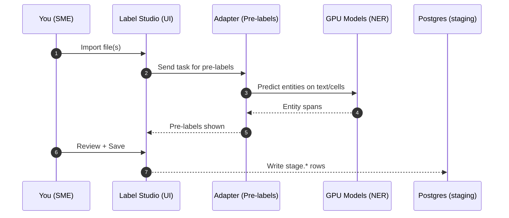
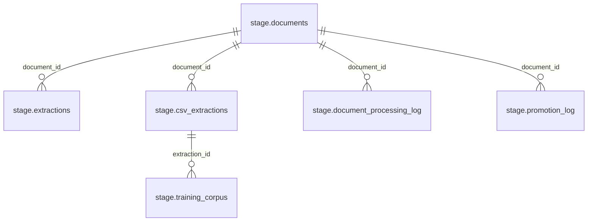
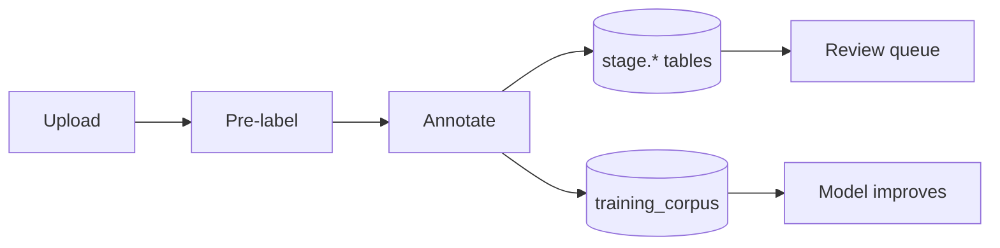

# SME Guide: Uploading, Annotating, and Accessing Raw Data (Staging)

Audience: Subject Matter Experts. This guide focuses only on what you need to do: upload, annotate, and view the raw data in the staging database. Everything else is pre‑wired so you don’t need to worry about infrastructure.

## What You’ll Do

- Upload data to Label Studio (text, PDFs, CSV/XLSX, images with text).
- Review pre‑labels, correct, and save.
- Optionally, open DBeaver to view your raw data in the staging database (CrunchyBridge PostgreSQL).



## Uploading and Annotating

- Open Label Studio at your team URL (Cloudflare Access protected), e.g., `https://label.<your-domain>`.
- Create or open a project.
- Import your data:
  - Text: a paragraph or sentence per task.
  - PDFs: either upload the file or provide an HTTPS URL.
  - CSV/XLSX: upload directly. If possible, include a `text` column summarizing the most relevant info per row. Keeping a `pdf` or `url` column helps fetch source docs for context.
- Open a task to see pre‑labels. Adjust spans and labels; Save/Submit.

Tips for high‑quality annotations:
- Choose the most specific label (e.g., `IMO` vs. generic `VESSEL`).
- Keep spans tight (no extra whitespace).
- For CSV/XLSX, if your sheet has multiple useful fields, add a temporary `text` column in Excel/Sheets that concatenates them (no scripts needed).

## Where Your Work Goes (Tables you’ll use)

Your saved work is captured in the staging schema. The key tables and views you’ll browse are:
- `stage.documents` — the task text + metadata; one row per task.
- `stage.extractions` — span-level NER results from text/PDF tasks.
- `stage.csv_extractions` — cell-level raw→cleaned values for CSV/XLSX rows.
- `stage.training_corpus` — human corrections used to improve models.
- `stage.v_review_queue` — extractions flagged for human review.
- `stage.v_document_processing_stats` — per-document processing overview.



```mermaid
flowchart LR
  subgraph UI[Annotation UI]
    LS[Label Studio]
  end
  subgraph ML[Pre‑labels]
    AD[Adapter]
    TR[Triton GPU]
  end
  subgraph DB[(CrunchyBridge Postgres - staging)]
    D[(stage.documents)]
    E[(stage.extractions)]
    C[(stage.csv_extractions)]
    T[(stage.training_corpus)]
    V1[(stage.v_review_queue)]
    V2[(stage.v_document_processing_stats)]
  end
  LS -- Webhooks/Sync --> DB
  LS -- Get pre‑labels --> AD --> TR
  D -. one:many .-> E
  D -. one:many .-> C
  C -. one:many .-> T
```

## Accessing Raw Data with DBeaver (CrunchyBridge staging)

We provide a read‑only connection for SMEs. If your workstation is pre‑configured, you’ll see “Oceanid Staging (RO)” in DBeaver. Note: some docs/chat may say “crunchybase”; it refers to the same CrunchyBridge-hosted Postgres staging database.

- If you already have the connection:
  - Open DBeaver → Database Navigator → double‑click “Oceanid Staging (RO)”.
  - Expand `Schemas` → `stage`.
  - Right‑click a table → “Read Data in SQL Console”.

- To add it manually (if not pre‑configured):
  - Driver: PostgreSQL
  - Host: provided CrunchyBridge hostname (format: `p.<cluster-id>.db.postgresbridge.com`)
  - Port: `5432`
  - Database: your staging DB name (ask ops if unsure)
  - User/Password: provided read‑only credentials
  - SSL: Required (default)

Helpful queries:

```sql
-- Most recent documents and status
SELECT *
FROM stage.v_document_processing_stats
ORDER BY last_processed_at DESC NULLS LAST
LIMIT 50;
```

```sql
-- NER spans for a document
SELECT e.label, e.value, e.confidence, e.updated_at
FROM stage.extractions e
WHERE e.document_id = $1
ORDER BY e.updated_at DESC;
```

```sql
-- CSV/XLSX cleaned cells needing review
SELECT document_id, row_index, column_name, raw_value, cleaned_value, confidence
FROM stage.csv_extractions
WHERE needs_review = true
ORDER BY confidence ASC, created_at ASC
LIMIT 200;
```

```sql
-- Your corrections (training data for the model)
SELECT corrected_value, correction_type, annotator, annotated_at
FROM stage.training_corpus
ORDER BY annotated_at DESC
LIMIT 200;
```

## Network Picture (What’s already working for you)

```mermaid
flowchart TB
  subgraph SME[Your Workstation]
    B[Browser: Label Studio]
    D[DBeaver]
  end

  subgraph CF[Cloudflare Access]
    A1[Access App: LS]
    A2[Access App: GPU]
  end

  subgraph CB[(CrunchyBridge Postgres\nstaging database)]
    S1[Schema: stage]
    S2[Schema: curated]
  end

  B -->|HTTPS + Access| A1 -->|to| LS[Label Studio Service]
  B -->|HTTPS + Access| A2 -->|to| GPU[Triton Models]

  D -->|TLS (5432)| CB

  LS -->|webhook/sink| S1
  GPU -->|pre‑labels| LS
```

## TABERT Pilot (Optional)

TaBERT is a research model for understanding tables. We run a small pilot to assist with CSV/XLSX normalization. This is optional and not GA; availability may vary.

What it does:
- Suggests standardized values for messy cells (e.g., vessel type aliases, country names, date formats).
- Flags low‑confidence transformations for human review.

How to try it (if enabled for your project):
- In Label Studio, open a CSV/XLSX task.
- Open the “Assist” panel and enable “Tabert (Pilot)”.
- Click “Suggest clean values”. Suggestions appear inline; accept or edit, then Save.
- Behind the scenes, accepted suggestions are recorded in `stage.csv_extractions` with `extraction_method = 'ml_model'` and a `model_version` like `tabert-<date>`.

Useful queries for pilot data:

```sql
-- Pilot suggestions that were auto‑filled by the model
SELECT document_id, row_index, column_name, raw_value, cleaned_value, confidence, model_version
FROM stage.csv_extractions
WHERE extraction_method = 'ml_model'
  AND model_version ILIKE 'tabert%'
ORDER BY created_at DESC
LIMIT 200;
```

Feedback:
- If you don’t see the Tabert toggle, or suggestions look off, please report it to ops with example rows. The pilot uses your corrections (via `stage.training_corpus`) to improve.

## FAQ

- Can I use Excel/Sheets only? Yes. For CSV/XLSX, adding a simple `text` column often yields better pre‑labels; no scripts are required.
- Can I query without DBeaver? Yes, any Postgres client works. You’ll need the same read‑only credentials and TLS.
- Are my edits versioned? Yes. An annotation sink appends versioned JSONL to our dataset and inserts rows into `stage.*` tables.

## At a Glance



If anything here isn’t visible or doesn’t match what you see, ping ops — your environment may not have the pilot features enabled yet, but the core upload → annotate → query flow is always on.
