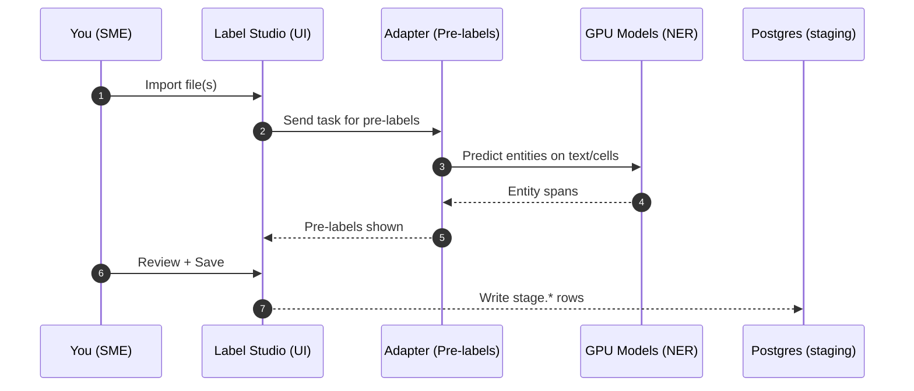
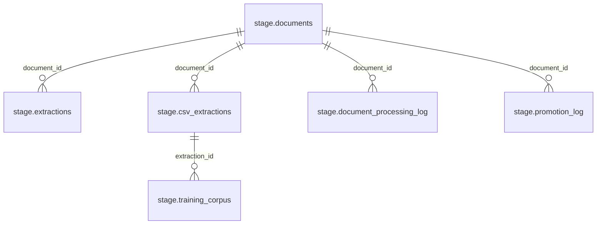
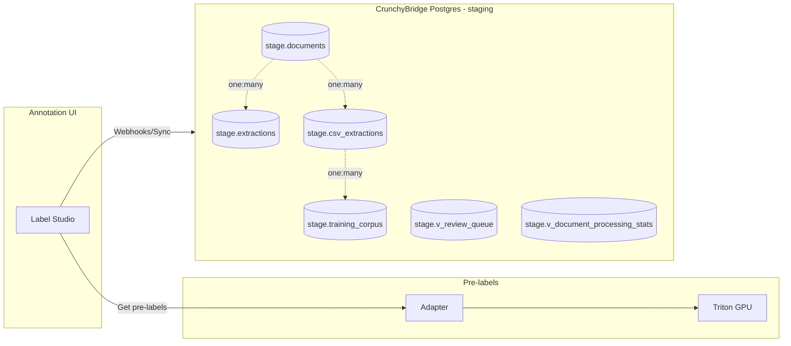
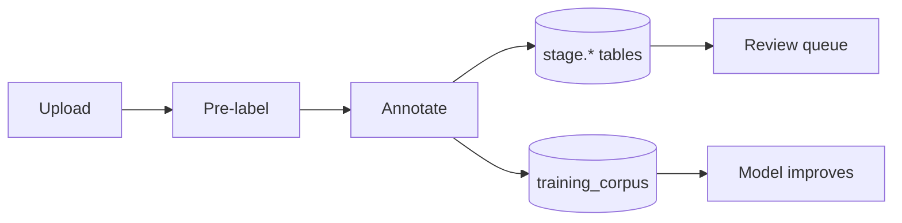

# SME Guide: Uploading, Annotating, and Accessing Raw Data (Staging)

Audience: Subject Matter Experts. This guide focuses only on what you need to do: upload, annotate, and view the raw data in the staging database. Everything else is pre‑wired so you don’t need to worry about infrastructure.

## SME Quickstart

- Open Label Studio: `https://label.boathou.se` (Cloudflare Access)
- Open project “NER_Data” (or your team project)
- Verify labeling interface has one block: `<Labels name="label" toName="text" ...>`
- Click a task → confirm pre‑labels appear inline
- Adjust spans and labels; Save/Submit
- Optional: open DBeaver to browse `stage.*` views (read‑only)

### Draw Boxes on PDFs

- Open a PDF task and use "PDF Page (Boxes)" to draw rectangles.
- Labels available: TABLE, FIGURE, SECTION, SIGNATURE, STAMP (ask if you need more).
- Your boxes are stored in the database and converted to PDF‑point coordinates for model training.
- Quick checks:
  - `SELECT * FROM stage.v_pdf_boxes_latest ORDER BY created_at DESC LIMIT 50;`

Need a new project or a custom label set? See Project Setup for SMEs: [project-setup.mdx](./project-setup.mdx)

## What You’ll Do

- Upload data to Label Studio (text, PDFs, CSV/XLSX, images with text).
- Review pre‑labels, correct, and save.
- Optionally, open DBeaver to view your raw data in the staging database (CrunchyBridge PostgreSQL).



## Uploading and Annotating

- Open Label Studio at your team URL (Cloudflare Access protected), e.g., `https://label.<your-domain>`.
- Create or open a project.
- Import your data:
  - Text: a paragraph or sentence per task.
  - PDFs: either upload the file or provide an HTTPS URL.
  - CSV/XLSX: upload directly. If possible, include a `text` column summarizing the most relevant info per row. Keeping a `pdf` or `url` column helps fetch source docs for context.
- Open a task to see pre‑labels. Adjust spans and labels; Save/Submit.

Tips for high‑quality annotations:
- Choose the most specific label (e.g., `IMO` vs. generic `VESSEL`).
- Keep spans tight (no extra whitespace).
- For CSV/XLSX, if your sheet has multiple useful fields, add a temporary `text` column in Excel/Sheets that concatenates them (no scripts needed).

### SME Checklist (keep handy)

- You see pre‑labels when opening a task
- The Labels control name is `label` mapped to `text`
- You’re not annotating HTML (HTML Labels are optional and can be read‑only)
- Saved work appears in read‑only staging views (`stage.*`)

## Where Your Work Goes (Tables you’ll use)

Your saved work is captured in the staging schema. The key tables and views you’ll browse are:
- `stage.documents` — the task text + metadata; one row per task.
- `stage.extractions` — span-level NER results from text/PDF tasks.
- `stage.csv_extractions` — cell-level raw→cleaned values for CSV/XLSX rows.
- `stage.training_corpus` — human corrections used to improve models.
- `stage.v_review_queue` — extractions flagged for human review.
- `stage.v_document_processing_stats` — per-document processing overview.





## SME Cheat Sheet

- Mental model: Upload → pre‑labels → correct → rows land in `stage.*` views for QA.
- Don’t worry about: GPUs, networking, credentials, or non‑stage schemas.
- Quick checks: `stage.v_review_queue` for work needing eyes; `stage.v_document_processing_stats` for status.
- Label Studio speed: use hotkeys, keep spans tight, prefer specific labels (e.g., `IMO`).
- CSV/XLSX: add a simple `text` column in Excel/Sheets for better pre‑labels; keep `pdf`/`url` columns when available.
- DBeaver: use the pre‑made “Staging (RO)” and save filters for your frequently used views.

## Accessing Raw Data with DBeaver (CrunchyBridge staging)

We provide a read‑only connection for SMEs. If your workstation is pre‑configured, you’ll see “Oceanid Staging (RO)” in DBeaver. Note: some docs/chat may say “crunchybase”; it refers to the same CrunchyBridge-hosted Postgres staging database.

- If you already have the connection:
  - Open DBeaver → Database Navigator → double‑click “Oceanid Staging (RO)”.
  - Expand `Schemas` → `stage`.
  - Right‑click a table → “Read Data in SQL Console”.

- To add it manually (if not pre‑configured):
  - Driver: PostgreSQL
  - Host: provided CrunchyBridge hostname (format: `p.<cluster-id>.db.postgresbridge.com`)
  - Port: `5432`
  - Database: your staging DB name (ask ops if unsure)
  - User/Password: provided read‑only credentials
  - SSL: Required (default)

Helpful queries:

```sql
-- Most recent documents and status
SELECT *
FROM stage.v_document_processing_stats
ORDER BY last_processed_at DESC NULLS LAST
LIMIT 50;
```

```sql
-- NER spans for a document
SELECT e.label, e.value, e.confidence, e.updated_at
FROM stage.extractions e
WHERE e.document_id = $1
ORDER BY e.updated_at DESC;
```

```sql
-- CSV/XLSX cleaned cells needing review
SELECT document_id, row_index, column_name, raw_value, cleaned_value, confidence
FROM stage.csv_extractions
WHERE needs_review = true
ORDER BY confidence ASC, created_at ASC
LIMIT 200;
```

Self‑serve extras:
- Connection template: `./dbeaver/connection-template.txt`
- Saved queries: `./dbeaver/snippets/sme_saved_queries.sql`
- DBeaver guide: `./dbeaver/README.md`

### Live SQL (Playground)

If your docs site enables an in‑browser SQL Playground with a read‑only staging connection, you can run these directly. The examples assume a pre‑configured connection alias named `staging` and enforce read‑only mode.

See setup details: `docs/operations/sqlplayground-connection.mdx`.

{/* Recent document stats */}
<SQLPlayground
  title="Recent document stats"
  connection="staging"
  readOnly
  defaultQuery={`SELECT *
FROM stage.v_document_processing_stats
ORDER BY last_processed_at DESC NULLS LAST
LIMIT 50;`}
/>

{/* CSV cells needing review */}
<SQLPlayground
  title="CSV/XLSX cells needing review"
  connection="staging"
  readOnly
  defaultQuery={`SELECT document_id, row_index, column_name, raw_value, cleaned_value, confidence
FROM stage.csv_extractions
WHERE needs_review = true
ORDER BY confidence ASC, created_at ASC
LIMIT 200;`}
/>

{/* NER spans by document */}
<SQLPlayground
  title="NER spans for a document"
  connection="staging"
  readOnly
  defaultQuery={`SELECT e.label, e.value, e.confidence, e.updated_at
FROM stage.extractions e
WHERE e.document_id = 12345
ORDER BY e.updated_at DESC;`}
/>

{/* Training corrections (latest) */}
<SQLPlayground
  title="Training corrections (latest)"
  connection="staging"
  readOnly
  defaultQuery={`SELECT extraction_id, corrected_value, correction_type, annotator, annotated_at
FROM stage.training_corpus
ORDER BY annotated_at DESC
LIMIT 200;`}
/>

{/* Review queue */}
<SQLPlayground
  title="Review queue (lowest confidence first)"
  connection="staging"
  readOnly
  defaultQuery={`SELECT id, document_id, source_doc_id, row_index, column_name,
       raw_value, cleaned_value, confidence, similarity_score, rule_name, created_at
FROM stage.v_review_queue
ORDER BY confidence ASC, created_at ASC
LIMIT 200;`}
/>

```sql
-- Your corrections (training data for the model)
SELECT corrected_value, correction_type, annotator, annotated_at
FROM stage.training_corpus
ORDER BY annotated_at DESC
LIMIT 200;
```

## Network Picture (What’s already working for you)

```mermaid
flowchart TB
  subgraph SME[Your Workstation]
    B[Browser: Label Studio]
    D[DBeaver]
  end

  subgraph CF[Cloudflare Access]
    A1[Access App: LS]
    A2[Access App: GPU]
  end

  subgraph CB[CrunchyBridge Postgres - staging database]
    S1[Schema: stage]
    S2[Schema: curated]
  end

  B -->|HTTPS + Access| A1 -->|to| LS[Label Studio Service]
  B -->|HTTPS + Access| A2 -->|to| GPU[Triton Models]

  D -->|TLS (5432)| CB

  LS -->|webhook/sink| S1
  GPU -->|pre‑labels| LS
```

## Storage (S3/MinIO)

- All uploads (files you import to Label Studio) are stored durably in our S3‑compatible object storage (MinIO/S3), not just in the database.
- The database holds metadata, spans, and table values; the original files live in object storage and can be re‑fetched for reprocessing.
- Practical takeaway: you don’t need to keep local copies after upload; if we need to re‑run extraction/cleaning, we will pull from storage.

## Managing NER Labels (Self‑Service)

Source of truth: `labels.json` (order matters; it defines model output shape) and ESC config `nerLabels` (injected into the adapter as `NER_LABELS`). Keep these in sync.

Steps to add or change labels:
- Edit `labels.json`:
  - Append new labels at the end of the `labels` array (preserve indices).
  - Bump `version` (minor for additions; major for renames/removals) and update `modelOutputShape.numLabels`.
  - Update `changeLog` entry.
- Update runtime config (exact same order):
  - Generate the array from `labels.json`:
    - `python scripts/ner_labels_from_labels_json.py > ner_labels.json`
    - `pulumi -C cluster config set oceanid-cluster:nerLabels "$(cat ner_labels.json)" --secret`
  - Values must match exactly and remain in the same order as `labels.json`.
- Refresh the adapter:
  - If you have cluster access: `kubectl -n apps rollout restart deploy/ls-triton-adapter` and wait for READY=1/1.
  - Otherwise, request a restart (no code changes needed).
- Update your Label Studio project labeling interface to include the new label(s):
  - Project → Settings → Labeling Interface → add the label(s) in the `<Labels>` block so the UI matches the backend.
- Validate:
  - In LS: Settings → Model → Test connection (200 OK on `/setup`).
  - In adapter logs: confirm “label validation passed” (counts match model output shape).

Retraining the NER model (recommended after label changes):
- Export latest annotations to the HF dataset (sink does this automatically).
- Train and export ONNX (see README “Model Training Loop”).
- Push to the model repo; the model puller updates Triton automatically.

Minimal Label Studio NER interface snippet (names must match `labels.json`):
```
<View>
  <Labels name="label" toName="text">
    <Label value="IMO" background="#ffd1a8"/>
    <Label value="VESSEL_NAME" background="#a8d1ff"/>
    <!-- add new labels here; names must match exactly -->
  </Labels>
  <Text name="text" value="$text"/>
</View>
```

## Updating Schemas (Self‑Service, Staging)

Small iterative changes are expected in staging. Typical SME changes:
- Add a view for QA (e.g., flag low‑confidence cells by source).
- Add a typed column in curated tables for a new high‑value field (after a label is stabilized).

Two ways to apply in staging:
- Manual psql (Option B in the migration guide):
  - `export DATABASE_URL='postgresql://<user>:<pass>@<host>:5432/<db>'`
  - `psql $DATABASE_URL -f sql/migrations/V7__your_change.sql`
- GitOps job (ops can include the file in the migration list):
  - Add `sql/migrations/V7__*.sql` and open a PR. CI will validate; then it is wired into the cluster job list and runs automatically.

Examples
- New QA view in `stage` (save as `sql/migrations/V7__stage_low_confidence_by_source.sql`):
```sql
CREATE OR REPLACE VIEW stage.v_low_confidence_by_source AS
SELECT d.source_doc_id, ce.column_name, ce.raw_value, ce.cleaned_value, ce.confidence
FROM stage.csv_extractions ce
JOIN stage.documents d ON d.id = ce.document_id
WHERE ce.confidence < 0.85
ORDER BY ce.confidence ASC, ce.created_at ASC;
```

- Add a typed field to curated vessel info (extend V6 pattern):
```sql
ALTER TABLE curated.vessel_info ADD COLUMN IF NOT EXISTS hull_material text;
COMMENT ON COLUMN curated.vessel_info.hull_material IS 'Hull material extracted from NER HULL_MATERIAL label.';
```

Validation after schema change:
- Re‑run your DBeaver saved queries and confirm the new view/column exists.
- For typed fields, check that post‑processing maps extractions to the new column (may require a small adapter mapping patch if dbMapping changes).

## TABERT Pilot (Optional)

TaBERT is a research model for understanding tables. We run a small pilot to assist with CSV/XLSX normalization. This is optional and not GA; availability may vary.

What it does:
- Suggests standardized values for messy cells (e.g., vessel type aliases, country names, date formats).
- Flags low‑confidence transformations for human review.

How to try it (if enabled for your project):
- In Label Studio, open a CSV/XLSX task.
- Open the “Assist” panel and enable “Tabert (Pilot)”.
- Click “Suggest clean values”. Suggestions appear inline; accept or edit, then Save.
- Behind the scenes, accepted suggestions are recorded in `stage.csv_extractions` with `extraction_method = 'ml_model'` and a `model_version` like `tabert-<date>`.

Useful queries for pilot data:

```sql
-- Pilot suggestions that were auto‑filled by the model
SELECT document_id, row_index, column_name, raw_value, cleaned_value, confidence, model_version
FROM stage.csv_extractions
WHERE extraction_method = 'ml_model'
  AND model_version ILIKE 'tabert%'
ORDER BY created_at DESC
LIMIT 200;
```

Feedback:
- If you don’t see the Tabert toggle, or suggestions look off, please report it to ops with example rows. The pilot uses your corrections (via `stage.training_corpus`) to improve.

## FAQ

- Can I use Excel/Sheets only? Yes. For CSV/XLSX, adding a simple `text` column often yields better pre‑labels; no scripts are required.
- Can I query without DBeaver? Yes, any Postgres client works. You’ll need the same read‑only credentials and TLS.
- Are my edits versioned? Yes. An annotation sink appends versioned JSONL to our dataset and inserts rows into `stage.*` tables.

## At a Glance



## Interactive Helpers

### Postgres URI Builder (Local Only)

Build a connection string for `psql` or other clients. Nothing is sent anywhere; this runs in your browser.

```jsx live
function PgUriBuilder(){
  const [host,setHost]=React.useState('p.<cluster-id>.db.postgresbridge.com');
  const [db,setDb]=React.useState('oceanid_staging');
  const [user,setUser]=React.useState('readonly_user');
  const [pass,setPass]=React.useState('');
  const [show,setShow]=React.useState(false);
  const enc = s => encodeURIComponent(s || '');
  const uri = host && db && user && pass ? `postgresql://${enc(user)}:${enc(pass)}@${host}:5432/${db}` : '';
  return (
    <div style={{border:'1px solid #ddd', padding:12, borderRadius:8}}>
      <div style={{display:'grid', gridTemplateColumns:'120px 1fr', gap:8}}>
        <label>Host</label><input value={host} onChange={e=>setHost(e.target.value)} />
        <label>Database</label><input value={db} onChange={e=>setDb(e.target.value)} />
        <label>User</label><input value={user} onChange={e=>setUser(e.target.value)} />
        <label>Password</label>
        <div>
          <input type={show?'text':'password'} value={pass} onChange={e=>setPass(e.target.value)} style={{width:'100%'}}/>
          <label style={{marginLeft:8}}><input type="checkbox" checked={show} onChange={()=>setShow(s=>!s)} /> show</label>
        </div>
      </div>
      <div style={{marginTop:12}}><strong>Connection URI</strong></div>
      <pre style={{overflowX:'auto'}}>{uri || '# fill all fields to generate'}</pre>
      <div style={{fontSize:12,color:'#555'}}>Keep credentials safe. Prefer the pre-made DBeaver RO connection.</div>
    </div>
  );
}

<PgUriBuilder />
```

### SQL Snippet Generator

Generate a spans query for a specific `document_id`.

```jsx live
function SqlGenerator(){
  const [id,setId]=React.useState('');
  const sql = id ? `SELECT e.label, e.value, e.confidence, e.updated_at\nFROM stage.extractions e\nWHERE e.document_id = ${id}\nORDER BY e.updated_at DESC;` : '-- enter a document_id';
  return (
    <div style={{border:'1px solid #ddd', padding:12, borderRadius:8}}>
      <div>document_id: <input value={id} onChange={e=>setId(e.target.value)} style={{width:160}} /></div>
      <div style={{marginTop:8}}><strong>SQL</strong></div>
      <pre style={{overflowX:'auto'}}>{sql}</pre>
    </div>
  );
}

<SqlGenerator />
```

If anything here isn’t visible or doesn’t match what you see, ping ops — your environment may not have the pilot features enabled yet, but the core upload → annotate → query flow is always on.
> Archived: This guide references the former Label Studio workflow. Oceanid now uses Argilla for SME review with a Workers-based ingestion pipeline (DeepSeek OCR + NER via Spark + Ollama Worker + MotherDuck). See `workers/vessel-ner/README.md` and `VESSEL_NER_CLOUDFLARE_WORKPLAN.md`.
