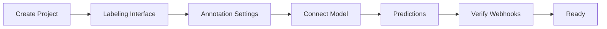
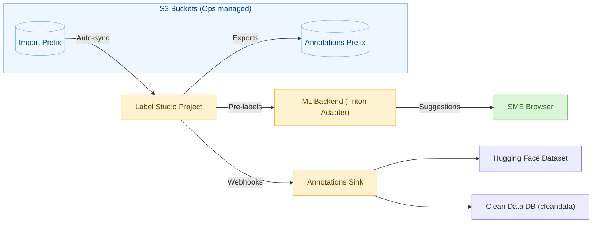
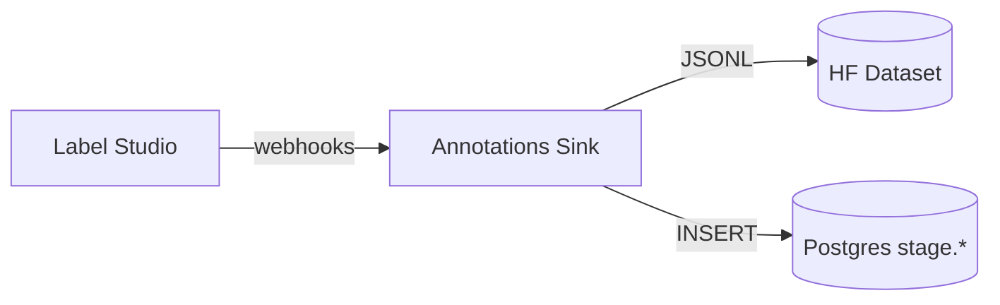

# Label Studio Project Setup (SME)

This guide shows how to set up a Label Studio project for SMEs with the correct Labeling Interface, annotation settings, ML backend, predictions, storage, and webhooks. Use the quick UI steps, or the optional script to automate.

## Before You Start

- URL: `https://label.boathou.se`
- Access: Cloudflare Access (use your SME email)
- Storage: Each project automatically gets S3 import/export storage (preconfigured per project by Ops)
- Optional (scripted): Label Studio PAT if you want to run a helper script



## How Everything Connects



**Key takeaways for SMEs**

- Files you drop into the shared S3 prefix appear in your project automatically—no manual configuration or sync buttons needed.
- Completed annotations are copied safely to a separate S3 prefix and forwarded to the training dataset; you do not have to download exports manually.
- Model suggestions come from the in-cluster “Triton Adapter” service; reconnect via Settings → Model if the project is cloned or duplicated.

## Quick Reference

| Task | Where to click | What happens | Notes |
| ---- | -------------- | ------------ | ----- |
| Create a project | Dashboard → New Project | Title/description saved | Project is provisioned with S3 + ML backend within ~1 minute |
| Upload files | Project → Tasks → Upload | Files land in S3 (import prefix) and appear as tasks automatically | Supports PDF, CSV/XLSX, TXT, images |
| Check storage status | Project → Cloud Storage | You should see “S3 Import” and “S3 Export” entries already added by Ops | Contact Ops if you need a different bucket/prefix |
| Get model suggestions | Open any task → “Get predictions” | Triton Adapter provides pre-labels | Works best when “Show predictions” is enabled |
| Verify webhooks | Project → Settings → Webhooks | Expect `/ingest` and `/webhook` entries | Webhooks keep the pipeline up to date |

If something looks off (missing storage, predictions not appearing, etc.), skip to the FAQ section at the end of this guide.

## 1) Create Project

- Click New Project
- Title: e.g., “SME 2025”
- Description: optional
- Create

## 2) Labeling Interface

Add a Named Entity Recognition interface. You can start with the minimal template and add labels as needed, or generate the full set from `labels.json` (see interactive generator below).

Minimal interface (paste into Settings → Labeling Interface):

```xml
<View>
  <Labels name="label" toName="text" showInline="true">
    <Label value="IMO" background="#ffd1a8"/>
    <Label value="VESSEL_NAME" background="#a8d1ff"/>
    <Label value="FLAG" background="#d1ffd8"/>
    <Label value="DATE" background="#ffe7a8"/>
    <Label value="PORT" background="#a8ffd1"/>
  </Labels>
  <Text name="text" value="$text"/>

</View>
```

Tip: Keep spans tight and choose specific labels (e.g., IMO vs. VESSEL).

### Notes on HTML and Tables

- Use the Text control for all primary annotations. The Labels control should be named `label` and mapped to `toName="text"`.
- HTML Labels are optional and not required for CSV/XLSX. Our adapter flattens CSV/XLSX rows to plain text (e.g., `Header: Value` lines) before pre‑labeling, so `label`→`text` is sufficient.
- If your project includes an HTML/HyperText view for reference, keep it read‑only or (if annotating HTML) use a distinct control name such as `label_html` mapped to `toName="html"`. Do not duplicate the name `label` across multiple controls; Label Studio will reject the config with “Label config contains non‑unique names”.

### Verify Your Mapping (optional)

If you see validation errors or missing predictions:
- Open Settings → Labeling Interface and confirm there is exactly one `<Labels name="label" toName="text" ...>` block.
- If there is also an HTML Labels block, ensure it has a unique `name` (e.g., `label_html`).
- Make sure “Show predictions” and (optionally) “Auto‑annotation” are enabled under Annotation Settings.

### Add PDF Page Boxes (optional)

If your team wants to draw boxes on PDF pages, add the following controls. Keep names unique.

```xml
<Header value="PDF Page (Boxes)"/>
<Image name="page" value="$image"/>
<RectangleLabels name="bbox" toName="page">
  <Label value="TABLE"/>
  <Label value="FIGURE"/>
  <Label value="SECTION"/>
  <Label value="SIGNATURE"/>
  <Label value="STAMP"/>
  <!-- customize as needed -->

</RectangleLabels>
```

Notes:
- The UI uses page images for drawing. The system converts saved boxes to PDF‑point coordinates for training.
- PDFs must be uploaded/imported into LS (or via Cloud Storage) for `$image` to be populated.

### Interactive: Generate Full Labeling Interface from labels.json

Paste your `labels.json` to generate the full Labeling Interface XML. Runs in your browser.

```jsx live
function LabelConfigGenerator(){
  const [jsonText, setJsonText] = React.useState('{\n  "labels": [\n    {"index": 0, "label": "O"},\n    {"index": 1, "label": "VESSEL"},\n    {"index": 2, "label": "VESSEL_NAME"},\n    {"index": 3, "label": "IMO"}\n  ]\n}');
  const [labels, setLabels] = React.useState([]);
  const [error, setError] = React.useState('');

  React.useEffect(() => {
    try {
      const data = JSON.parse(jsonText || '{}');
      const arr = (data.labels || []).slice().sort((a,b) => (a.index ?? 0) - (b.index ?? 0)).map(x => (x && typeof x === 'object') ? x.label : String(x));
      setLabels(arr);
      setError('');
    } catch (e) {
      setLabels([]);
      setError('Invalid JSON');
    }
  }, [jsonText]);

  const labelTags = labels.map(l => `    <Label value="${l}"/>`).join('\n');
  const xml = labels.length ? (
`<View>
  <Header value="Document Text"/>
  <Text name="text" value="$text"/>
  <Labels name="label" toName="text" showInline="true">
${labelTags}
  </Labels>
</View>`
  ) : '<!-- paste valid labels.json above -->';

  return (
    <div style={{border:'1px solid #ddd', padding: 12, borderRadius: 8}}>
      <div style={{marginBottom: 8}}><strong>labels.json</strong></div>
      <textarea rows={8} style={{width:'100%'}} value={jsonText} onChange={e=>setJsonText(e.target.value)} />
      {error && <div style={{color:'#b00', marginTop: 8}}>{error}</div>}
      <div style={{marginTop: 12}}><strong>Labeling Interface XML</strong></div>
      <pre style={{overflowX:'auto', maxHeight: 280}}>{xml}</pre>
    </div>
  );
}

<LabelConfigGenerator />
```

## 3) Annotation Settings

Settings → Annotation

- Overlap (optional): `1` (single annotation per task) or higher for consensus
- Show predictions: Enabled (display model suggestions)
- Auto‑annotation: Enable if you want predictions stored automatically on task load

If you use the script below, these options are applied for you.

## 4) Connect Model (ML Backend)

Settings → Model → Connect model

- URL: `http://ls-triton-adapter.apps.svc.cluster.local:9090`
- Health endpoint: `/health`
- Setup endpoint: `/setup`
- Leave auth blank
- Save; Test should return 200 OK

Predictions appear under “Get predictions” and, if Auto‑annotation is enabled, on task open.

## 5) Cloud Storage (Optional)

You do not need to configure Cloud Storage to persist uploads — the backend already stores files in S3/MinIO.

### Good news: Storage is pre-configured

Ops now provisions S3 storage automatically when a project is created. The default setup includes:

- **Import storage** (Files mode) pointing at `s3://labelstudio-goldfish-uploads/<prefix>` with `use_blob_urls` + presigned URLs enabled, so assets appear instantly.
- **Export storage** writing completed annotations to a dedicated S3 prefix.
- The import storage is synced as soon as the project is provisioned, so any files dropped in the bucket show up in the task list without manual steps.

You only need to file a ticket if you want to change bucket/prefix/regex settings for your project.

## 6) Webhooks (Verify)

Webhooks route events to the annotations sink. These are auto‑registered by ops, but you can verify:

- Settings → Webhooks
- You should see at least:
  - Ingest: `/ingest` for `TASK_CREATED`/`TASKS_BULK_CREATED`
  - Annotations: `/webhook` for annotation events (create/update)

If missing, ping ops to re‑register.

## 7) Predictions (Using It)

- Open any task → model suggestions appear inline
- Use Get predictions to refresh suggestions
- Save to record your edits; the sink appends versioned JSONL and writes to staging tables



## Optional: Scripted Setup

Automate connection + labeling interface with your full label set.

```bash
# 1) Get a PAT from Label Studio (Account & Settings → Access Token)
export LABEL_STUDIO_URL=https://label.boathou.se
export LABEL_STUDIO_PAT='<your PAT>'
# Optional: provide NER labels explicitly (else the script reads labels.json)
# export NER_LABELS="$(cat ner_labels.json)"

# 2) Apply labeling interface and connect model to an existing project
python3 scripts/provision-ls-project-lite.py --title "SME 2025"
```

This will:
- Connect `ls-triton-adapter` ML backend if missing
- Generate and apply a full Labeling Interface from labels
- Import a sample text task

If your project title is different or you prefer ID‑based targeting, use `scripts/provision-ls-project.py --id <ID>`.

## FAQ & Troubleshooting

```mermaid
mindmap
  root((Need help?))
    Storage
      "Entries missing?":::action
      "All good by default":::ok
    Uploads
      "Files not appearing":::action
      "Check file type":::tip
    Predictions
      "No suggestions":::action
      "Reconnect model":::tip
    Webhooks
      "Errors in list":::action
      "Contact Ops":::tip

classDef ok fill:#daf5d8,stroke:#5daa4b,color:#2f6b25;
classDef action fill:#ffe0e0,stroke:#ff7a7a,color:#b30000;
classDef tip fill:#eef7ff,stroke:#87b0ff,color:#003b82;
```

**Storage entries are missing in the UI**

- Go to Settings → Cloud Storage. You should see “S3 Import” and “S3 Export”.
- If they are missing, don’t add them manually—ping Ops so we can rerun the provisioner or adjust the bucket/prefix.
- Remember: uploads still land in the bucket even if the UI entry is temporarily absent.

**Uploaded files aren’t showing up as tasks**

- Refresh the project once; large PDFs can take a minute to process.
- Check that the filename matches the allowed patterns (default accepts `.pdf, .csv, .xlsx, .xls, .txt, .jpg, .png`).
- If the file is outside the managed prefix, ask Ops to update the prefix or drop the file into the correct folder.

**Model suggestions are missing**

- Settings → Model → ensure the URL is `http://ls-triton-adapter.apps.svc.cluster.local:9090`.
- Click “Test”. If it fails, press “Reconnect” (no credentials needed) and retest.
- In Settings → Annotation, confirm “Show predictions” (and optionally “Auto-annotation”) is enabled.

**Webhook status shows errors**

- Settings → Webhooks should list `/ingest` and `/webhook`. If you see errors, click “Last log” and share the message with Ops.
- Do not delete the webhook entries; Ops will fix the downstream service.

**Need a different S3 bucket or custom prefix?**

- Submit an Ops request with the desired bucket, prefix, and (optionally) a regex of allowed file types.
- Ops updates Pulumi and reruns the provisioner so everyone keeps a consistent setup.

**How to contact Ops**

- Slack: `#ops-support`
- Request form: “AI Ops Support” in the internal portal
- Include project name, approximate time of issue, and screenshots or error messages if available
