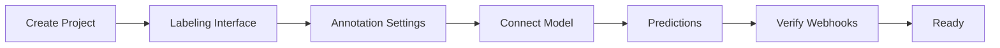
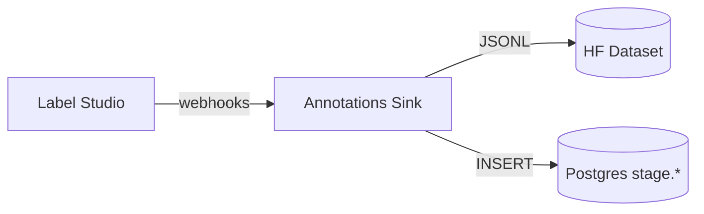

# Label Studio Project Setup (SME)

This guide shows how to set up a Label Studio project for SMEs with the correct Labeling Interface, annotation settings, ML backend, predictions, storage, and webhooks. Use the quick UI steps, or the optional script to automate.

## Before You Start

- URL: `https://label.boathou.se`
- Access: Cloudflare Access (use your SME email)
- Storage: S3/MinIO is pre‑configured on the backend; uploads are durable
- Optional (scripted): Label Studio PAT if you want to run a helper script



## 1) Create Project

- Click New Project
- Title: e.g., “SME 2025”
- Description: optional
- Create

## 2) Labeling Interface

Add a Named Entity Recognition interface. You can start with the minimal template and add labels as needed, or generate the full set from `labels.json` (see interactive generator below).

Minimal interface (paste into Settings → Labeling Interface):

```xml
<View>
  <Labels name="label" toName="text" showInline="true">
    <Label value="IMO" background="#ffd1a8"/>
    <Label value="VESSEL_NAME" background="#a8d1ff"/>
    <Label value="FLAG" background="#d1ffd8"/>
    <Label value="DATE" background="#ffe7a8"/>
    <Label value="PORT" background="#a8ffd1"/>
  </Labels>
  <Text name="text" value="$text"/>

</View>
```

Tip: Keep spans tight and choose specific labels (e.g., IMO vs. VESSEL).

### Notes on HTML and Tables

- Use the Text control for all primary annotations. The Labels control should be named `label` and mapped to `toName="text"`.
- HTML Labels are optional and not required for CSV/XLSX. Our adapter flattens CSV/XLSX rows to plain text (e.g., `Header: Value` lines) before pre‑labeling, so `label`→`text` is sufficient.
- If your project includes an HTML/HyperText view for reference, keep it read‑only or (if annotating HTML) use a distinct control name such as `label_html` mapped to `toName="html"`. Do not duplicate the name `label` across multiple controls; Label Studio will reject the config with “Label config contains non‑unique names”.

### Verify Your Mapping (optional)

If you see validation errors or missing predictions:
- Open Settings → Labeling Interface and confirm there is exactly one `<Labels name="label" toName="text" ...>` block.
- If there is also an HTML Labels block, ensure it has a unique `name` (e.g., `label_html`).
- Make sure “Show predictions” and (optionally) “Auto‑annotation” are enabled under Annotation Settings.

### Add PDF Page Boxes (optional)

If your team wants to draw boxes on PDF pages, add the following controls. Keep names unique.

```xml
<Header value="PDF Page (Boxes)"/>
<Image name="page" value="$image"/>
<RectangleLabels name="bbox" toName="page">
  <Label value="TABLE"/>
  <Label value="FIGURE"/>
  <Label value="SECTION"/>
  <Label value="SIGNATURE"/>
  <Label value="STAMP"/>
  <!-- customize as needed -->

</RectangleLabels>
```

Notes:
- The UI uses page images for drawing. The system converts saved boxes to PDF‑point coordinates for training.
- PDFs must be uploaded/imported into LS (or via Cloud Storage) for `$image` to be populated.

### Interactive: Generate Full Labeling Interface from labels.json

Paste your `labels.json` to generate the full Labeling Interface XML. Runs in your browser.

```jsx live
function LabelConfigGenerator(){
  const [jsonText, setJsonText] = React.useState('{\n  "labels": [\n    {"index": 0, "label": "O"},\n    {"index": 1, "label": "VESSEL"},\n    {"index": 2, "label": "VESSEL_NAME"},\n    {"index": 3, "label": "IMO"}\n  ]\n}');
  const [labels, setLabels] = React.useState([]);
  const [error, setError] = React.useState('');

  React.useEffect(() => {
    try {
      const data = JSON.parse(jsonText || '{}');
      const arr = (data.labels || []).slice().sort((a,b) => (a.index ?? 0) - (b.index ?? 0)).map(x => (x && typeof x === 'object') ? x.label : String(x));
      setLabels(arr);
      setError('');
    } catch (e) {
      setLabels([]);
      setError('Invalid JSON');
    }
  }, [jsonText]);

  const labelTags = labels.map(l => `    <Label value="${l}"/>`).join('\n');
  const xml = labels.length ? (
`<View>
  <Header value="Document Text"/>
  <Text name="text" value="$text"/>
  <Labels name="label" toName="text" showInline="true">
${labelTags}
  </Labels>
</View>`
  ) : '<!-- paste valid labels.json above -->';

  return (
    <div style={{border:'1px solid #ddd', padding: 12, borderRadius: 8}}>
      <div style={{marginBottom: 8}}><strong>labels.json</strong></div>
      <textarea rows={8} style={{width:'100%'}} value={jsonText} onChange={e=>setJsonText(e.target.value)} />
      {error && <div style={{color:'#b00', marginTop: 8}}>{error}</div>}
      <div style={{marginTop: 12}}><strong>Labeling Interface XML</strong></div>
      <pre style={{overflowX:'auto', maxHeight: 280}}>{xml}</pre>
    </div>
  );
}

<LabelConfigGenerator />
```

## 3) Annotation Settings

Settings → Annotation

- Overlap (optional): `1` (single annotation per task) or higher for consensus
- Show predictions: Enabled (display model suggestions)
- Auto‑annotation: Enable if you want predictions stored automatically on task load

If you use the script below, these options are applied for you.

## 4) Connect Model (ML Backend)

Settings → Model → Connect model

- URL: `http://ls-triton-adapter.apps.svc.cluster.local:9090`
- Health endpoint: `/health`
- Setup endpoint: `/setup`
- Leave auth blank
- Save; Test should return 200 OK

Predictions appear under “Get predictions” and, if Auto‑annotation is enabled, on task open.

## 5) Cloud Storage (Optional)

You do not need to configure Cloud Storage to persist uploads — the backend already stores files in S3/MinIO.

Only configure Cloud Storage if you want LS to import tasks from an external bucket:

- Settings → Cloud Storage → Add Source → Amazon S3
- Bucket: provided by ops (if using our managed bucket) or your own
- Region: e.g., `us-east-1`
- Prefix: optional (folder)
- Credentials: access key ID and secret (contact ops for project‑scoped credentials)
- Import strategy: choose whether to copy or reference (we recommend copying for stability)

If you’re unsure, skip this step and upload via the UI — your files will still be stored in S3 via the backend.

## 6) Webhooks (Verify)

Webhooks route events to the annotations sink. These are auto‑registered by ops, but you can verify:

- Settings → Webhooks
- You should see at least:
  - Ingest: `/ingest` for `TASK_CREATED`/`TASKS_BULK_CREATED`
  - Annotations: `/webhook` for annotation events (create/update)

If missing, ping ops to re‑register.

## 7) Predictions (Using It)

- Open any task → model suggestions appear inline
- Use Get predictions to refresh suggestions
- Save to record your edits; the sink appends versioned JSONL and writes to staging tables



## Optional: Scripted Setup

Automate connection + labeling interface with your full label set.

```bash
# 1) Get a PAT from Label Studio (Account & Settings → Access Token)
export LABEL_STUDIO_URL=https://label.boathou.se
export LABEL_STUDIO_PAT='<your PAT>'
# Optional: provide NER labels explicitly (else the script reads labels.json)
# export NER_LABELS="$(cat ner_labels.json)"

# 2) Apply labeling interface and connect model to an existing project
python3 scripts/provision-ls-project-lite.py --title "SME 2025"
```

This will:
- Connect `ls-triton-adapter` ML backend if missing
- Generate and apply a full Labeling Interface from labels
- Import a sample text task

If your project title is different or you prefer ID‑based targeting, use `scripts/provision-ls-project.py --id <ID>`.

## Troubleshooting

- No Labeling Interface found: paste the minimal XML or run the script
- Backend test fails: confirm URL and that the adapter is reachable in cluster; try again
- No predictions: ensure the Model is connected and Auto‑annotation/Show predictions are enabled
- Webhooks missing: ask ops to re‑register; tasks and annotations should trigger sink endpoints
