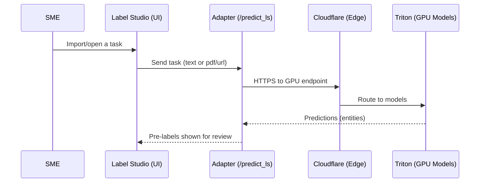
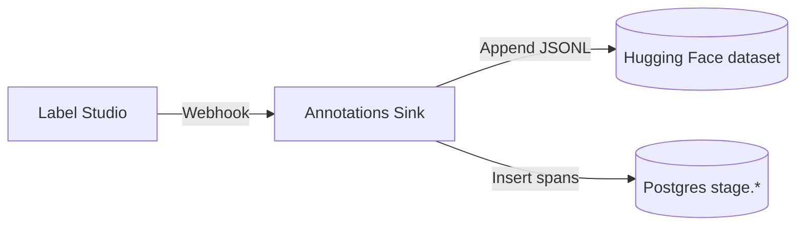
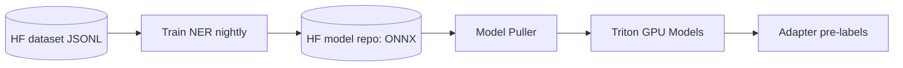

# SME Workflow Guide (v1 now, v2 planned)

Audience: Subject Matter Experts working with text, PDFs, images, and CSVs.

Goal: Show what to upload, how pre-labels appear, how to save, and where your work goes.
CSVs are supported now (v1).
Your existing pandas spreadsheet cleaners will be integrated next (v2) so you won’t run them manually.

Related guide (DB access + tables): [SME Guide — Uploading, Annotating, and Accessing Raw Data (Staging)](./index.mdx)

## What You Do

- Open Label Studio at `label.<base>` (Cloudflare Access).
- Create/open a project and import your data (Text, PDFs, CSVs, images).
- Review pre-labels (auto suggestions), correct spans/labels, Save.

## Supported Inputs (v1)

- Text: gets NER pre-labels (entities like VESSEL, IMO, FLAG, PORT, DATE).
- PDFs: Docling text extraction + NER pre-labels.
- CSVs: header-aware flattening + NER pre-labels (details below).
- XLSX: header-aware flattening + NER pre-labels.
- Images:
  - If images contain text, convert to PDF or OCR to text to get pre-labels.
  - Pure image annotations are supported in LS, but no auto pre-labels in v1.

## How Pre‑Labels Work



## CSV/XLSX Instructions (v1)

- Prepare your CSV with at least one of:
  - `text` column: a sentence/paragraph to annotate for entities, or
  - `pdf` or `url` column: a public PDF link (the system fetches it for pre-labels)
- Keep all other columns; they are preserved as metadata for provenance and later use.
- Examples:

```csv
text,pdf,meta_id
"Vessel IMO 9395044 entered Singapore on 2024-09-01",,doc-123
,"https://example.com/report.pdf",doc-124
```

- Import steps:
  - Project → Import → Upload CSV.
  - Mapping: map your text column to “text”; keep pdf/url columns (no special mapping required).
  - The ML backend is already wired to our adapter; open a task to see pre-labels.
- Best practices:
  - If rows don’t have a single “text” column, create a temporary text column (in Excel/Sheets, no scripts)
    that combines the most useful fields (e.g., “Vessel {VESSEL_NAME} (IMO {IMO}) arrived {DATE} at {PORT}”).
  - For PDFs, ensure the pdf/url column contains a working HTTPS link.
  - For XLSX, the system reads all sheets/cells and generates header-aware “Header: Value” lines for NER.

## Annotating and Saving

- Adjust spans and labels to be accurate and specific (e.g., prefer IMO over generic VESSEL where applicable).
- Click Save/Submit. Your annotation is recorded immediately.

## Where Your Work Goes



- Hugging Face dataset (versioned JSONL): a permanent, auditable history of annotations used for model training.
- Postgres stage schema:
  - `stage.documents`: task text and metadata (project/task IDs, source).
  - `stage.extractions`: the cleaned spans (label, value, offsets, confidence).
  - `stage.table_ingest`: raw table rows (CSV/XLSX) ingested on task creation via webhook.
  - Views for QA/ops: `stage.v_documents_freshness`, `stage.v_duplicates`.

## Label Set (What You’ll See)

- Entities aligned to our schema, e.g., VESSEL, VESSEL_NAME, IMO, MMSI, IRCS, FLAG, PORT, ORGANIZATION, PERSON,
  COMPANY, HS_CODE, SPECIES, DATE, LOCATION, RISK_LEVEL, etc.
- These labels map downstream to curated tables so your work supports analytics and intelligence.

## Quality Loop (Why Your Edits Matter)

- Your saved annotations update the HF dataset.
- Nightly training exports a new model; the GPU server pulls it automatically.
- Pre-labels improve over time, reducing your manual edits.



## Images

- To get pre-labels from images containing text, convert to PDF or run OCR to text, then import that into LS.
- For pure image annotation (boxes/regions), use LS image tools; pre-labels are not automated in v1.

## Coming in v2: Your Pandas Cleaners, Integrated

- What changes for you:
  - You won’t run scripts locally.
    The system will run your existing pandas cleaners automatically in the cluster.
  - Cleaners will normalize per-country spreadsheets (encodings, delimiters, dates), compose a high-signal text column,
    and import clean tasks to LS on a schedule or on demand.
- What stays the same:
  - You keep using LS to review pre-labels, correct spans, and save.
  - Your work still flows to the HF dataset and Postgres stage for QA and downstream use.

## Do’s and Don’ts

- Do:
  - Provide a `text` or `pdf/url` column in CSVs to enable pre-labels.
  - Keep spans tight to the entity text; use the most specific label.
  - Add a simple “text” column in Excel/Sheets if needed; no scripts required in v1.
- Don’t:
  - Upload sensitive content without clearance.
  - Introduce ad-hoc labels without checking the project schema.

