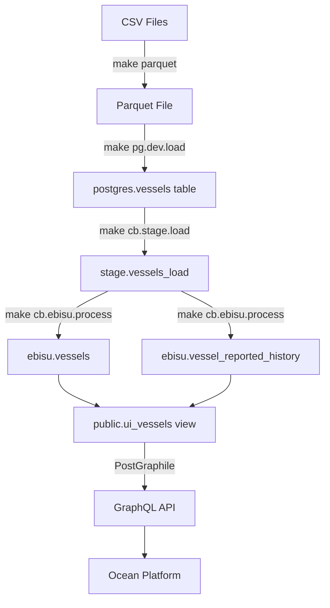

# Oceanid Local Development - Quick Start

This guide gets you up and running with a local Postgres 17 environment that matches CrunchyBridge for testing the complete data flow.

## Prerequisites

- Docker & Docker Compose
- Python 3.11+ with conda/miniconda
- DuckDB CLI (`brew install duckdb`)
- Make

**Database Architecture:**
- @oceanid → CrunchyBridge PostgreSQL 17 (data pipeline)
- @ocean → Supabase (platform auth/multi-tenancy)
- No Supabase in @oceanid! Use CrunchyBridge for production.

## One-Command Setup

```bash
# Start everything and load sample data
make pg.dev.full
```

This will:
1. Start Postgres 17.6 container
2. Build MVP parquet dataset from CSVs
3. Load data into Postgres via DuckDB
4. Apply all migrations + views/functions
5. Start PostGraphile GraphQL API

**Access Points:**
- GraphQL API: http://localhost:5000/graphiql
- PgAdmin: http://localhost:5050 (login: admin@oceanid.local / admin)
- Direct psql: `make pg.dev.psql`

## Step-by-Step Setup

### 1. Start Infrastructure

```bash
# Start Postgres + PostGraphile + PgAdmin
docker-compose up -d

# Check status
docker-compose ps
```

### 2. Prepare Data

```bash
# Build parquet from CSV inputs (uses test reconciliation data)
make parquet

# Or specify custom input directory
make parquet IN_DIR=data/raw/vessels/RFMO/raw
```

**Output:** `data/mvp/vessels_mvp.parquet`

### 3. Load Data

```bash
# Load parquet into Postgres via DuckDB
make pg.dev.load

# Apply schema (migrations + views + functions)
make pg.dev.schema
```

### 4. Verify Setup

```bash
# Open GraphiQL
open http://localhost:5000/graphiql

# Run test query
{
  allUiVessels(first: 10) {
    nodes {
      entityId
      vesselName
      imo
      mmsi
      vesselFlag
    }
  }
}
```

## Available Commands

### Database Management

```bash
make pg.dev.up          # Start Postgres container
make pg.dev.load        # Load parquet data
make pg.dev.migrate     # Apply migrations only
make pg.dev.schema      # Apply migrations + views/functions
make pg.dev.reset       # Drop and recreate database
make pg.dev.psql        # Open psql shell
make pg.dev.full        # Complete setup (up → load → schema)
```

### Data Processing

```bash
make parquet            # Build parquet from CSVs
make cb.stage.load      # Load to staging with batch tracking
make cb.ebisu.process   # Run EBISU transform pipeline
make cb.ebisu.full      # Full staging → transform → schema
```

### GraphQL API

```bash
make graphql.up         # Start PostGraphile (standalone)
# Or use docker-compose (already running)
docker-compose restart postgraphile
```

## Data Flow Testing

### Test Complete Pipeline

```bash
# 1. Clean environment
make pg.dev.reset

# 2. Build fresh dataset
python scripts/mvp_build_dataset.py \
  --in-dir tests/reconciliation/baseline/vessels/RFMO/cleaned \
  --parquet data/mvp/vessels_mvp.parquet

# 3. Load to staging
make cb.stage.load

# 4. Run EBISU transform (entity resolution + history tracking)
make cb.ebisu.process

# 5. Apply views for PostGraphile
make pg.dev.schema

# 6. Query via GraphQL
curl http://localhost:5000/graphql \
  -H 'Content-Type: application/json' \
  -d '{"query": "{ allUiVessels(first: 5) { nodes { entityId vesselName imo } } }"}'
```

### Test Individual Components

**CSV → Parquet:**
```bash
python scripts/mvp_build_dataset.py \
  --in-dir tests/reconciliation/baseline/vessels/RFMO/cleaned \
  --parquet data/test.parquet \
  --dedupe
```

**Parquet → Postgres (Direct CTAS):**
```bash
export CB_HOST=localhost CB_PORT=5432 CB_USER=postgres \
       CB_PASS=postgres CB_DB=vessels
make cb.load.parquet PARQUET=data/test.parquet
```

**Apply Schema:**
```bash
make pg.dev.schema
```

## Common Issues

### Port 5432 Already in Use

```bash
# Stop existing Postgres
brew services stop postgresql@17

# Or change docker-compose port
# Edit docker-compose.yml: ports: - '5433:5432'
# Then connect to localhost:5433
```

### Migrations Failing

```bash
# Reset and reapply
make pg.dev.reset
make pg.dev.migrate

# Check logs
docker-compose logs postgres
```

### PostGraphile Can't Connect

```bash
# Verify Postgres is ready
docker-compose ps postgres

# Check connection
docker exec -it oceanid-postgres psql -U postgres -d vessels -c '\l'

# Restart PostGraphile
docker-compose restart postgraphile
```

## Environment Variables

### Local Development (docker-compose)

```bash
export CB_HOST=localhost
export CB_PORT=5432
export CB_USER=postgres
export CB_PASS=postgres
export CB_DB=vessels
```

### CrunchyBridge (Production PostgreSQL)

CrunchyBridge provides managed PostgreSQL 17 for production vessel data.

```bash
# Get credentials from 1Password
export CB_HOST=$(op read "op://Private/CrunchyBridge/hostname")
export CB_PORT=5432
export CB_USER=$(op read "op://Private/CrunchyBridge/username")
export CB_PASS=$(op read "op://Private/CrunchyBridge/password")
export CB_DB=vessels
```

**Note:** Supabase is NOT used in @oceanid. It's only for @ocean platform auth.

## Directory Structure

```
oceanid/
├── data/
│   ├── mvp/                    # MVP parquet datasets
│   ├── raw/                    # Raw CSV/PDF inputs
│   └── processed/              # Intermediate outputs
├── sql/
│   ├── migrations/             # Versioned schema migrations
│   │   ├── V1__staging_baseline.sql
│   │   ├── V2__views_freshness_duplicates.sql
│   │   └── ...
│   ├── vessels_lookup.sql      # PostGraphile views/functions
│   ├── ebisu_stage.sql         # Staging schema
│   ├── ebisu_transform.sql     # EBISU transform functions
│   └── ebisu_admin.sql         # Admin objects
├── scripts/
│   ├── mvp_build_dataset.py    # CSV → Parquet
│   └── load_supabase.py        # Parquet → Postgres
├── docker-compose.yml          # Local services
├── Makefile                    # All targets
└── QUICKSTART.md               # This file
```

## Understanding the Data Flow



**See [DATA_FLOW.md](docs/DATA_FLOW.md) for complete architecture details.**

## Next Steps

### Connect Ocean Platform

Once local Postgres is running with data:

```bash
# In @ocean/ directory
cd ../ocean

# Update .env.local with local PostGraphile endpoint
echo "VITE_GRAPHQL_ENDPOINT=http://localhost:5000/graphql" >> .env.local

# Start platform
pnpm run dev
```

### Test SME Workflow

```bash
# TODO: Set up Label Studio container
# docker-compose up label-studio
```

### Deploy to Production

```bash
# Load data to CrunchyBridge
export CB_HOST=p.3x4xvkn3xza2zjwiklcuonpamy.db.postgresbridge.com
export CB_USER=u_ogfzdegyvvaj3g4iyuvlu5yxmi
export CB_PASS=$(op read "op://Private/CrunchyBridge/password")
export CB_DB=vessels

make cb.ebisu.full  # Stage → Transform → Schema

# PostGraphile deployed via K8s (see cluster/README.md)
```

## Resources

- [Data Flow Documentation](docs/DATA_FLOW.md)
- [SQL Schema Status](sql/SCHEMA_STATUS.md)
- [Migration Guide](sql/README.md)
- [Ocean Platform Setup](../ocean/README.md)
- [Cluster Infrastructure](README.md)

## Support

- GitHub Issues: https://github.com/goldfish-inc/oceanid/issues
- Slack: #oceanid-dev
