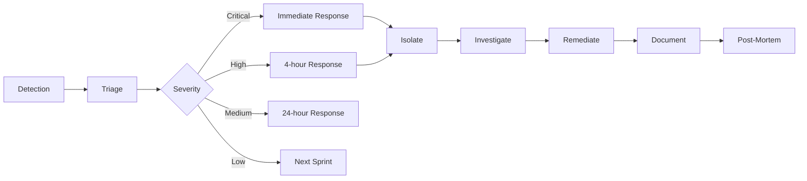

# Security Documentation - Oceanid Cluster

## Executive Summary

The Oceanid cluster implements a **Zero-Trust Security Architecture** following 2025 best practices. All components assume no implicit trust, with multiple layers of defense and automatic security controls.

## Security Principles

1. **Zero Trust**: Never trust, always verify
2. **Defense in Depth**: Multiple security layers
3. **Least Privilege**: Minimal permissions by default
4. **Automatic Rotation**: Credentials rotate automatically
5. **External Monitoring**: Security monitoring without cluster overhead

## Security Layers

### 1. Edge Security (Cloudflare)

#### WAF Protection
- **Geo-blocking**: High-risk countries blocked (CN, RU, KP)
- **Threat Scoring**: Challenge requests with score >30
- **Attack Vector Blocking**: WordPress, XML-RPC endpoints
- **Rate Limiting**: 100 requests/minute per IP

#### DDoS Protection
- **Security Level**: High
- **Challenge TTL**: 1800 seconds
- **Browser Verification**: Enabled
- **HTTP/3 & QUIC**: Enabled for performance

#### Zero Trust Access
- **Email Verification**: Required for all access
- **Session Duration**: 24 hours
- **Binding Cookies**: HTTP-only, SameSite=lax
- **Custom Deny Page**: Configured

### 2. Network Security

#### Firewall Configuration (UFW)
```bash
# Default Policies
- Deny all incoming
- Allow all outgoing
- Deny routed traffic

# Essential Ports
- 22/tcp    : SSH (restricted)
- 6443/tcp  : Kubernetes API
- 10250/tcp : Kubelet API
- 2379-2380 : etcd cluster
- 8472/udp  : Flannel VXLAN
- 30000-32767: NodePort range
```

#### Network Policies
- **Default**: Deny all traffic
- **Internal**: Allow trusted namespace communication
- **Egress**: Restricted to required endpoints
- **DNS**: Only to kube-system

### 3. Cluster Security

#### RBAC Configuration
```yaml
Roles:
- cluster-admin: Full cluster access
- developer: Namespace-scoped access
- viewer: Read-only access
- service-accounts: Minimal required permissions
```

#### Pod Security Standards
- **Restricted**: Default for all namespaces
- **Baseline**: For system namespaces
- **Privileged**: Only for kube-system

#### Secret Management
- **Storage**: Pulumi ESC (encrypted)
- **Rotation**: Automatic every 90 days
- **Access**: RBAC-controlled
- **Audit**: All access logged

### 4. Certificate Management

#### TLS Certificates
- **Provider**: Let's Encrypt via cert-manager
- **Rotation**: Every 90 days
- **Renewal**: 30 days before expiry
- **Algorithm**: ECDSA-256
- **Minimum TLS**: v1.2

#### SSH Keys
- **Type**: ED25519
- **Storage**: Pulumi ESC
- **Rotation**: Every 90 days
- **Backup**: Previous keys retained
- **Access**: Key-only (no passwords)

### 5. Monitoring & Compliance

#### Sentry Integration
- **Error Tracking**: 100% capture rate
- **Performance**: 10% sampling
- **Cluster Health**: 5-minute intervals
- **Deployment Tracking**: Automatic
- **Resource Usage**: <150MB RAM total

#### Compliance Checks
- ✅ CIS Kubernetes Benchmark (partial)
- ✅ Network segmentation
- ✅ Automatic credential rotation
- ✅ Encryption in transit (TLS 1.2+)
- ✅ Audit logging
- ⚠️ Image scanning (planned)
- ⚠️ SBOM generation (planned)

## Security Procedures

### Incident Response



### Key Rotation Process

1. **Automatic Rotation** (Every 90 days)
   ```bash
   ./scripts/rotate-ssh-keys.sh
   ```

2. **Manual Emergency Rotation**
   ```bash
   # Immediate rotation
   ./scripts/rotate-ssh-keys.sh --force

   # Update ESC
   esc env set default/oceanid-cluster ssh.last_rotation "$(date -u)"

   # Deploy changes
   pulumi up --yes
   ```

### Adding New Nodes Securely

1. **Generate node credentials**
   ```bash
   ssh-keygen -t ed25519 -f /tmp/newnode_key
   ```

2. **Add to ESC**
   ```bash
   esc env set default/oceanid-cluster ssh.newnode_key "$(cat /tmp/newnode_key)" --secret
   ```

3. **Update Pulumi configuration**
   ```typescript
   // Add to nodes.ts
   newnode: {
       hostname: "newnode",
       ip: "x.x.x.x",
       role: "worker"
   }
   ```

4. **Deploy with security policies**
   ```bash
   pulumi up --yes
   ```

## Security Gaps & Roadmap

### Current Gaps (Issues Created)

| Priority | Gap | Issue | Impact |
|----------|-----|-------|--------|
| 🔴 Critical | No backup/disaster recovery | #18 | Data loss risk |
| 🔴 Critical | No security scanning | #19 | Vulnerability exposure |
| 🟠 High | No service mesh | #17 | Limited microsegmentation |
| 🟠 High | Limited RBAC | #23 | Over-privileged access |
| 🟡 Medium | No GitOps | #16 | Manual deployments |
| 🟡 Medium | No autoscaling | #20 | Resource inefficiency |

### Security Roadmap 2025

#### Q1 2025
- [ ] Implement Velero backup solution
- [ ] Add Trivy image scanning
- [ ] Deploy OPA for policy enforcement

#### Q2 2025
- [ ] Implement Cilium/Linkerd service mesh
- [ ] Add KEDA for event-driven scaling
- [ ] Integrate External Secrets Operator

#### Q3 2025
- [ ] Deploy ArgoCD for GitOps
- [ ] Implement multi-region failover
- [ ] Add security benchmarking automation

#### Q4 2025
- [ ] Achieve SOC2 compliance readiness
- [ ] Implement zero-trust service mesh
- [ ] Full SBOM generation pipeline

## Security Contacts

| Role | Contact | Responsibility |
|------|---------|---------------|
| Security Lead | admin@boathou.se | Overall security posture |
| Infrastructure | devops@boathou.se | Cluster security |
| Incident Response | security@boathou.se | Security incidents |

## Security Tools

### Current Tools
- **Pulumi**: Infrastructure as Code
- **ESC**: Secret management
- **Cloudflare**: WAF/DDoS protection
- **cert-manager**: Certificate automation
- **Sentry**: Error/security monitoring

### Planned Tools
- **Trivy**: Container scanning
- **OPA**: Policy enforcement
- **Velero**: Backup/restore
- **Falco**: Runtime security
- **KEDA**: Autoscaling

## Compliance Matrix

| Standard | Status | Notes |
|----------|---------|-------|
| CIS Kubernetes | Partial | Manual checks only |
| PCI DSS | No | Not required |
| HIPAA | No | Not required |
| SOC2 | Planned | Q4 2025 target |
| ISO 27001 | No | Future consideration |

## Security Best Practices

### For Developers

1. **Never commit secrets**
   ```bash
   # Use ESC for all secrets
   esc env set default/oceanid-cluster my.secret "value" --secret
   ```

2. **Use least-privilege service accounts**
   ```yaml
   serviceAccount: my-app-sa
   automountServiceAccountToken: false
   ```

3. **Set resource limits**
   ```yaml
   resources:
     limits:
       memory: "256Mi"
       cpu: "200m"
     requests:
       memory: "128Mi"
       cpu: "100m"
   ```

### For Operations

1. **Regular security updates**
   ```bash
   # Check for updates weekly
   kubectl get nodes -o wide
   ssh root@node "apt update && apt upgrade -y"
   ```

2. **Monitor security events**
   ```bash
   # Check Sentry dashboard daily
   # Review cluster events
   kubectl get events --all-namespaces | grep Warning
   ```

3. **Audit access logs**
   ```bash
   # Review SSH access
   ssh root@node "grep sshd /var/log/auth.log | tail -20"
   ```

## Security Testing

### Penetration Testing Checklist

- [ ] External port scanning
- [ ] Cloudflare bypass attempts
- [ ] API authentication testing
- [ ] RBAC privilege escalation
- [ ] Container escape attempts
- [ ] Network policy bypass
- [ ] Secret extraction attempts
- [ ] DDoS simulation

### Security Scanning Commands

```bash
# Network scan (from external)
nmap -sS -sV 157.173.210.123

# Check exposed services
kubectl get svc --all-namespaces -o wide | grep -E "LoadBalancer|NodePort"

# Review network policies
kubectl get networkpolicies --all-namespaces

# Check RBAC
kubectl auth can-i --list

# Audit pod security
kubectl get pods --all-namespaces -o jsonpath='{.items[*].spec.securityContext}'
```

## Emergency Procedures

### Compromise Response

1. **Isolate affected nodes**
   ```bash
   kubectl cordon node-name
   kubectl drain node-name --ignore-daemonsets
   ```

2. **Rotate all credentials**
   ```bash
   ./scripts/rotate-ssh-keys.sh --emergency
   ./scripts/rotate-k3s-certs.sh --force
   ```

3. **Review audit logs**
   ```bash
   kubectl logs -n kube-system -l component=kube-apiserver
   ```

4. **Notify stakeholders**
   - Security team
   - Infrastructure team
   - Management

### Disaster Recovery

1. **Restore from backup**
   ```bash
   # Future: velero restore create --from-backup latest
   ```

2. **Verify cluster health**
   ```bash
   kubectl get nodes
   kubectl get pods --all-namespaces
   ```

3. **Validate security policies**
   ```bash
   kubectl get networkpolicies --all-namespaces
   kubectl get clusterrolebindings
   ```

---

*Last Updated: September 26, 2025*
*Next Review: October 26, 2025*