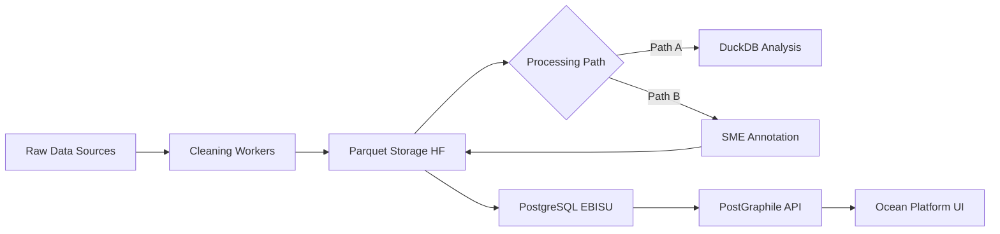
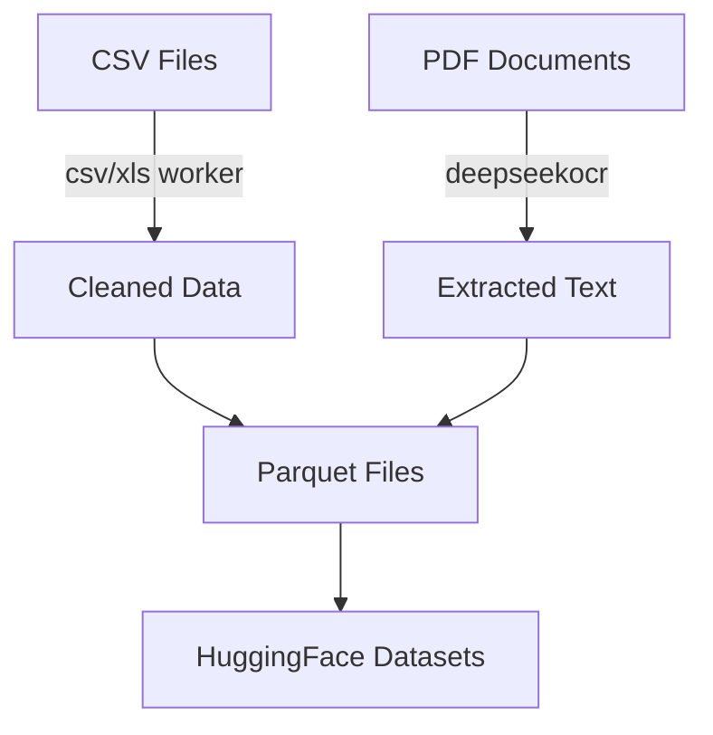
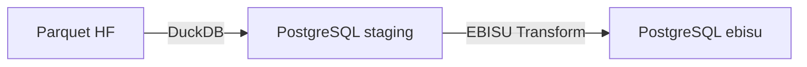
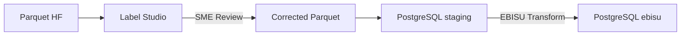
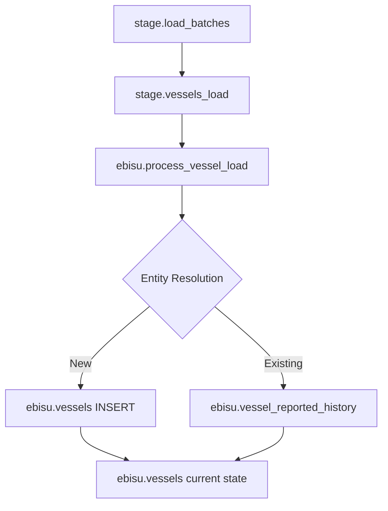
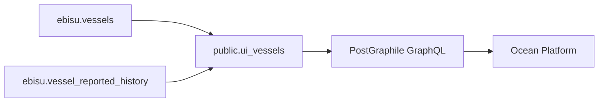
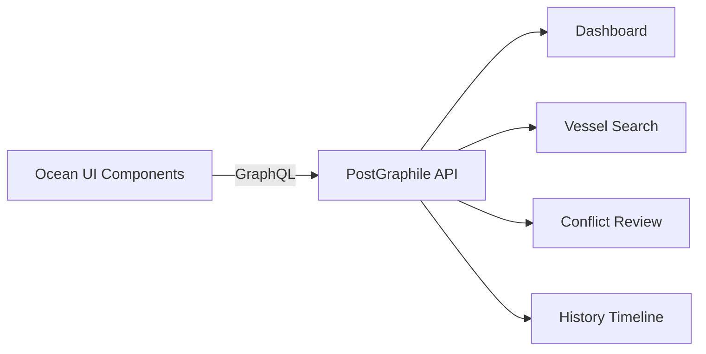

# Oceanid Data Flow Architecture

## Overview

Oceanid processes maritime vessel data through a multi-stage pipeline from raw sources to production-ready intelligence. This document describes the complete data flow architecture.

## Database Architecture Note

**IMPORTANT:** @oceanid uses **CrunchyBridge PostgreSQL 17** for all data operations. Supabase is **ONLY** used in @ocean/ (the platform with auth and multi-tenancy). This separation ensures:
- **@oceanid**: Data pipeline, EBISU intelligence → CrunchyBridge PostgreSQL
- **@ocean**: Platform auth, user management, billing → Supabase

## High-Level Flow



## Detailed Data Flow

### Stage 1: Data Ingestion



**Inputs:**
- **CSV/XLS**: Vessel registration lists from RFMOs (Regional Fisheries Management Organizations)
- **PDF**: Scanned vessel documents, certificates, registrations
- **Images**: Vessel photos, documentation (converted to PDF first)

**Processing:**
- CSV/XLS Worker: Pandas-based cleaning, column normalization, deduplication
- DeepSeek OCR: PDF text extraction with layout preservation
- Schema: Validates and normalizes fields (IMO, MMSI, vessel names, etc.)

**Output:**
- Parquet files with standardized schema
- Metadata: source, timestamp, checksums
- Stored in HuggingFace Datasets for versioning

### Stage 2: Quality Assurance (Two Paths)

#### Path A: Direct Load (Production Fast Track)


**When to use:**
- High confidence data (government registries, official sources)
- Previously validated datasets
- Automated batch updates

#### Path B: SME Annotation (Quality Review)


**When to use:**
- New data sources
- Low confidence OCR results
- Conflicting vessel identifiers
- Historical data reconciliation

**SME Workflow:**
1. Data loaded into Label Studio tasks
2. SME reviews and corrects:
   - Vessel names (spelling, transliteration)
   - Identifiers (IMO, MMSI, IRCS validation)
   - Flag states and registrations
   - Temporal changes (name changes, re-flagging)
3. Approved corrections exported to Parquet
4. Re-ingested to staging

### Stage 3: Database Pipeline (EBISU)



**Database Schemas:**

| Schema | Purpose | Examples |
|--------|---------|----------|
| `raw` | Unprocessed ingestion | `raw.vessels_documents` |
| `stage` | Landing zone, batch tracking | `stage.load_batches`, `stage.vessels_load` |
| `ebisu` | Production intelligence | `ebisu.vessels`, `ebisu.vessel_reported_history` |
| `control` | Pipeline orchestration | `control.sources`, `control.ingestion_runs` |
| `label` | Annotation metadata | (paused, future) |

**Key Tables:**

- `stage.load_batches`: Tracks each data load with checksums
- `stage.vessels_load`: Raw vessel rows from Parquet
- `ebisu.vessels`: Current canonical state per vessel (1 row per vessel_uuid)
- `ebisu.vessel_reported_history`: All historical values and changes

**Transform Logic (`ebisu.process_vessel_load`):**
1. Match vessels by:
   - IMO (primary, if present)
   - MMSI + Name (composite)
   - Other identifiers (IRCS, national registry)
2. Detect changes:
   - Name changes
   - IMO reassignments
   - MMSI changes
   - Flag state changes
3. Update current state in `ebisu.vessels`
4. Record history in `ebisu.vessel_reported_history`
5. Flag conflicts for review

### Stage 4: API Layer (PostGraphile)



**Views for UI:**

| View | Purpose | Features |
|------|---------|----------|
| `public.ui_vessels` | Current vessel list | Compatible with legacy queries |
| `public.ui_vessel_report` | Intelligence summary | History aggregation, conflict flags |
| `public.search_vessels()` | Fuzzy search | Trigram matching, accent-insensitive |

**GraphQL API:**
- Hosted by PostGraphile
- Exposes `public` and `ebisu` schemas
- Type-safe queries with automatic pagination
- Real-time subscriptions (planned)

### Stage 5: Platform Consumption (Ocean)



**Ocean Platform Features:**
- **Dashboard**: Vessel counts, data freshness, quality metrics
- **Search**: Multi-field search (name, IMO, MMSI, flag)
- **Vessel Detail**: Current state + full history
- **Conflict Review**: UI for resolving identifier conflicts
- **Data Export**: CSV/Excel for analysts

## Local Development Setup

### Prerequisites
- Docker & Docker Compose
- Python 3.11+ with pandas, pyarrow, duckdb
- pnpm (for Ocean platform)

### Quick Start

```bash
# 1. Start local infrastructure
docker-compose up -d

# 2. Build dataset from CSV inputs
make parquet  # Creates data/mvp/vessels_mvp.parquet

# 3. Load into local Postgres
make pg.dev.load

# 4. Apply schema (migrations + functions)
make pg.dev.schema

# 5. Access services
open http://localhost:5000/graphiql  # PostGraphile
open http://localhost:5050           # PgAdmin (admin/admin)
```

### Available Make Targets

| Target | Description |
|--------|-------------|
| `make parquet` | Build MVP dataset from CSVs |
| `make pg.dev.up` | Start local Postgres 17.6 container |
| `make pg.dev.load` | Load parquet into Postgres via DuckDB |
| `make pg.dev.schema` | Apply migrations + views/functions |
| `make pg.dev.reset` | Drop and recreate local database |
| `make graphql.up` | Start PostGraphile against local DB |

### Testing Data Flows

```bash
# 1. Process raw CSV to parquet
python scripts/mvp_build_dataset.py \
  --in-dir tests/reconciliation/baseline/vessels/RFMO/cleaned \
  --parquet data/mvp/vessels_mvp.parquet

# 2. Load to staging (with batch tracking)
export CB_HOST=localhost CB_PORT=5432 CB_USER=postgres \
       CB_PASS=postgres CB_DB=vessels
make cb.stage.load

# 3. Run EBISU transform
make cb.ebisu.process

# 4. Query via GraphQL
curl http://localhost:5000/graphql \
  -H 'Content-Type: application/json' \
  -d '{"query": "{ allUiVessels(first: 10) { nodes { entityId vesselName imo mmsi } } }"}'
```

## Production Deployment

### CrunchyBridge (Production PostgreSQL)

CrunchyBridge provides managed PostgreSQL 17 for the Oceanid data pipeline.

```bash
# Set CrunchyBridge credentials (from 1Password)
export CB_HOST=p.3x4xvkn3xza2zjwiklcuonpamy.db.postgresbridge.com
export CB_PORT=5432
export CB_USER=u_ogfzdegyvvaj3g4iyuvlu5yxmi
export CB_PASS=$(op read "op://Private/CrunchyBridge/password")
export CB_DB=vessels

# Full pipeline to production
make cb.ebisu.full  # Stage → Transform → Schema
```

**Why CrunchyBridge?**
- PostgreSQL 17 with full extension support
- Direct psql/DuckDB access for data loading
- No pooling restrictions (unlike Supabase pooler)
- PostGraphile connects directly (port 5432)

### PostGraphile (K8s Deployment)

PostGraphile runs in the K3s cluster (managed by Pulumi + Flux):
- Namespace: `apps`
- Service: `postgraphile.apps.svc.cluster.local:5000`
- Ingress: `https://api.oceanid.io/graphql` (via Cloudflare Tunnel)

Connection string from Pulumi ESC:
- `postgraphileDatabaseUrl`: Direct connection to CrunchyBridge (port 5432)
- Read-only user: `vessels_ro`
- SSL required: `sslmode=require`

### Monitoring

- **Grafana**: Dashboard for query performance, error rates
- **Sentry**: Error tracking for PostGraphile and workers
- **Postgres Logs**: CrunchyBridge console for slow queries
- **Data Quality**: `sql/tests/quality_assertions.sql` (run via `make cb.test.schema`)

## Data Quality Checks

### Automated Assertions

```sql
-- Run quality checks
psql $DATABASE_URL -f sql/tests/quality_assertions.sql
```

Checks include:
- No duplicate IMOs within a source
- No vessels with missing primary identifiers
- Timestamp consistency (created_at <= updated_at)
- Foreign key integrity
- History records match current state

### Manual Review Triggers

SME review required when:
1. IMO conflicts detected (same IMO, different vessels)
2. MMSI conflicts (same MMSI, multiple vessels)
3. Low confidence OCR scores (< 0.8)
4. Missing critical fields (name, flag, identifiers)
5. Temporal anomalies (future dates, impossible sequences)

## Future Enhancements

### Short Term
- [ ] Real-time ingestion via Kafka
- [ ] Automated conflict resolution with ML
- [ ] Mobile app for field data collection
- [ ] AIS integration for live tracking

### Long Term
- [ ] Multi-lingual name matching
- [ ] Ownership and beneficial owner tracking
- [ ] Sanctions and watchlist screening
- [ ] Predictive analytics for IUU risk

## References

- [EBISU Schema Documentation](./sql/README.md)
- [PostGraphile Deployment](./cluster/README.md)
- [Ocean Platform Setup](../ocean/README.md)
- [Migration Status](./sql/SCHEMA_STATUS.md)
