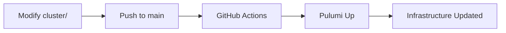
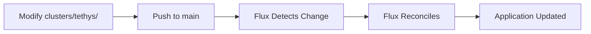

# IaC vs GitOps: Clear Separation of Concerns

## Overview

This document defines the clear boundary between Infrastructure as Code (IaC) managed by Pulumi and Application Deployment managed by Flux GitOps. For how those layers flow through GitHub Actions, Pulumi, and Flux, see [docs/operations/cicd-architecture.md](./operations/cicd-architecture.md).

## Core Principle

- **IaC (Pulumi)**: Manages the **platform** (cluster, networking, storage, operators)
- **GitOps (Flux)**: Manages the **applications** (deployments, configs, secrets)

## Decision Tree

```
Is it needed for the cluster to exist and function?
  └─ YES → Pulumi (IaC)
  └─ NO → Is it an application or service?
      └─ YES → Flux (GitOps)
      └─ NO → Re-evaluate the requirement
```

## Pulumi Responsibilities (cluster/)

### ✅ MUST Manage
- K3s cluster provisioning and configuration
- Node configurations and taints/tolerations
- CNI and network policies (cluster-wide)
- Storage classes and CSI drivers
- RBAC policies and service accounts (cluster-level)
- Flux CD bootstrap and configuration
- Cert-manager CRDs and issuers
- Ingress controllers (Cloudflare tunnels)
- Monitoring CRDs (Prometheus, Grafana)
- Pulumi Kubernetes Operator

### ❌ MUST NOT Manage
- Application deployments
- Application-specific ConfigMaps/Secrets
- Application PVCs
- Application Services
- Application Ingresses
- Application-specific RBAC

### Code Example (Pulumi)
```typescript
// ✅ CORRECT: Infrastructure only
export class ClusterInfrastructure extends pulumi.ComponentResource {
    constructor() {
        // Create cluster
        const cluster = new K3sCluster(...);

        // Install GitOps operator
        const flux = new FluxBootstrap(...);

        // Install cert-manager CRDs
        const certManager = new CertManager(...);
    }
}

// ❌ WRONG: Don't deploy apps here
export class AppWorkload extends pulumi.ComponentResource {
    // This should NOT be in Pulumi
}
```

## Flux Responsibilities (clusters/tethys/)

### ✅ MUST Manage
- All application Helm releases
- Application ConfigMaps and Secrets
- Application PVCs
- Application Services and Ingresses
- Application-specific network policies
- Application RBAC (roles/rolebindings)
- Image update automation
- Application monitoring rules

### ❌ MUST NOT Manage
- Cluster infrastructure
- Node configurations
- Cluster-wide operators (except through HelmRelease)
- Storage class definitions

### Code Example (Flux)
```yaml
# ✅ CORRECT: Application deployment
apiVersion: helm.toolkit.fluxcd.io/v2beta1
kind: HelmRelease
metadata:
  name: postgraphile
  namespace: apps
spec:
  chart:
    spec:
      chart: label-studio
      sourceRef:
        kind: HelmRepository
        name: heartex
```

## Secret Management

### Current State (Transitional)
1. Secrets stored in Pulumi ESC (e.g., database credentials)
2. Pulumi creates K8s Secrets for platform components
3. Flux references these for apps where applicable

### Target State (Pure GitOps)
1. Secrets stored in Git (encrypted with SOPS/SealedSecrets)
2. Flux decrypts and creates K8s Secrets
3. Applications reference these Secrets

### Migration Path
```bash
# Step 1: Export from ESC
pulumi config get --secret postgres_password > temp-secret.txt

# Step 2: Create SealedSecret
echo -n "$(cat temp-secret.txt)" | kubeseal --cert=pub-cert.pem \
  --format yaml > postgraphile-secrets.yaml

# Step 3: Commit to Git
git add postgraphile-secrets.yaml
git commit -m "Add sealed secret for PostGraphile"
```

## Deployment Workflows

### Infrastructure Changes


### Application Changes


## Common Patterns

### Pattern 1: New Application Deployment
```bash
# 1. Create Helm release
cat > clusters/tethys/apps/myapp.yaml <<EOF
apiVersion: helm.toolkit.fluxcd.io/v2beta1
kind: HelmRelease
metadata:
  name: myapp
  namespace: apps
spec:
  chart:
    spec:
      chart: myapp
      sourceRef:
        kind: HelmRepository
        name: myrepo
EOF

# 2. Commit and push
git add clusters/tethys/apps/myapp.yaml
git commit -m "Deploy myapp via GitOps"
git push

# 3. Flux automatically deploys (no manual intervention)
```

### Pattern 2: Infrastructure Addition
```typescript
// 1. Add to cluster/src/components/
export class NewOperator extends pulumi.ComponentResource {
    // Implementation
}

// 2. Import in cluster/src/index.ts
import { NewOperator } from "./components/newOperator";
const operator = new NewOperator(...);

// 3. Commit, push, and GitHub Actions deploys
```

## Anti-Patterns to Avoid

### ❌ Anti-Pattern 1: Mixed Management
```typescript
// Pulumi creating app resources
const argilla = new k8s.apps.v1.Deployment("argilla", {...});
```

### ❌ Anti-Pattern 2: Manual Kubectl Commands
```bash
kubectl apply -f some-app.yaml  # Should use GitOps
```

### ❌ Anti-Pattern 3: Direct Pulumi App Management
```typescript
// Pulumi managing app configs
const appConfig = new k8s.core.v1.ConfigMap("app-config", {...});
```

## Migration Checklist

When moving an app from Pulumi to Flux:

- [ ] Export all configuration values from Pulumi
- [ ] Create HelmRelease or Kustomization in clusters/tethys/
- [ ] Move secrets to SealedSecrets/SOPS
- [ ] Remove component from cluster/src/components/
- [ ] Remove imports from cluster/src/index.ts
- [ ] Test deployment through GitOps
- [ ] Remove old resources from cluster: `kubectl delete deployment old-app`
- [ ] Commit and verify Flux reconciliation

## Summary

- **Pulumi**: Platform and infrastructure only
- **Flux**: All applications and their configurations
- **Never**: Mix IaC and GitOps for the same resources
- **Always**: Use Git as the source of truth for applications
