# Oceanid Kubernetes Architecture

**Last Updated**: 2025-10-13
**K3s Version**: v1.33.4+k3s1
**Status**: Production Deployed

---

## Table of Contents

1. [Overview](#overview)
2. [Cluster Topology](#cluster-topology)
3. [Control Plane Architecture](#control-plane-architecture)
4. [Workload Distribution](#workload-distribution)
5. [Storage Architecture](#storage-architecture)
6. [GitOps & Deployment](#gitops--deployment)
7. [High Availability](#high-availability)
8. [Resource Management](#resource-management)
9. [Security & RBAC](#security--rbac)

---

## Overview

Oceanid runs on **K3s** (lightweight Kubernetes) with a **single control plane** and **two worker nodes** (one GPU-enabled).

### Key Characteristics

- **Distribution**: K3s v1.33.4+k3s1
- **CNI**: Flannel (VXLAN mode)
- **Storage**: Local storage class (hostPath)
- **Ingress**: Cloudflare Tunnel + WARP
- **GitOps**: Flux CD v2.6.4
- **Automation**: Pulumi Kubernetes Operator (PKO)

---

## Cluster Topology

### Node Architecture

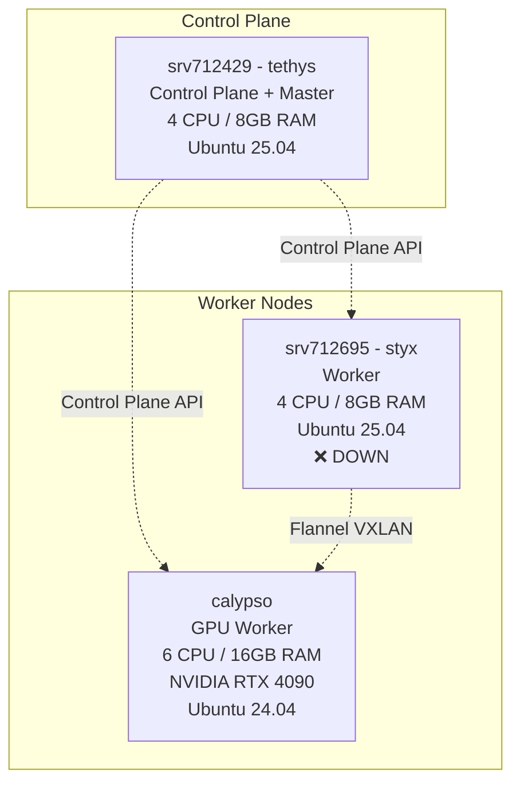

### Node Roles & Taints

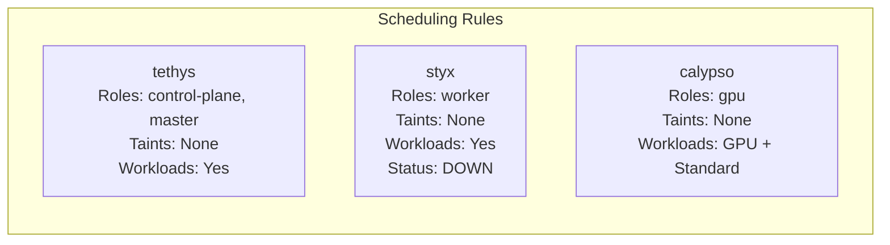

| Node | Roles | Taints | Workload Types | Status |
|------|-------|--------|----------------|--------|
| tethys | control-plane, master | None | System + Application | ✅ Ready |
| styx | worker | None | Application | ❌ NotReady (2+ days) |
| calypso | gpu | None | GPU + Application | ✅ Ready |

**Note**: K3s control plane nodes are schedulable by default (no `NoSchedule` taint).

---

## Control Plane Architecture

### Control Plane Components (on tethys)

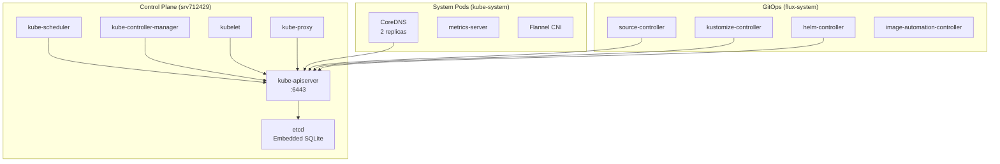

### K3s-Specific Optimizations

K3s differs from standard Kubernetes:

| Component | Standard K8s | K3s |
|-----------|--------------|-----|
| **etcd** | Separate cluster | Embedded SQLite (default) or etcd |
| **Container Runtime** | containerd/CRI-O | containerd (embedded) |
| **Image Pulling** | Separate registry mirror | Built-in airgap support |
| **Control Plane** | Multiple binaries | Single `k3s` binary |
| **Storage** | Separate CSI | local-path-provisioner (default) |

**Benefits**:
- ✅ Smaller memory footprint (~512MB control plane)
- ✅ Faster installation (single binary)
- ✅ No external etcd cluster needed
- ✅ Easier upgrades (single package)

---

## Workload Distribution

### Namespace Organization

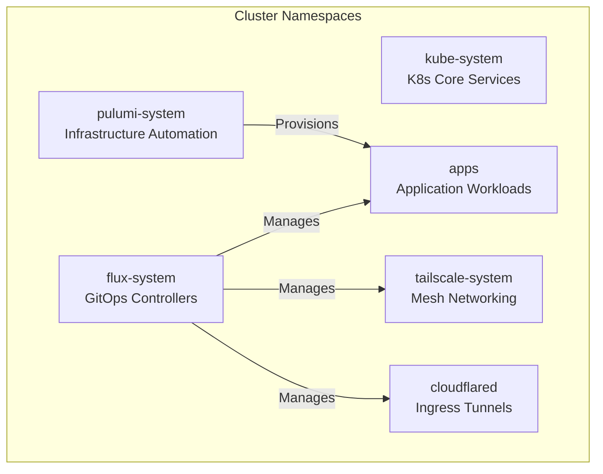

### Namespace-Level Details

| Namespace | Purpose | Workloads | PodSecurity |
|-----------|---------|-----------|-------------|
| `kube-system` | K8s core services | CoreDNS, metrics-server, Flannel | privileged |
| `flux-system` | GitOps automation | Flux controllers (6 pods) | restricted |
| `apps` | Application workloads | Label Studio, CSV workers, project-bootstrapper | baseline |
| `tailscale-system` | Mesh networking | Tailscale DaemonSets | privileged |
| `pulumi-system` | IaC automation | Pulumi Kubernetes Operator | privileged |
| `cloudflared` | Ingress tunnels | cloudflared daemon | baseline |

### Application Workload Map

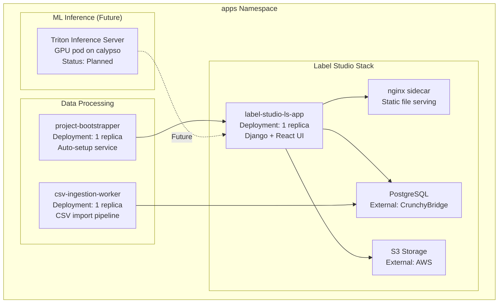

### Pod Distribution by Node

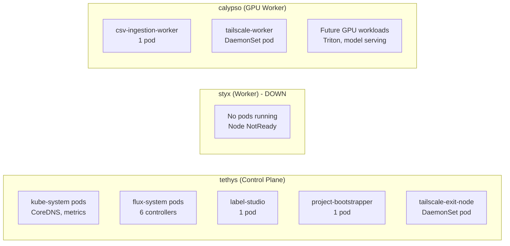

**Current Pod Distribution**:
- **tethys**: ~30 pods (control plane + apps)
- **styx**: 0 pods (node down, pods stuck Terminating)
- **calypso**: ~10 pods (CSV worker + DaemonSets)

---

## Storage Architecture

### Storage Classes

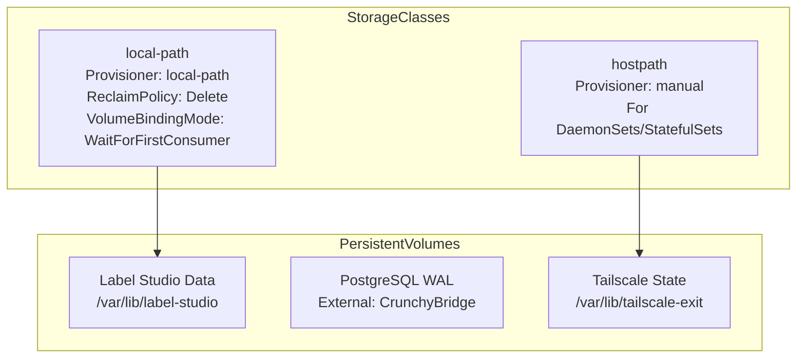

### Storage Patterns

| Workload | Storage Type | Path | Persistence |
|----------|--------------|------|-------------|
| Label Studio | local-path PVC | `/var/lib/label-studio` | ✅ Persistent |
| CSV Worker | EmptyDir | `/tmp` | ❌ Ephemeral |
| Tailscale DaemonSet | hostPath | `/var/lib/tailscale-exit` | ✅ Survives pod restart |
| PostgreSQL | External | CrunchyBridge managed | ✅ Persistent |
| S3 Objects | External | AWS S3 | ✅ Persistent |

### Volume Binding

**WaitForFirstConsumer** mode:
- PVC created → PV not provisioned yet
- Pod scheduled to node → PV provisioned on that node
- Benefit: Ensures PV is on the same node as pod (no cross-node mounting)

**Example**:
```yaml
apiVersion: v1
kind: PersistentVolumeClaim
metadata:
  name: label-studio-data
  namespace: apps
spec:
  storageClassName: local-path
  accessModes:
    - ReadWriteOnce
  resources:
    requests:
      storage: 10Gi
```

When Label Studio pod starts on `tethys`:
1. K3s local-path-provisioner creates `/var/lib/label-studio` on tethys
2. PV bound to PVC
3. Pod mounts PVC

---

## GitOps & Deployment

### Flux CD Architecture

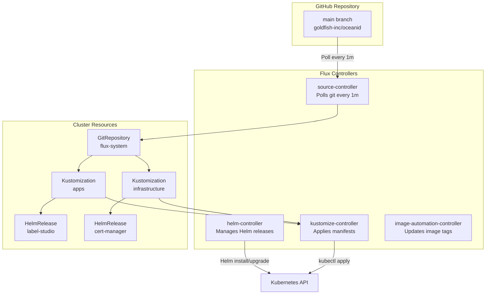

### Deployment Flow

**Developer workflow**:
```
1. Developer commits manifest to git
2. Push to main branch
3. Flux source-controller detects change (1m poll)
4. kustomize-controller or helm-controller applies changes
5. Pods reconciled to desired state
```

**Example: Updating Label Studio**:
```bash
# Edit Helm values
vim clusters/tethys/apps/label-studio/values.yaml

# Commit and push
git add clusters/tethys/apps/label-studio/values.yaml
git commit -m "feat(label-studio): increase replica count to 2"
git push

# Flux automatically:
# 1. Detects change in git
# 2. helm-controller upgrades HelmRelease
# 3. New pod created
```

### Pulumi Kubernetes Operator Integration

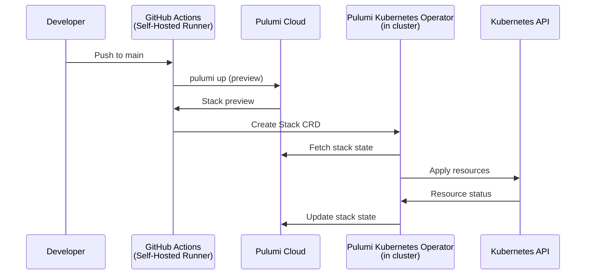

**PKO Resources Managed**:
- Secrets (from Pulumi ESC)
- ConfigMaps
- Kubernetes resources not in git (dynamic provisioning)

**Flux Resources Managed**:
- Static manifests (DaemonSets, Deployments)
- Helm releases
- GitOps-managed infrastructure

---

## High Availability

### Current HA Status: ⚠️ **LIMITED**

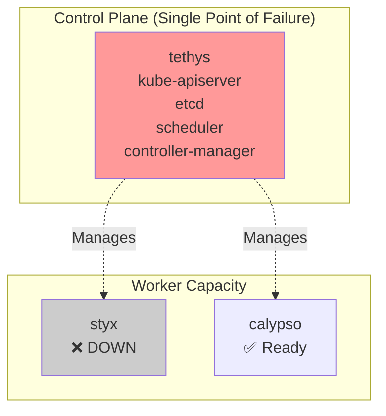

**Single Points of Failure**:
- ❌ Control plane (tethys) - no HA
- ❌ etcd (embedded SQLite) - no backup/replication
- ❌ Worker capacity (styx down) - 50% capacity loss

### Failure Scenarios

| Failure | Impact | Recovery Time | Mitigation |
|---------|--------|---------------|------------|
| **tethys down** | Total cluster outage | Manual restart (5-10 min) | ⚠️ None (single control plane) |
| **styx down** | 33% worker capacity loss | Manual investigation | ✅ Workloads rescheduled to calypso |
| **calypso down** | GPU workloads lost | Manual restart (5-10 min) | ⚠️ No GPU failover |
| **CrunchyBridge down** | Database unavailable | Automatic failover (< 1 min) | ✅ Managed service with HA |
| **S3 down** | File uploads fail | Automatic retry | ✅ AWS S3 with regional replication |

### Application-Level HA

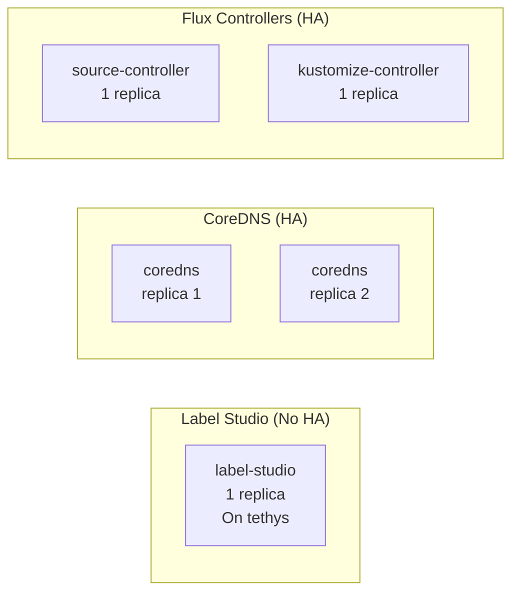

**Current HA Configuration**:
- ✅ CoreDNS: 2 replicas (survives 1 pod failure)
- ❌ Label Studio: 1 replica (downtime during restart)
- ❌ CSV Worker: 1 replica (jobs lost on failure)
- ❌ Flux Controllers: 1 replica each (GitOps disrupted during restart)

**Recommendations** (future enhancement):
- Scale Label Studio to 2+ replicas
- Add PodDisruptionBudgets for critical services
- Consider multi-control-plane K3s setup (3 nodes minimum)

---

## Resource Management

### Resource Quotas & Limits

**Current Status**: ⚠️ **NO QUOTAS CONFIGURED**

Each pod has requests/limits but no namespace-level quotas.

### Pod Resource Patterns

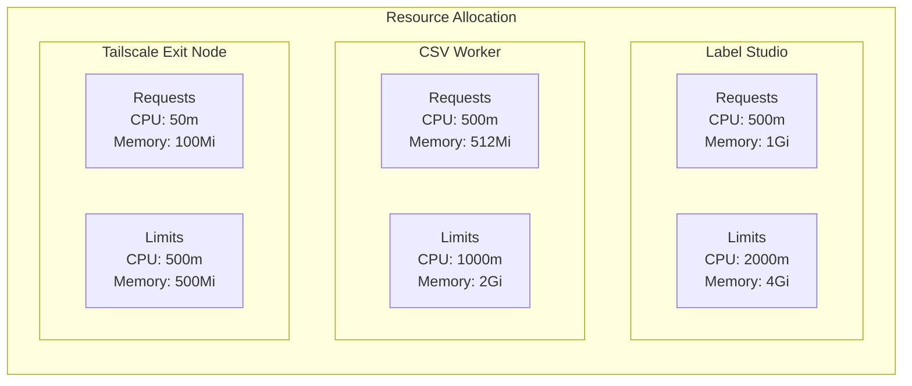

### Node Capacity & Allocation

| Node | CPU Capacity | Memory Capacity | Allocatable CPU | Allocatable Memory | Current Usage |
|------|--------------|-----------------|-----------------|-------------------|---------------|
| tethys | 4 cores | 8 GB | ~3.8 cores | ~7 GB | ~2 cores / ~4 GB |
| calypso | 6 cores | 16 GB | ~5.8 cores | ~15 GB | ~1 core / ~2 GB |
| styx | 4 cores | 8 GB | (offline) | (offline) | N/A |

**Calculation**:
- **Allocatable** = Capacity - K8s system reserved
- K3s system reservation: ~200m CPU, ~1GB memory

### QoS Classes

Pods are assigned QoS classes based on requests/limits:

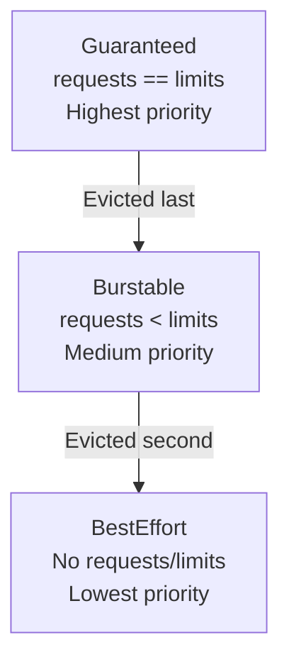

**Current Pod QoS**:
- Label Studio: Burstable (requests: 500m/1Gi, limits: 2000m/4Gi)
- CSV Worker: Burstable (requests: 500m/512Mi, limits: 1000m/2Gi)
- Tailscale: Burstable (requests: 50m/100Mi, limits: 500m/500Mi)

**Eviction Order** (under memory pressure):
1. BestEffort pods killed first
2. Burstable pods killed if exceeding requests
3. Guaranteed pods killed last (only if node OOM)

---

## Security & RBAC

### PodSecurity Standards

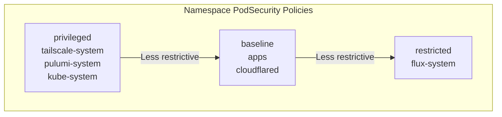

| Standard | Requirements | Namespaces |
|----------|-------------|------------|
| **privileged** | No restrictions | tailscale-system, pulumi-system, kube-system |
| **baseline** | No privileged escalation | apps, cloudflared |
| **restricted** | Minimal permissions | flux-system |

**Enforcement**:
```yaml
apiVersion: v1
kind: Namespace
metadata:
  name: tailscale-system
  labels:
    pod-security.kubernetes.io/enforce: privileged
    pod-security.kubernetes.io/audit: privileged
    pod-security.kubernetes.io/warn: privileged
```

### RBAC Structure

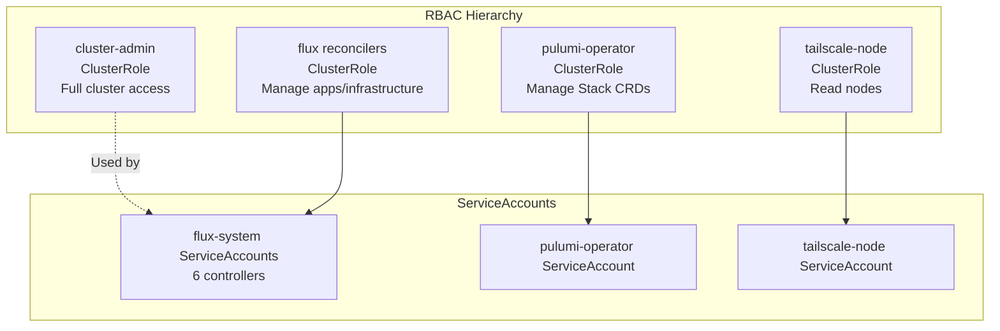

**Key RBAC Policies**:

1. **Flux Controllers**:
   ```yaml
   ClusterRole: flux-reconcilers
   Permissions:
     - All verbs on: deployments, services, configmaps, secrets
     - Read on: namespaces, nodes
   Bound to: source-controller, kustomize-controller, helm-controller ServiceAccounts
   ```

2. **Tailscale DaemonSet**:
   ```yaml
   ClusterRole: tailscale-node
   Permissions:
     - get, list on: nodes
   Bound to: tailscale-node ServiceAccount
   ```

3. **Pulumi Kubernetes Operator**:
   ```yaml
   ClusterRole: pulumi-kubernetes-operator
   Permissions:
     - All verbs on: Stack CRDs
     - Create/Update secrets from Pulumi ESC
   Bound to: pulumi-kubernetes-operator ServiceAccount
   ```

### Network Policies

**Status**: ⚠️ **NOT IMPLEMENTED**

See [NETWORK_ARCHITECTURE.md](./NETWORK_ARCHITECTURE.md#kubernetes-network-policies) for recommended policies.

---

## Appendix: Operational Commands

### Cluster Health Checks

```bash
# Check all nodes
kubectl get nodes -o wide

# Check control plane components
kubectl get pods -n kube-system

# Check Flux GitOps status
flux get kustomizations
flux get helmreleases -A

# Check DaemonSet rollout
kubectl get daemonsets -A
```

### Resource Usage

```bash
# Node resource usage
kubectl top nodes

# Pod resource usage by namespace
kubectl top pods -n apps

# Describe node capacity
kubectl describe node tethys
```

### Scaling Operations

```bash
# Scale deployment
kubectl scale deployment label-studio-ls-app -n apps --replicas=2

# Restart deployment (rolling restart)
kubectl rollout restart deployment/label-studio-ls-app -n apps

# Check rollout status
kubectl rollout status deployment/label-studio-ls-app -n apps
```

### Debugging Pods

```bash
# Get pod logs
kubectl logs -n apps label-studio-ls-app-xxx

# Exec into pod
kubectl exec -it -n apps label-studio-ls-app-xxx -- /bin/bash

# Describe pod (shows events)
kubectl describe pod -n apps label-studio-ls-app-xxx
```

---

## References

- [NETWORK_ARCHITECTURE.md](./NETWORK_ARCHITECTURE.md) - Network topology and routing
- [TAILSCALE_DAEMONSET_SUCCESS.md](../../TAILSCALE_DAEMONSET_SUCCESS.md) - Mesh networking implementation
- [K3s Documentation](https://docs.k3s.io/) - K3s specifics
- [Flux CD Documentation](https://fluxcd.io/docs/) - GitOps patterns

---

**Document Status**: ✅ Production Deployed
**Last Verified**: 2025-10-13
**Next Review**: After styx node recovery
