# Oceanid Network Architecture

**Last Updated**: 2025-11-11
**Status**: Production Deployed (3 nodes: tethys + calypso active, styx down)
**K3s Version**: v1.33.4+k3s1
**Annotation Tool**: Argilla (migrated from Label Studio November 2025)

---

## Table of Contents

1. [Overview](#overview)
2. [Physical Network Topology](#physical-network-topology)
3. [Kubernetes Network Architecture](#kubernetes-network-architecture)
4. [Tailscale Mesh Network](#tailscale-mesh-network)
5. [Ingress & Egress Patterns](#ingress--egress-patterns)
6. [Service Mesh & Internal Routing](#service-mesh--internal-routing)
7. [Security Zones & Firewall Rules](#security-zones--firewall-rules)
8. [DNS Resolution](#dns-resolution)
9. [Network Troubleshooting](#network-troubleshooting)

---

## Overview

The Oceanid infrastructure uses a **multi-layered network architecture** combining:

- **K3s Kubernetes** (v1.33.4) with Flannel CNI
- **Tailscale mesh network** for unified egress and secure inter-node communication
- **Cloudflare WARP** for secure cluster access from developer workstations
- **Cloudflare Workers** (vessel-ner stack) for OCR processing and entity extraction
- **MotherDuck** (SQL warehouse) for OCR results and annotations
- **CrunchyBridge PostgreSQL** with IP allowlist firewall

### Network Layers

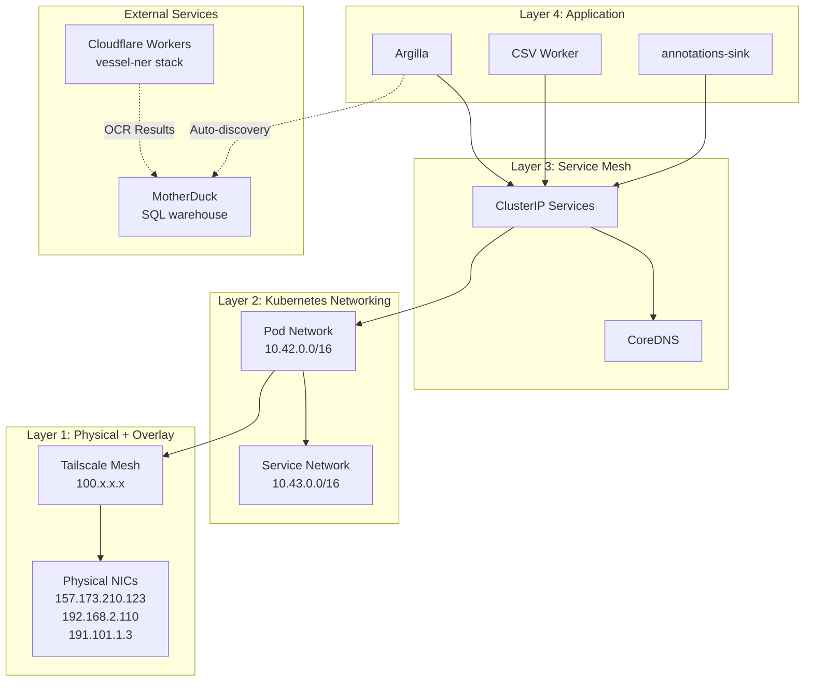
```mermaid
graph TB
    subgraph "Layer 4: Application"
        ARG[Argilla]
        CS[CSV Worker]
        AS[annotations-sink]
    end

    subgraph "Layer 3: Service Mesh"
        SVC[ClusterIP Services]
        DNS[CoreDNS]
    end

    subgraph "Layer 2: Kubernetes Networking"
        POD[Pod Network<br/>10.42.0.0/16]
        CLUS[Service Network<br/>10.43.0.0/16]
    end

    subgraph "Layer 1: Physical + Overlay"
        PHYS[Physical NICs<br/>157.173.210.123<br/>192.168.2.110<br/>191.101.1.3]
        TS[Tailscale Mesh<br/>100.x.x.x]
    end

    subgraph "External Services"
        CF[Cloudflare Workers<br/>vessel-ner stack]
        MD[MotherDuck<br/>SQL warehouse]
    end

    ARG --> SVC
    CS --> SVC
    AS --> SVC
    SVC --> DNS
    SVC --> POD
    POD --> CLUS
    POD --> TS
    TS --> PHYS
    ARG -.Auto-discovery.-> MD
    CF -.OCR Results.-> MD
```

---

## Physical Network Topology

### Node Inventory

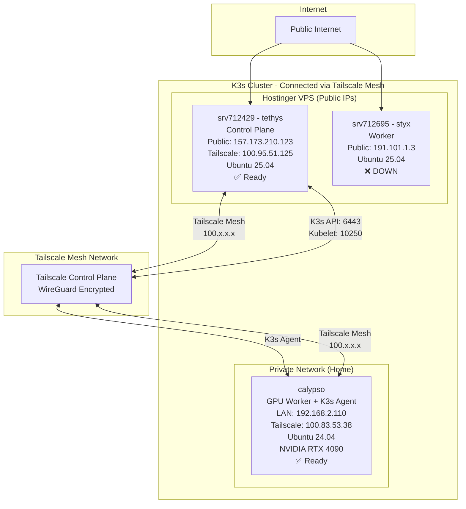
```mermaid
graph TB
    subgraph "Internet"
        INET[Public Internet]
    end

    subgraph "K3s Cluster - Connected via Tailscale Mesh"
        subgraph "Hostinger VPS (Public IPs)"
            TETHYS[srv712429 - tethys<br/>Control Plane<br/>Public: 157.173.210.123<br/>Tailscale: 100.95.51.125<br/>Ubuntu 25.04<br/>✅ Ready]
            STYX[srv712695 - styx<br/>Worker<br/>Public: 191.101.1.3<br/>Ubuntu 25.04<br/>❌ DOWN]
        end

        subgraph "Private Network (Home)"
            CALYPSO[calypso<br/>GPU Worker + K3s Agent<br/>LAN: 192.168.2.110<br/>Tailscale: 100.83.53.38<br/>Ubuntu 24.04<br/>NVIDIA RTX 4090<br/>✅ Ready]
        end
    end

    subgraph "Tailscale Mesh Network"
        TS[Tailscale Control Plane<br/>WireGuard Encrypted]
    end

    INET --> TETHYS
    INET --> STYX
    TETHYS <-->|Tailscale Mesh<br/>100.x.x.x| TS
    CALYPSO <-->|Tailscale Mesh<br/>100.x.x.x| TS
    TS <-->|K3s API: 6443<br/>Kubelet: 10250| TETHYS
    TS <-->|K3s Agent| CALYPSO
```

| Node | Hostname | Role | IP Address | Tailscale IP | Public IP | Status | GPU |
|------|----------|------|------------|--------------|-----------|--------|-----|
| srv712429 | tethys | Control Plane + Master | 157.173.210.123 | 100.95.51.125 | 157.173.210.123 | ✅ Ready | No |
| srv712695 | styx | Worker | 191.101.1.3 | (offline) | 191.101.1.3 | ❌ NotReady | No |
| calypso | calypso | GPU Worker + K3s Agent | 192.168.2.110 | 100.83.53.38 | None (private network) | ✅ Ready | NVIDIA RTX 4090 |

### Network Characteristics

- **Tethys**: Hostinger VPS, full internet connectivity
- **Styx**: Hostinger VPS, full internet connectivity (currently DOWN)
- **Calypso**: Private network, no direct internet access (uses NAT/proxy)

---

## Kubernetes Network Architecture

### CNI: Flannel (VXLAN Mode)

K3s uses **Flannel** as the default CNI plugin in **VXLAN mode**.

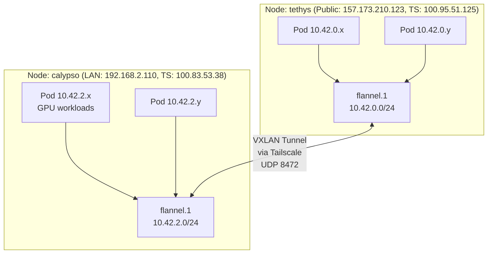
```mermaid
graph TB
    subgraph "Node: tethys (Public: 157.173.210.123, TS: 100.95.51.125)"
        TPOD1[Pod 10.42.0.x]
        TPOD2[Pod 10.42.0.y]
        TFLANNEL[flannel.1<br/>10.42.0.0/24]
    end

    subgraph "Node: calypso (LAN: 192.168.2.110, TS: 100.83.53.38)"
        CPOD1[Pod 10.42.2.x<br/>GPU workloads]
        CPOD2[Pod 10.42.2.y]
        CFLANNEL[flannel.1<br/>10.42.2.0/24]
    end

    TPOD1 --> TFLANNEL
    TPOD2 --> TFLANNEL
    CPOD1 --> CFLANNEL
    CPOD2 --> CFLANNEL

    TFLANNEL <-->|VXLAN Tunnel<br/>via Tailscale<br/>UDP 8472| CFLANNEL
```

### IP Address Ranges

| CIDR | Purpose | Allocated To |
|------|---------|--------------|
| `10.42.0.0/16` | **Pod Network** | K3s Pods (Flannel) |
| `10.42.0.0/24` | Pod subnet (tethys) | Pods on srv712429 |
| `10.42.1.0/24` | Pod subnet (styx) | Pods on srv712695 (down) |
| `10.42.2.0/24` | Pod subnet (calypso) | Pods on calypso |
| `10.43.0.0/16` | **Service Network** | ClusterIP Services |
| `10.43.0.1` | Kubernetes API | kube-apiserver |
| `10.43.0.10` | CoreDNS | DNS resolution |
| `100.64.0.0/10` | **Tailscale CGNAT** | Tailscale mesh IPs |
| `100.95.51.125` | Tailscale (tethys) | Control plane (K3s API via Tailscale) |
| `100.83.53.38` | Tailscale (calypso) | GPU worker node |
| `192.168.2.0/24` | **Home Network** | Calypso LAN segment |

### Service Network Details

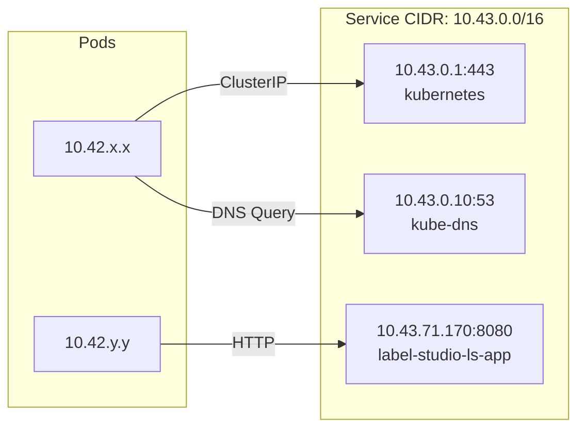
```mermaid
graph LR
    subgraph "Service CIDR: 10.43.0.0/16"
        K8SAPI[10.43.0.1:443<br/>kubernetes]
        COREDNS[10.43.0.10:53<br/>kube-dns]
        LS[10.43.71.170:8080<br/>label-studio-ls-app]
    end

    subgraph "Pods"
        POD1[10.42.x.x]
        POD2[10.42.y.y]
    end

    POD1 -->|ClusterIP| K8SAPI
    POD1 -->|DNS Query| COREDNS
    POD2 -->|HTTP| LS
```

**Key Services**:
- `kubernetes.default.svc.cluster.local` → 10.43.0.1:443 (API Server)
- `kube-dns.kube-system.svc.cluster.local` → 10.43.0.10:53 (CoreDNS)
- `argilla.apps.svc.cluster.local` → Argilla annotation UI (ClusterIP)
- `md-query-proxy.apps.svc.cluster.local` → MotherDuck SQL proxy (ClusterIP)

---

## Tailscale Mesh Network

### Architecture: DaemonSet-Based Deployment

As of 2025-10-13, Tailscale is deployed via **Kubernetes DaemonSets** (not host-level installation).

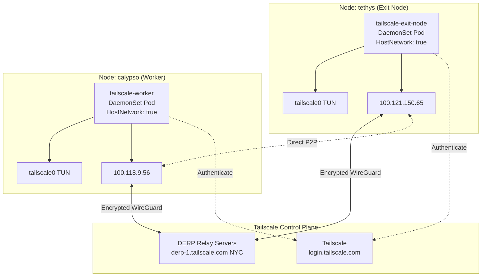
```mermaid
graph TB
    subgraph "Tailscale Control Plane"
        TSCTL[Tailscale<br/>login.tailscale.com]
        DERP[DERP Relay Servers<br/>derp-1.tailscale.com NYC]
    end

    subgraph "Node: tethys (Exit Node)"
        TSPOD1[tailscale-exit-node<br/>DaemonSet Pod<br/>HostNetwork: true]
        TSTUN1[tailscale0 TUN]
        TSIP1[100.121.150.65]
    end

    subgraph "Node: calypso (Worker)"
        TSPOD2[tailscale-worker<br/>DaemonSet Pod<br/>HostNetwork: true]
        TSTUN2[tailscale0 TUN]
        TSIP2[100.118.9.56]
    end

    TSPOD1 --> TSTUN1
    TSPOD1 --> TSIP1
    TSPOD2 --> TSTUN2
    TSPOD2 --> TSIP2

    TSIP1 <-->|Encrypted WireGuard| DERP
    TSIP2 <-->|Encrypted WireGuard| DERP
    TSIP1 <-.Direct P2P.-> TSIP2

    TSPOD1 -.Authenticate.-> TSCTL
    TSPOD2 -.Authenticate.-> TSCTL
```

### Tailscale Network Topology

| Node | Tailscale Hostname | Tailscale IP | K3s Role | Installation Method |
|------|--------------------|--------------|----------|---------------------|
| tethys | srv712429-oceanid | 100.95.51.125 | Control Plane | Host-level (systemd) |
| calypso | calypso | 100.83.53.38 | GPU Worker + K3s Agent | Host-level (systemd) |
| styx | srv712695-styx | (offline) | Worker (down) | Not installed |

**Key Architecture Notes**:
- Tailscale installed as **host-level services** (not DaemonSets) for reliable K3s agent communication
- Calypso joined cluster via `k3s-agent` connecting to tethys at Tailscale IP `100.95.51.125:6443`
- All nodes authenticate to same Tailnet: `goldfish-inc.ts.net`
- No exit node routing active (each node uses direct egress)

### Exit Node Architecture (Unified Egress)

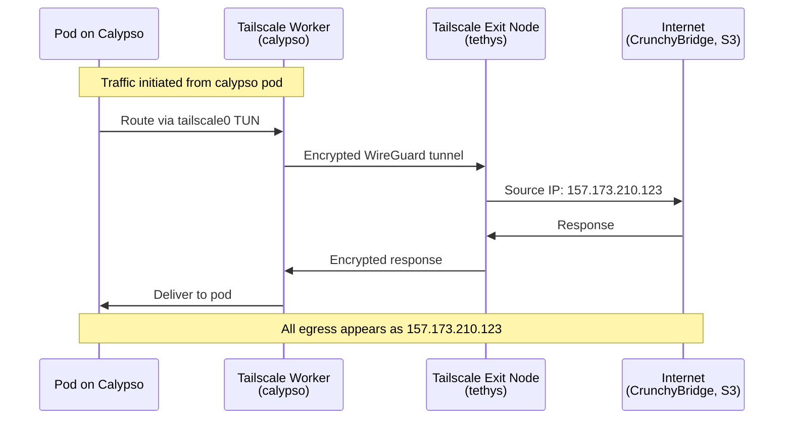
```mermaid
sequenceDiagram
    participant CalypsoPod as Pod on Calypso
    participant TailscaleWorker as Tailscale Worker<br/>(calypso)
    participant TailscaleExit as Tailscale Exit Node<br/>(tethys)
    participant Internet as Internet<br/>(CrunchyBridge, S3)

    Note over CalypsoPod,TailscaleWorker: Traffic initiated from calypso pod
    CalypsoPod->>TailscaleWorker: Route via tailscale0 TUN
    TailscaleWorker->>TailscaleExit: Encrypted WireGuard tunnel
    TailscaleExit->>Internet: Source IP: 157.173.210.123
    Internet->>TailscaleExit: Response
    TailscaleExit->>TailscaleWorker: Encrypted response
    TailscaleWorker->>CalypsoPod: Deliver to pod

    Note over CalypsoPod,Internet: All egress appears as 157.173.210.123
```

**Benefits**:
- ✅ **Unified Egress IP**: All cluster traffic appears as `157.173.210.123`
- ✅ **Single Firewall Entry**: CrunchyBridge allowlist only needs one IP
- ✅ **Private Node Support**: Calypso (no public IP) can reach external services
- ✅ **Encrypted Transit**: WireGuard encryption for inter-node traffic

**Status**:
- ✅ **Exit node ACTIVE AND VERIFIED** (as of 2025-10-13)
- Workers authenticated and routing through exit node
- Unified egress IP confirmed: 157.173.210.123
- See [TAILSCALE_DAEMONSET_SUCCESS.md](../../TAILSCALE_DAEMONSET_SUCCESS.md) for implementation details

### Tailscale ACL Policy

Managed in `policy.hujson` and synced via GitHub Actions:

```hujson
{
  "tagOwners": {
    "tag:k8s": ["autogroup:admin"],
    "tag:k8s-operator": ["autogroup:admin"]
  },
  "grants": [
    // K8s devices can access everything (for database, S3)
    {"src": ["tag:k8s"], "dst": ["*"], "ip": ["*"]},
    // Members can access K8s services (Label Studio UI)
    {"src": ["autogroup:member"], "dst": ["tag:k8s"], "ip": ["*"]}
  ]
}
```

---

## DeepSeek-OCR vLLM Integration

### Architecture: Host-Level GPU Service

DeepSeek-OCR via vLLM runs as a **systemd service** on DGX Spark (192.168.2.119), providing GPU-accelerated OCR processing.

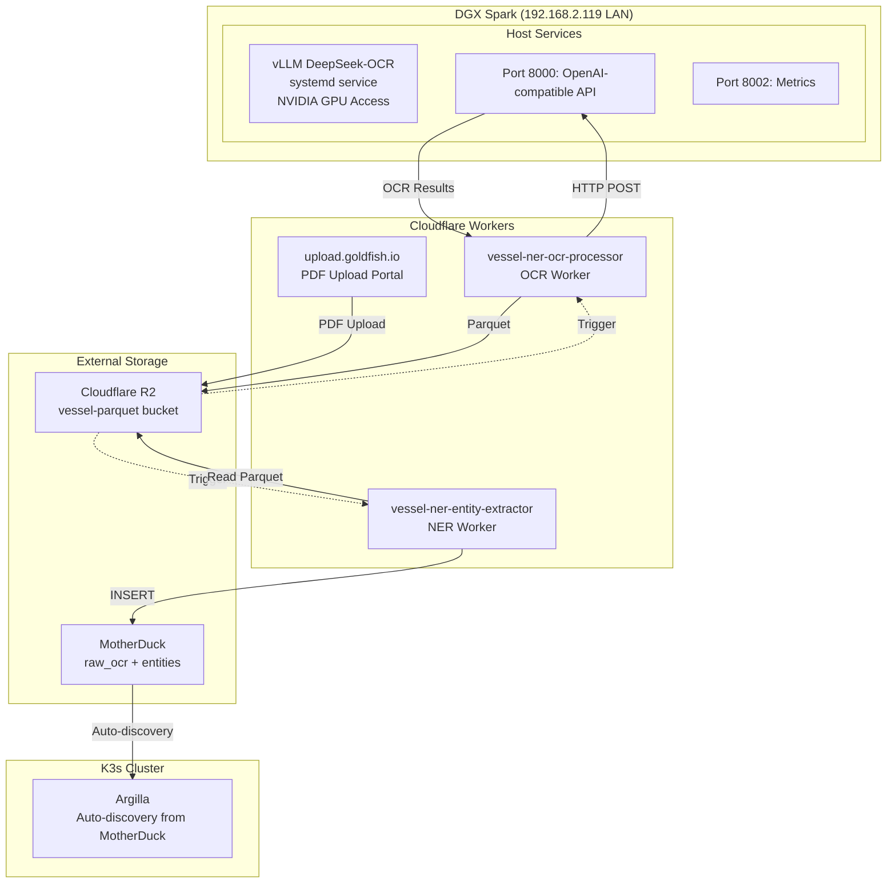
```mermaid
graph TB
    subgraph "DGX Spark (192.168.2.119 LAN)"
        subgraph "Host Services"
            VLLM[vLLM DeepSeek-OCR<br/>systemd service<br/>NVIDIA GPU Access]
            VLLM_HTTP[Port 8000: OpenAI-compatible API]
            VLLM_METRICS[Port 8002: Metrics]
        end
    end

    subgraph "Cloudflare Workers"
        UPLOAD[upload.goldfish.io<br/>PDF Upload Portal]
        OCR[vessel-ner-ocr-processor<br/>OCR Worker]
        ENTITY[vessel-ner-entity-extractor<br/>NER Worker]
    end

    subgraph "External Storage"
        R2[Cloudflare R2<br/>vessel-parquet bucket]
        MD[MotherDuck<br/>raw_ocr + entities]
    end

    subgraph "K3s Cluster"
        ARGILLA[Argilla<br/>Auto-discovery from MotherDuck]
    end

    UPLOAD -->|PDF Upload| R2
    R2 -.Trigger.-> OCR
    OCR -->|HTTP POST| VLLM_HTTP
    VLLM_HTTP -->|OCR Results| OCR
    OCR -->|Parquet| R2
    R2 -.Trigger.-> ENTITY
    ENTITY -->|Read Parquet| R2
    ENTITY -->|INSERT| MD
    MD -->|Auto-discovery| ARGILLA
```

### Service Details

**vLLM DeepSeek-OCR Configuration**:
- **Host**: DGX Spark (192.168.2.119 LAN)
- **Ports**:
  - `8000/tcp` - OpenAI-compatible API (HTTP)
  - `8002/tcp` - Prometheus metrics endpoint
- **Model**: `deepseek-ai/DeepSeek-OCR` (vision-language model)
- **GPU**: NVIDIA H100 (80GB VRAM)
- **Management**: systemd service (`deepseek-ocr-vllm.service`)
- **Access**: Cloudflare Workers via private LAN

### Access Patterns

**Pattern 1: Cloudflare Workers → vLLM (Primary)**
```typescript
// vessel-ner-ocr-processor Worker
const response = await fetch('http://192.168.2.119:8000/v1/chat/completions', {
  method: 'POST',
  headers: { 'Content-Type': 'application/json' },
  body: JSON.stringify({
    model: 'deepseek-ai/DeepSeek-OCR',
    messages: [{
      role: 'user',
      content: [
        { type: 'text', text: '<|grounding|>Convert the document to markdown.' },
        { type: 'image_url', image_url: { url: pdfUrl } }
      ]
    }],
    max_tokens: 4096,
    temperature: 0
  })
});
```

**Pattern 2: Direct Access (Development/Testing)**
```bash
# From workstation with access to 192.168.2.119
curl -X POST http://192.168.2.119:8000/v1/chat/completions \
  -H "Content-Type: application/json" \
  -d '{
    "model": "deepseek-ai/DeepSeek-OCR",
    "messages": [{"role": "user", "content": "..."}],
    "max_tokens": 4096
  }'
```

**Pattern 3: K8s Pod Access (Future)**
```yaml
apiVersion: v1
kind: Pod
metadata:
  name: ocr-client
spec:
  containers:
  - name: client
    image: ocr-client:latest
    env:
    - name: VLLM_URL
      value: "http://192.168.2.119:8000"  # DGX Spark LAN IP
```

### Why Host-Level Deployment?

**Advantages**:
- ✅ Direct H100 GPU access (no container runtime overhead)
- ✅ Simplified CUDA/driver management
- ✅ Persistent model cache (17GB DeepSeek-OCR model)
- ✅ Independent of K8s lifecycle
- ✅ Cloudflare Workers can access via private LAN (no cluster dependency)

**Trade-offs**:
- ⚠️ Manual systemd management (not GitOps-managed)
- ⚠️ Single-node deployment (no HA)
- ⚠️ Requires network reachability from Workers (private LAN)

---

## Ingress & Egress Patterns

### Ingress: Multiple Entry Points

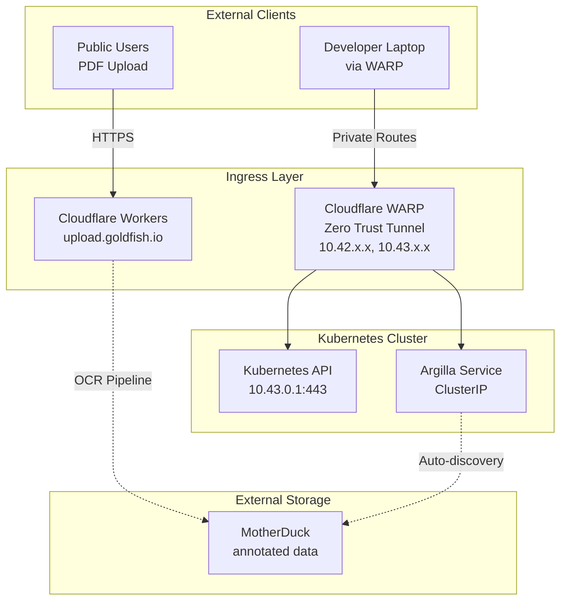
```mermaid
graph TB
    subgraph "External Clients"
        DEV[Developer Laptop<br/>via WARP]
        PUBLIC[Public Users<br/>PDF Upload]
    end

    subgraph "Ingress Layer"
        WARP[Cloudflare WARP<br/>Zero Trust Tunnel<br/>10.42.x.x, 10.43.x.x]
        CFWORKER[Cloudflare Workers<br/>upload.goldfish.io]
    end

    subgraph "Kubernetes Cluster"
        K8SAPI[Kubernetes API<br/>10.43.0.1:443]
        ARGSVC[Argilla Service<br/>ClusterIP]
    end

    subgraph "External Storage"
        MD[MotherDuck<br/>annotated data]
    end

    DEV -->|Private Routes| WARP
    PUBLIC -->|HTTPS| CFWORKER
    WARP --> K8SAPI
    WARP --> ARGSVC
    CFWORKER -.OCR Pipeline.-> MD
    ARGSVC -.Auto-discovery.-> MD
```

#### 1. Cloudflare WARP (Developer Access)

**Purpose**: Secure private network access for developers to reach cluster services.

**How it works**:
- Developer workstation connects to Cloudflare WARP client
- WARP client enrolled in `goldfishinc` Zero Trust organization
- Split tunnel policy routes cluster CIDRs through WARP:
  - `10.42.0.0/16` (Pod Network)
  - `10.43.0.0/16` (Service Network)
  - `192.168.2.0/24` (Private network - calypso)

**Configuration**:
- Organization: `goldfishinc.cloudflareaccess.com`
- Mode: Gateway with WARP (Layer 4 routing, not TLS termination)
- Authentication: Zero Trust device enrollment

**Usage**:
```bash
# Connect to WARP
warp-cli connect

# Access Kubernetes API directly
export KUBECONFIG=~/.kube/k3s-warp.yaml
kubectl get nodes  # Routes to 10.43.0.1 via WARP

# Access Argilla (no public tunnel needed)
curl http://argilla.apps.svc.cluster.local/api/health
```

**Advantages**:
- ✅ No SSH tunnels required
- ✅ Client certificates work end-to-end
- ✅ Automatic reconnection
- ✅ Works from any network (cafe, home, office)

#### 2. Cloudflare Workers (OCR Pipeline)

**Purpose**: Process PDF uploads → OCR → Entity Extraction → MotherDuck storage.

**How it works**:
- User uploads PDF to `upload.goldfish.io` (Cloudflare Worker)
- Worker stores PDF in R2 bucket (`vessel-parquet`)
- R2 event triggers `vessel-ner-ocr-processor` Worker
- OCR Worker calls DeepSeek-OCR vLLM (192.168.2.119:8000) via private LAN
- Results stored as Parquet in R2
- R2 event triggers `vessel-ner-entity-extractor` Worker
- Entity Worker reads Parquet, extracts entities, writes to MotherDuck

**Architecture**:
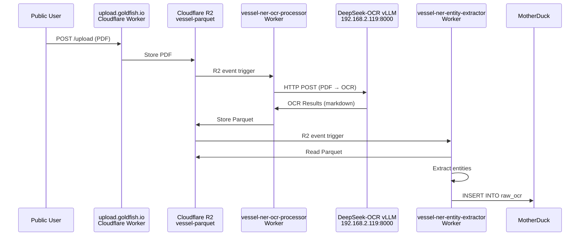
```mermaid
sequenceDiagram
    participant User as Public User
    participant Upload as upload.goldfish.io<br/>Cloudflare Worker
    participant R2 as Cloudflare R2<br/>vessel-parquet
    participant OCR as vessel-ner-ocr-processor<br/>Worker
    participant VLLM as DeepSeek-OCR vLLM<br/>192.168.2.119:8000
    participant Entity as vessel-ner-entity-extractor<br/>Worker
    participant MD as MotherDuck

    User->>Upload: POST /upload (PDF)
    Upload->>R2: Store PDF
    R2->>OCR: R2 event trigger
    OCR->>VLLM: HTTP POST (PDF → OCR)
    VLLM->>OCR: OCR Results (markdown)
    OCR->>R2: Store Parquet
    R2->>Entity: R2 event trigger
    Entity->>R2: Read Parquet
    Entity->>Entity: Extract entities
    Entity->>MD: INSERT INTO raw_ocr
```

**Configuration**:
- Upload portal: `upload.goldfish.io`
- R2 bucket: `vessel-parquet`
- vLLM endpoint: `http://192.168.2.119:8000` (private LAN)
- MotherDuck: `md.raw_ocr` table

**Advantages**:
- ✅ Serverless autoscaling
- ✅ Global edge deployment
- ✅ Event-driven architecture
- ✅ Direct GPU access via private LAN

### Egress: Unified Exit Node

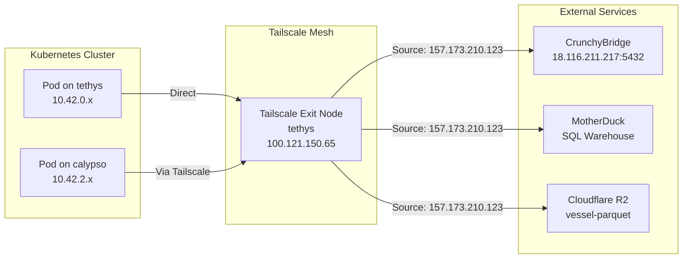
```mermaid
graph LR
    subgraph "Kubernetes Cluster"
        POD1[Pod on tethys<br/>10.42.0.x]
        POD2[Pod on calypso<br/>10.42.2.x]
    end

    subgraph "Tailscale Mesh"
        TSEXIT[Tailscale Exit Node<br/>tethys<br/>100.121.150.65]
    end

    subgraph "External Services"
        CB[CrunchyBridge<br/>18.116.211.217:5432]
        MD[MotherDuck<br/>SQL Warehouse]
        R2[Cloudflare R2<br/>vessel-parquet]
    end

    POD1 -->|Direct| TSEXIT
    POD2 -->|Via Tailscale| TSEXIT
    TSEXIT -->|Source: 157.173.210.123| CB
    TSEXIT -->|Source: 157.173.210.123| MD
    TSEXIT -->|Source: 157.173.210.123| R2
```

**Status**: ✅ **Exit node routing ACTIVE AND VERIFIED** (as of 2025-10-13)

**How it works**:
- All pods route external traffic via Tailscale exit node on tethys
- External services see source IP: `157.173.210.123`
- CrunchyBridge firewall needs only one allowlist entry

---

## Service Mesh & Internal Routing

### CoreDNS Resolution

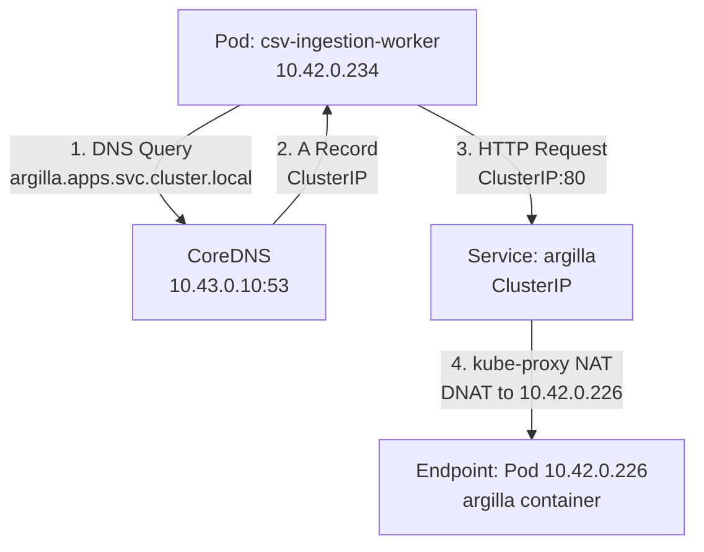
```mermaid
graph TB
    POD[Pod: csv-ingestion-worker<br/>10.42.0.234]
    COREDNS[CoreDNS<br/>10.43.0.10:53]
    SVCIP[Service: argilla<br/>ClusterIP]
    ENDPOINT[Endpoint: Pod 10.42.0.226<br/>argilla container]

    POD -->|1. DNS Query<br/>argilla.apps.svc.cluster.local| COREDNS
    COREDNS -->|2. A Record<br/>ClusterIP| POD
    POD -->|3. HTTP Request<br/>ClusterIP:80| SVCIP
    SVCIP -->|4. kube-proxy NAT<br/>DNAT to 10.42.0.226| ENDPOINT
```

### Service Discovery Patterns

**Fully Qualified Domain Name (FQDN)**:
```
<service>.<namespace>.svc.cluster.local
```

Examples:
- `argilla.apps.svc.cluster.local` → Argilla service
- `md-query-proxy.apps.svc.cluster.local` → MotherDuck proxy
- `kubernetes.default.svc.cluster.local` → Kubernetes API
- `kube-dns.kube-system.svc.cluster.local` → CoreDNS

**Short Names** (within same namespace):
```
<service>
```

Example from `apps` namespace:
- `argilla` → Resolves to Argilla in same namespace
- `md-query-proxy` → Resolves to MotherDuck proxy in same namespace

### Service Types

| Type | Purpose | Example | IP Allocation |
|------|---------|---------|---------------|
| ClusterIP | Internal cluster services | argilla, md-query-proxy | 10.43.x.x |
| NodePort | Expose on node IP:port | (not used) | N/A |
| LoadBalancer | Cloud LB integration | (not used) | N/A |
| ExternalName | CNAME to external DNS | (not used) | N/A |

**Note**: We use **ClusterIP** exclusively, with ingress via Cloudflare WARP for developer access.

---

## Security Zones & Firewall Rules

### Network Security Model

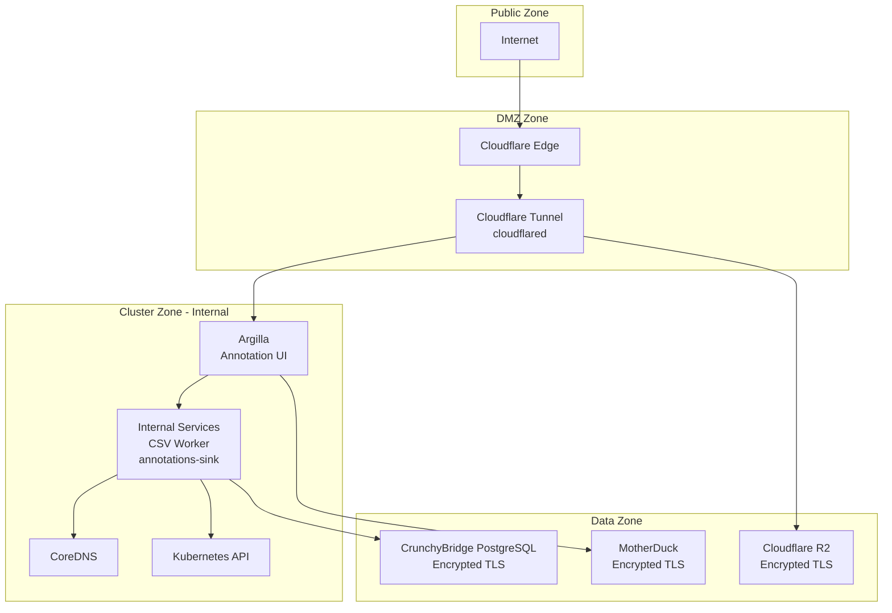
```mermaid
graph TB
    subgraph "Public Zone"
        INTERNET[Internet]
    end

    subgraph "DMZ Zone"
        CFEDGE[Cloudflare Edge]
        CFTUN[Cloudflare Tunnel<br/>cloudflared]
    end

    subgraph "Cluster Zone - Internal"
        ARGILLA[Argilla<br/>Annotation UI]
        INTERNALPODS[Internal Services<br/>CSV Worker<br/>annotations-sink]
        COREDNS[CoreDNS]
        K8SAPI[Kubernetes API]
    end

    subgraph "Data Zone"
        CB[CrunchyBridge PostgreSQL<br/>Encrypted TLS]
        MD[MotherDuck<br/>Encrypted TLS]
        R2[Cloudflare R2<br/>Encrypted TLS]
    end

    INTERNET --> CFEDGE
    CFEDGE --> CFTUN
    CFTUN --> ARGILLA
    ARGILLA --> INTERNALPODS
    INTERNALPODS --> COREDNS
    INTERNALPODS --> K8SAPI
    INTERNALPODS --> CB
    ARGILLA --> MD
    CFTUN --> R2
```

### CrunchyBridge Firewall

**Network**: `ebisu-network` (ID: `ooer7tenangenjelkxbkgz6sdi`)

**Current Allowlist** (as of 2025-10-13):
| CIDR | Description | Justification |
|------|-------------|---------------|
| `157.173.210.123/32` | Unified K8s egress via Tailscale (tethys) | Exit node public IP |

**Pending Removal** (once exit node active):
| CIDR | Description | Reason for Removal |
|------|-------------|-------------------|
| `191.101.1.3/32` | Legacy styx direct egress | Node down, replaced by unified egress |
| `192.168.2.80/32` | Legacy calypso direct egress | Replaced by unified egress |

**Database Endpoint**:
- Host: `p.3x4xvkn3xza2zjwiklcuonpamy.db.postgresbridge.com`
- Port: `5432`
- TLS: Required (`sslmode=require`)

### Kubernetes Network Policies

**Status**: ⚠️ **NOT YET IMPLEMENTED**

**Recommended Policies** (future enhancement):

1. **Deny all ingress by default** (namespace-scoped)
2. **Allow CoreDNS** from all pods
3. **Allow Label Studio → PostgreSQL** only
4. **Deny pod-to-pod** across namespaces (except explicitly allowed)

Example policy (not yet deployed):
```yaml
apiVersion: networking.k8s.io/v1
kind: NetworkPolicy
metadata:
  name: deny-all-ingress
  namespace: apps
spec:
  podSelector: {}
  policyTypes:
    - Ingress
```

---

## DNS Resolution

### Resolution Flow

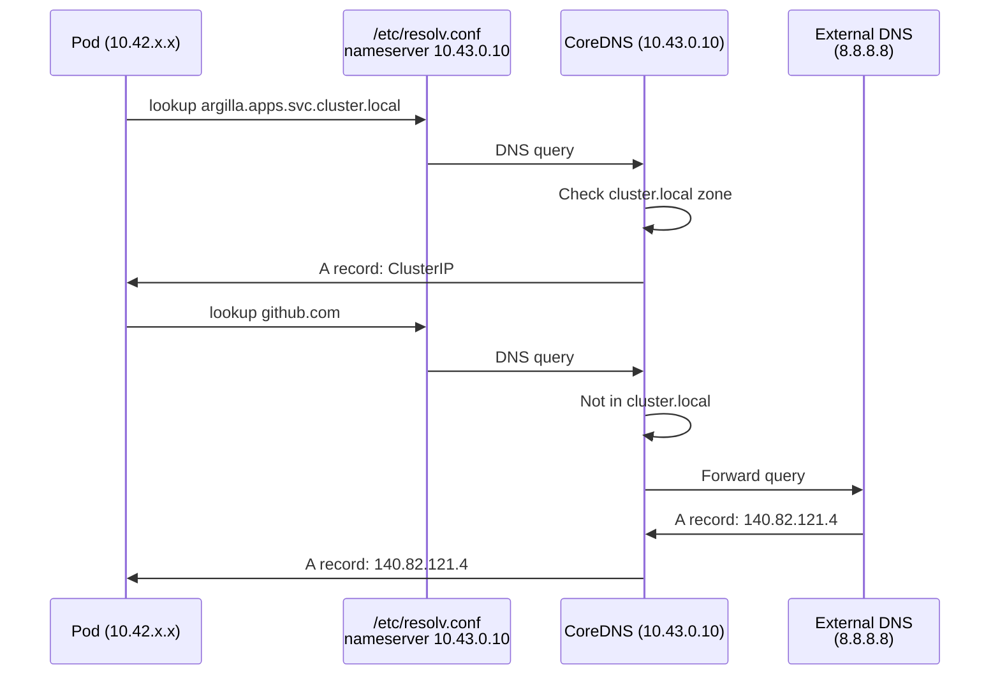
```mermaid
sequenceDiagram
    participant Pod as Pod (10.42.x.x)
    participant Resolver as /etc/resolv.conf<br/>nameserver 10.43.0.10
    participant CoreDNS as CoreDNS (10.43.0.10)
    participant External as External DNS<br/>(8.8.8.8)

    Pod->>Resolver: lookup argilla.apps.svc.cluster.local
    Resolver->>CoreDNS: DNS query
    CoreDNS->>CoreDNS: Check cluster.local zone
    CoreDNS->>Pod: A record: ClusterIP

    Pod->>Resolver: lookup github.com
    Resolver->>CoreDNS: DNS query
    CoreDNS->>CoreDNS: Not in cluster.local
    CoreDNS->>External: Forward query
    External->>CoreDNS: A record: 140.82.121.4
    CoreDNS->>Pod: A record: 140.82.121.4
```

### CoreDNS Configuration

**Corefile** (default K3s config):
```
.:53 {
    errors
    health {
        lameduck 5s
    }
    ready
    kubernetes cluster.local in-addr.arpa ip6.arpa {
        pods insecure
        fallthrough in-addr.arpa ip6.arpa
        ttl 30
    }
    prometheus :9153
    forward . /etc/resolv.conf
    cache 30
    loop
    reload
    loadbalance
}
```

**Key Features**:
- Serves `.cluster.local` zone from Kubernetes API
- Forwards external queries to upstream (8.8.8.8, 8.8.4.4)
- Cache TTL: 30 seconds
- Health checks on `:8080/health`

### DNS Search Domains

Pods in `apps` namespace have the following search domains:
```
search apps.svc.cluster.local svc.cluster.local cluster.local
```

**Resolution order**:
1. `argilla` → tries `argilla.apps.svc.cluster.local` ✅
2. `argilla` → tries `argilla.svc.cluster.local`
3. `argilla` → tries `argilla.cluster.local`
4. `argilla` → tries external DNS

---

## Network Troubleshooting

### Common Issues & Diagnostics

#### Issue 1: "network is unreachable" from pods

**Symptoms**:
```
dial tcp 10.43.x.x:80: connect: network is unreachable
```

**Possible Causes**:
1. Flannel VXLAN tunnel down between nodes
2. Node routing table corrupted
3. IP forwarding disabled on node

**Diagnostics**:
```bash
# Check Flannel on node
ip addr show flannel.1
ip route | grep 10.42

# Check IP forwarding
sysctl net.ipv4.ip_forward
sysctl net.ipv6.conf.all.forwarding

# Check VXLAN tunnel
ip -d link show flannel.1

# Test connectivity between nodes
kubectl run nettest --rm -i --image=nicolaka/netshoot -- ping 10.42.0.1
```

**Fix**:
```bash
# Restart Flannel (K3s)
systemctl restart k3s  # Control plane
systemctl restart k3s-agent  # Worker nodes
```

#### Issue 2: DNS resolution failing

**Symptoms**:
```
dial tcp: lookup argilla on 10.43.0.10:53: no such host
```

**Diagnostics**:
```bash
# Check CoreDNS pods
kubectl get pods -n kube-system -l k8s-app=kube-dns

# Test DNS from pod
kubectl run dnstest --rm -i --image=busybox -- nslookup kubernetes.default

# Check CoreDNS logs
kubectl logs -n kube-system -l k8s-app=kube-dns
```

**Fix**:
```bash
# Restart CoreDNS
kubectl rollout restart deployment/coredns -n kube-system
```

#### Issue 3: Service not routing to pods

**Symptoms**:
- Service exists but connection refused
- Endpoint list is empty

**Diagnostics**:
```bash
# Check service
kubectl get svc argilla -n apps

# Check endpoints (backing pods)
kubectl get endpoints argilla -n apps

# Verify pod selector matches
kubectl get svc argilla -n apps -o yaml | grep selector
kubectl get pods -n apps -l app.kubernetes.io/name=argilla
```

**Fix**:
- Ensure pod labels match service selector
- Check pod readiness probes passing

#### Issue 4: Tailscale exit node not routing

**Symptoms**:
- Pods show non-unified egress IP
- Database connections failing despite unified IP in allowlist

**Diagnostics**:
```bash
# Check Tailscale status
kubectl -n tailscale-system exec tailscale-exit-node-xxx -- tailscale status

# Verify exit node advertising
kubectl -n tailscale-system logs tailscale-exit-node-xxx | grep "exit-node"

# Test egress from specific node
kubectl run egress-test --rm -i --image=curlimages/curl:latest \
  --overrides='{"spec":{"nodeSelector":{"kubernetes.io/hostname":"calypso"}}}' \
  -- curl -s https://ipinfo.io/ip
```

**Fix**:
- See [AUDIT_REPORT_TAILSCALE_DAEMONSET.md](../../AUDIT_REPORT_TAILSCALE_DAEMONSET.md) for activation checklist

### Network Debugging Tools

**Install netshoot pod**:
```bash
kubectl run netshoot --rm -i --image=nicolaka/netshoot -- /bin/bash
```

**Available tools in netshoot**:
- `curl`, `wget` - HTTP testing
- `nslookup`, `dig` - DNS debugging
- `ping`, `traceroute` - ICMP testing
- `nc` (netcat) - Port scanning
- `tcpdump` - Packet capture
- `iperf3` - Bandwidth testing

**Example diagnostics**:
```bash
# Test service connectivity
kubectl run netshoot --rm -i --image=nicolaka/netshoot -- \
  curl -v http://argilla.apps.svc.cluster.local/api/health

# Test DNS resolution
kubectl run netshoot --rm -i --image=nicolaka/netshoot -- \
  nslookup argilla.apps.svc.cluster.local

# Test database connectivity
kubectl run netshoot --rm -i --image=nicolaka/netshoot -- \
  nc -zv p.3x4xvkn3xza2zjwiklcuonpamy.db.postgresbridge.com 5432

# Test MotherDuck connectivity
kubectl run netshoot --rm -i --image=nicolaka/netshoot -- \
  curl -v http://md-query-proxy.apps.svc.cluster.local:8080/health
```

---

## Appendix: Network Flow Examples

### Example 1: Developer kubectl Command

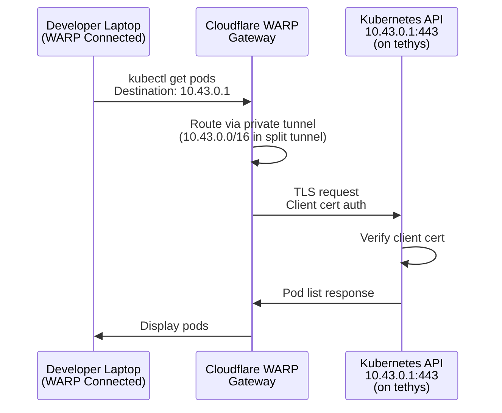
```mermaid
sequenceDiagram
    participant Dev as Developer Laptop<br/>(WARP Connected)
    participant WARP as Cloudflare WARP<br/>Gateway
    participant K8SAPI as Kubernetes API<br/>10.43.0.1:443<br/>(on tethys)

    Dev->>WARP: kubectl get pods<br/>Destination: 10.43.0.1
    WARP->>WARP: Route via private tunnel<br/>(10.43.0.0/16 in split tunnel)
    WARP->>K8SAPI: TLS request<br/>Client cert auth
    K8SAPI->>K8SAPI: Verify client cert
    K8SAPI->>WARP: Pod list response
    WARP->>Dev: Display pods
```

### Example 2: Argilla MotherDuck Query

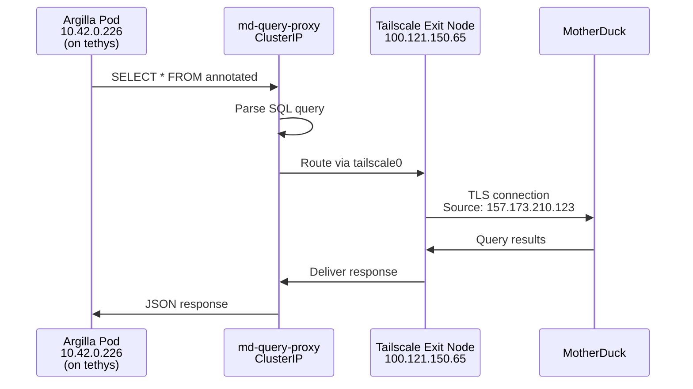
```mermaid
sequenceDiagram
    participant ARG as Argilla Pod<br/>10.42.0.226<br/>(on tethys)
    participant PROXY as md-query-proxy<br/>ClusterIP
    participant TSEXIT as Tailscale Exit Node<br/>100.121.150.65
    participant MD as MotherDuck

    ARG->>PROXY: SELECT * FROM annotated
    PROXY->>PROXY: Parse SQL query
    PROXY->>TSEXIT: Route via tailscale0
    TSEXIT->>MD: TLS connection<br/>Source: 157.173.210.123
    MD->>TSEXIT: Query results
    TSEXIT->>PROXY: Deliver response
    PROXY->>ARG: JSON response
```

### Example 3: PDF Upload → OCR → Argilla

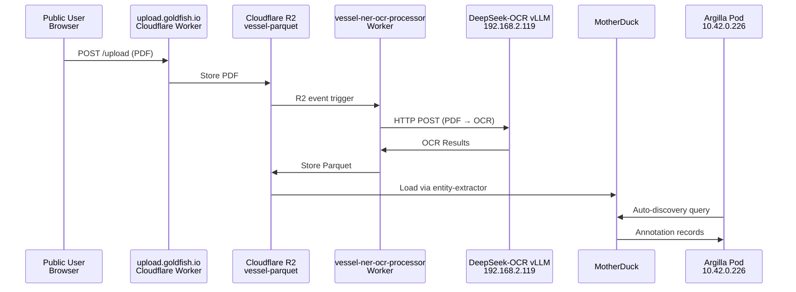
```mermaid
sequenceDiagram
    participant User as Public User<br/>Browser
    participant Upload as upload.goldfish.io<br/>Cloudflare Worker
    participant R2 as Cloudflare R2<br/>vessel-parquet
    participant OCR as vessel-ner-ocr-processor<br/>Worker
    participant VLLM as DeepSeek-OCR vLLM<br/>192.168.2.119
    participant MD as MotherDuck
    participant ARG as Argilla Pod<br/>10.42.0.226

    User->>Upload: POST /upload (PDF)
    Upload->>R2: Store PDF
    R2->>OCR: R2 event trigger
    OCR->>VLLM: HTTP POST (PDF → OCR)
    VLLM->>OCR: OCR Results
    OCR->>R2: Store Parquet
    R2->>MD: Load via entity-extractor
    ARG->>MD: Auto-discovery query
    MD->>ARG: Annotation records
```

---

## References

- [TAILSCALE_DAEMONSET_SUCCESS.md](../../TAILSCALE_DAEMONSET_SUCCESS.md) - Tailscale implementation details
- [AUDIT_REPORT_TAILSCALE_DAEMONSET.md](../../AUDIT_REPORT_TAILSCALE_DAEMONSET.md) - Network security audit
- [K3s Networking](https://docs.k3s.io/networking) - Flannel configuration
- [Tailscale Kubernetes](https://tailscale.com/kb/1236/kubernetes-operator/) - Mesh networking

---

**Document Status**: ✅ Production Deployed (Argilla + vessel-ner Workers)
**Last Verified**: 2025-11-11
**Next Review**: After DGX Spark vLLM production deployment
