# Oceanid Network Architecture

**Last Updated**: 2025-10-13
**Status**: Production Deployed
**K3s Version**: v1.33.4+k3s1

---

## Table of Contents

1. [Overview](#overview)
2. [Physical Network Topology](#physical-network-topology)
3. [Kubernetes Network Architecture](#kubernetes-network-architecture)
4. [Tailscale Mesh Network](#tailscale-mesh-network)
5. [Ingress & Egress Patterns](#ingress--egress-patterns)
6. [Service Mesh & Internal Routing](#service-mesh--internal-routing)
7. [Security Zones & Firewall Rules](#security-zones--firewall-rules)
8. [DNS Resolution](#dns-resolution)
9. [Network Troubleshooting](#network-troubleshooting)

---

## Overview

The Oceanid infrastructure uses a **multi-layered network architecture** combining:

- **K3s Kubernetes** (v1.33.4) with Flannel CNI
- **Tailscale mesh network** for unified egress and secure inter-node communication
- **Cloudflare WARP** for secure cluster access from developer workstations
- **Cloudflare Tunnel** for public ingress to services
- **CrunchyBridge PostgreSQL** with IP allowlist firewall

### Network Layers

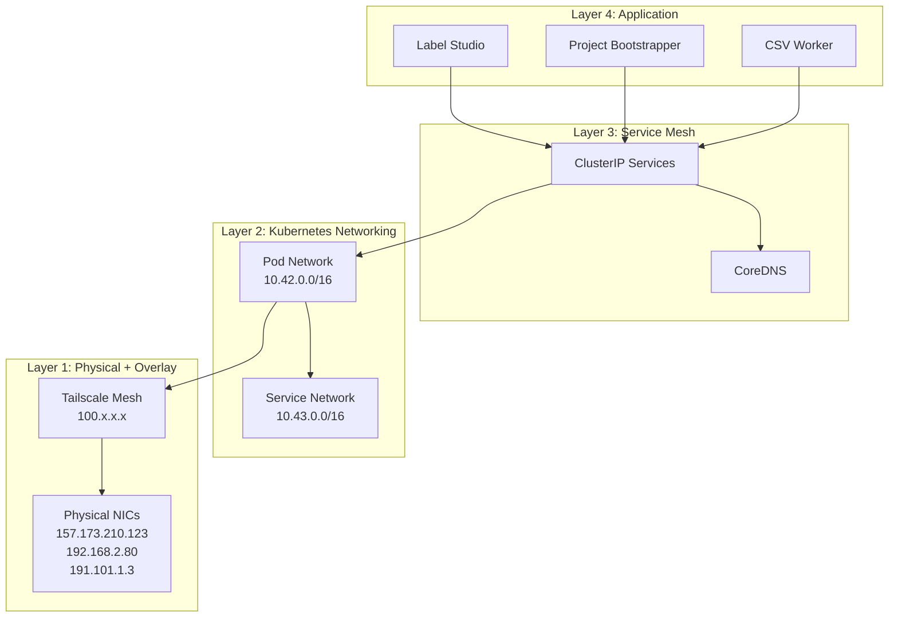

---

## Physical Network Topology

### Node Inventory

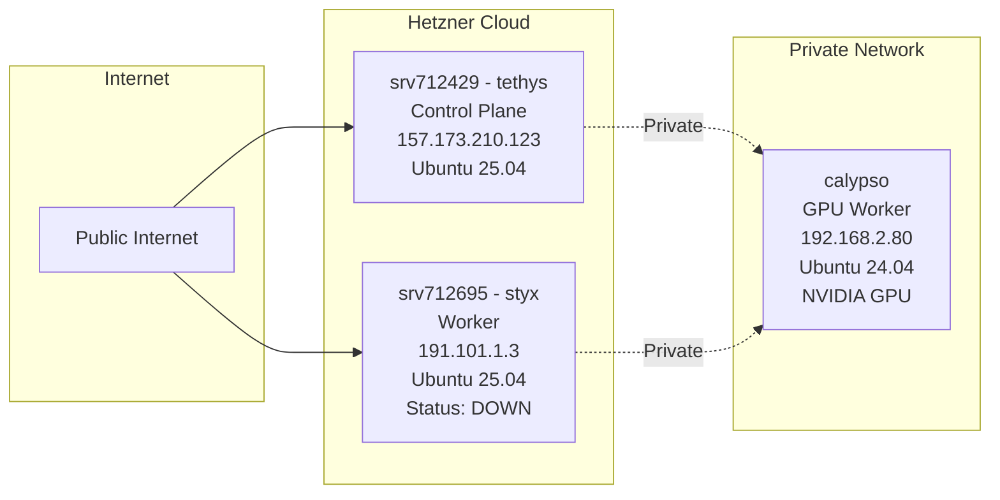

| Node | Hostname | Role | IP Address | Public IP | Status | GPU |
|------|----------|------|------------|-----------|--------|-----|
| srv712429 | tethys | Control Plane + Master | 157.173.210.123 | 157.173.210.123 | ✅ Ready | No |
| srv712695 | styx | Worker | 191.101.1.3 | 191.101.1.3 | ❌ NotReady | No |
| calypso | calypso | GPU Worker | 192.168.2.80 | None (private) | ✅ Ready | NVIDIA T600 |

### Network Characteristics

- **Tethys**: Hetzner Cloud VPS, full internet connectivity
- **Styx**: Hetzner Cloud VPS, full internet connectivity (currently DOWN)
- **Calypso**: Private network, no direct internet access (uses NAT/proxy)

---

## Kubernetes Network Architecture

### CNI: Flannel (VXLAN Mode)

K3s uses **Flannel** as the default CNI plugin in **VXLAN mode**.

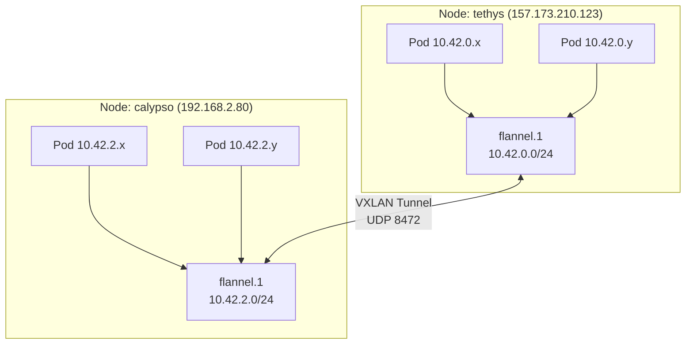

### IP Address Ranges

| CIDR | Purpose | Allocated To |
|------|---------|--------------|
| `10.42.0.0/16` | **Pod Network** | K3s Pods (Flannel) |
| `10.42.0.0/24` | Pod subnet (tethys) | Pods on srv712429 |
| `10.42.1.0/24` | Pod subnet (styx) | Pods on srv712695 (down) |
| `10.42.2.0/24` | Pod subnet (calypso) | Pods on calypso |
| `10.43.0.0/16` | **Service Network** | ClusterIP Services |
| `10.43.0.1` | Kubernetes API | kube-apiserver |
| `10.43.0.10` | CoreDNS | DNS resolution |
| `100.64.0.0/10` | **Tailscale CGNAT** | Tailscale mesh IPs |
| `100.121.150.65` | Tailscale (tethys) | Exit node |
| `100.118.9.56` | Tailscale (calypso) | Worker node |

### Service Network Details

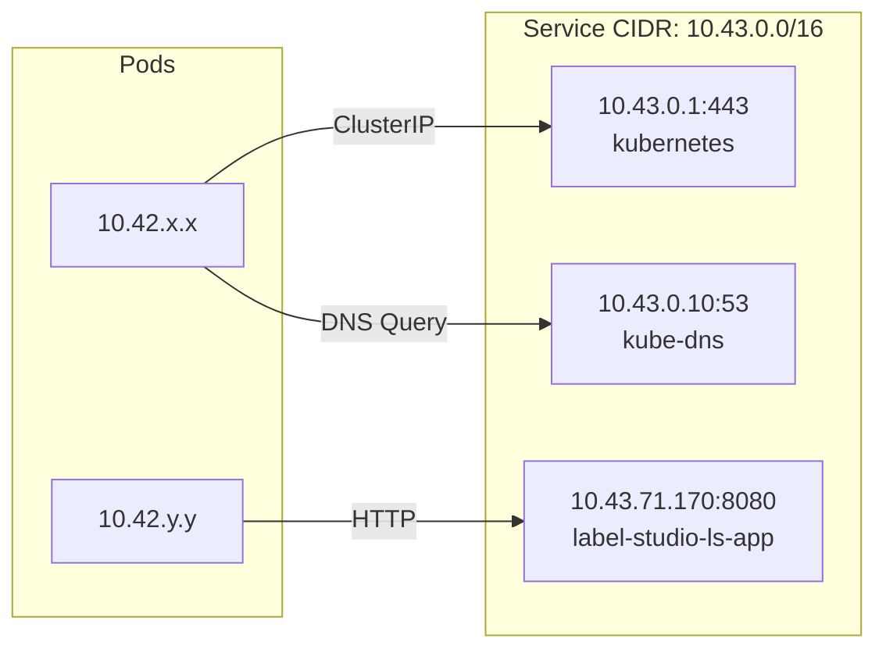

**Key Services**:
- `kubernetes.default.svc.cluster.local` → 10.43.0.1:443 (API Server)
- `kube-dns.kube-system.svc.cluster.local` → 10.43.0.10:53 (CoreDNS)
- `label-studio-ls-app.apps.svc.cluster.local` → 10.43.71.170:8080

---

## Tailscale Mesh Network

### Architecture: DaemonSet-Based Deployment

As of 2025-10-13, Tailscale is deployed via **Kubernetes DaemonSets** (not host-level installation).

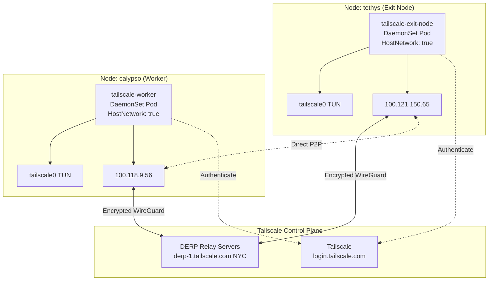

### Tailscale Network Topology

| Node | Tailscale Hostname | Tailscale IP | Exit Node | Routes Advertised |
|------|--------------------|--------------|-----------|-------------------|
| tethys | srv712429 | 100.121.150.65 | **Yes** (self) | 10.42.0.0/16, 10.43.0.0/16 |
| calypso | calypso | 100.118.9.56 | No (pending) | None |
| styx | srv712695-styx | (offline) | No | None |

### Exit Node Architecture (Unified Egress)

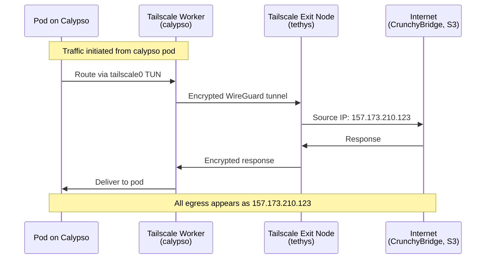

**Benefits**:
- ✅ **Unified Egress IP**: All cluster traffic appears as `157.173.210.123`
- ✅ **Single Firewall Entry**: CrunchyBridge allowlist only needs one IP
- ✅ **Private Node Support**: Calypso (no public IP) can reach external services
- ✅ **Encrypted Transit**: WireGuard encryption for inter-node traffic

**Status**:
- ⚠️ Exit node routing **NOT YET ENABLED** (pending Tailscale admin approval)
- Workers authenticated but not configured to use exit node yet
- See [TAILSCALE_DAEMONSET_SUCCESS.md](../../TAILSCALE_DAEMONSET_SUCCESS.md) for activation steps

### Tailscale ACL Policy

Managed in `policy.hujson` and synced via GitHub Actions:

```hujson
{
  "tagOwners": {
    "tag:k8s": ["autogroup:admin"],
    "tag:k8s-operator": ["autogroup:admin"]
  },
  "grants": [
    // K8s devices can access everything (for database, S3)
    {"src": ["tag:k8s"], "dst": ["*"], "ip": ["*"]},
    // Members can access K8s services (Label Studio UI)
    {"src": ["autogroup:member"], "dst": ["tag:k8s"], "ip": ["*"]}
  ]
}
```

---

## Ingress & Egress Patterns

### Ingress: Multiple Entry Points

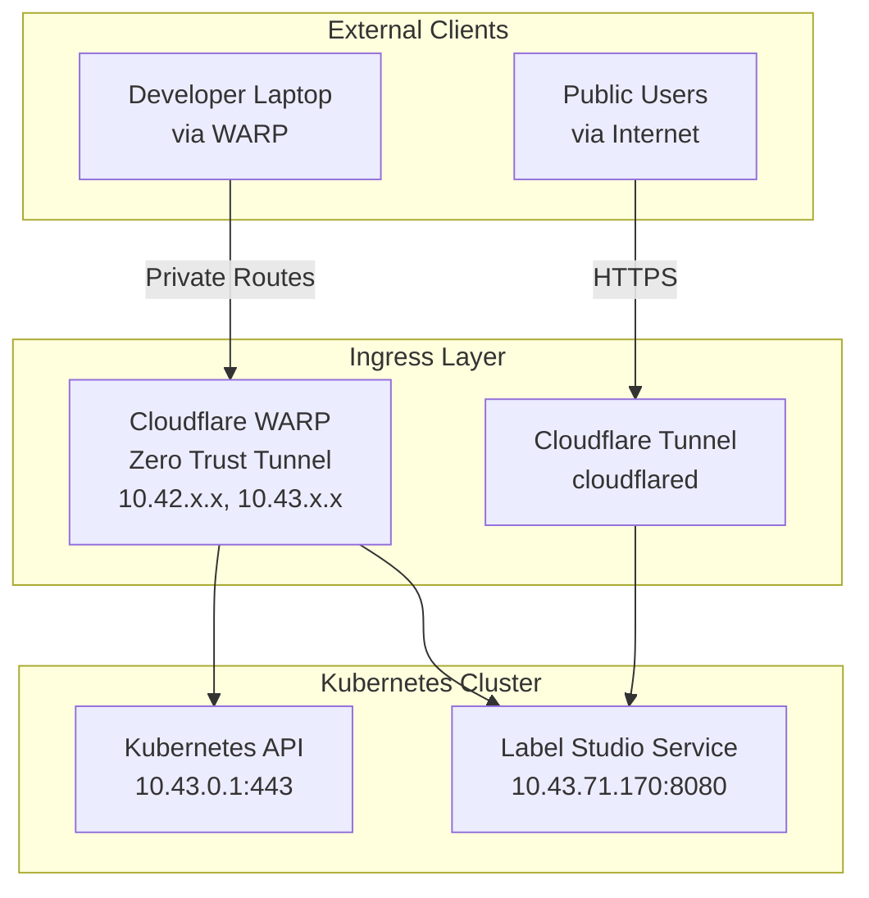

#### 1. Cloudflare WARP (Developer Access)

**Purpose**: Secure private network access for developers to reach cluster services.

**How it works**:
- Developer workstation connects to Cloudflare WARP client
- WARP client enrolled in `goldfishinc` Zero Trust organization
- Split tunnel policy routes cluster CIDRs through WARP:
  - `10.42.0.0/16` (Pod Network)
  - `10.43.0.0/16` (Service Network)
  - `192.168.2.0/24` (Private network - calypso)

**Configuration**:
- Organization: `goldfishinc.cloudflareaccess.com`
- Mode: Gateway with WARP (Layer 4 routing, not TLS termination)
- Authentication: Zero Trust device enrollment

**Usage**:
```bash
# Connect to WARP
warp-cli connect

# Access Kubernetes API directly
export KUBECONFIG=~/.kube/k3s-warp.yaml
kubectl get nodes  # Routes to 10.43.0.1 via WARP

# Access Label Studio (no public tunnel needed)
curl http://label-studio-ls-app.apps.svc.cluster.local:8080/health
```

**Advantages**:
- ✅ No SSH tunnels required
- ✅ Client certificates work end-to-end
- ✅ Automatic reconnection
- ✅ Works from any network (cafe, home, office)

#### 2. Cloudflare Tunnel (Public Ingress)

**Purpose**: Expose Label Studio web UI to public internet.

**How it works**:
- `cloudflared` daemon runs as Deployment in cluster
- Establishes outbound-only connection to Cloudflare edge
- No inbound firewall ports opened on cluster nodes
- Cloudflare edge terminates TLS, proxies to cluster

**Architecture**:
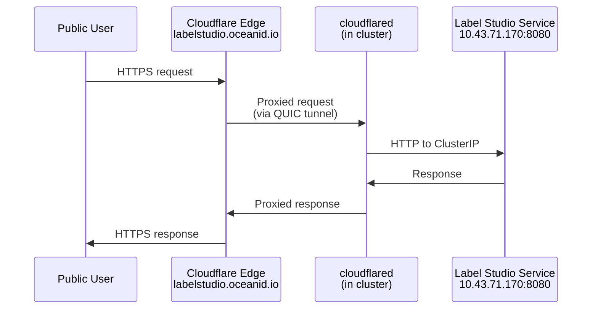

**Configuration**:
- Public hostname: `labelstudio.oceanid.io` (example)
- Tunnel token: Stored in Pulumi ESC secret `cloudflareTunnelToken`
- Backend: `http://label-studio-ls-app.apps.svc.cluster.local:8080`

**Advantages**:
- ✅ Zero inbound firewall rules
- ✅ DDoS protection via Cloudflare
- ✅ Automatic TLS certificates
- ✅ WAF and bot protection available

### Egress: Unified Exit Node

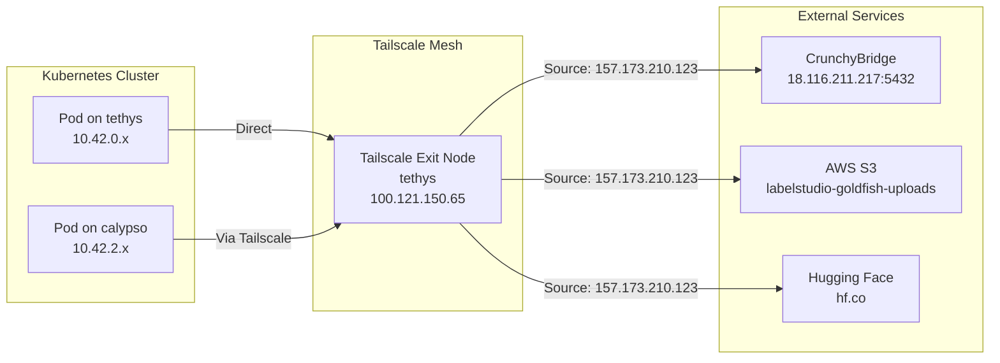

**Status**: ⚠️ **Exit node routing NOT YET ACTIVE** (see audit report)

**When enabled**:
- All pods route external traffic via Tailscale exit node on tethys
- External services see source IP: `157.173.210.123`
- CrunchyBridge firewall needs only one allowlist entry

---

## Service Mesh & Internal Routing

### CoreDNS Resolution

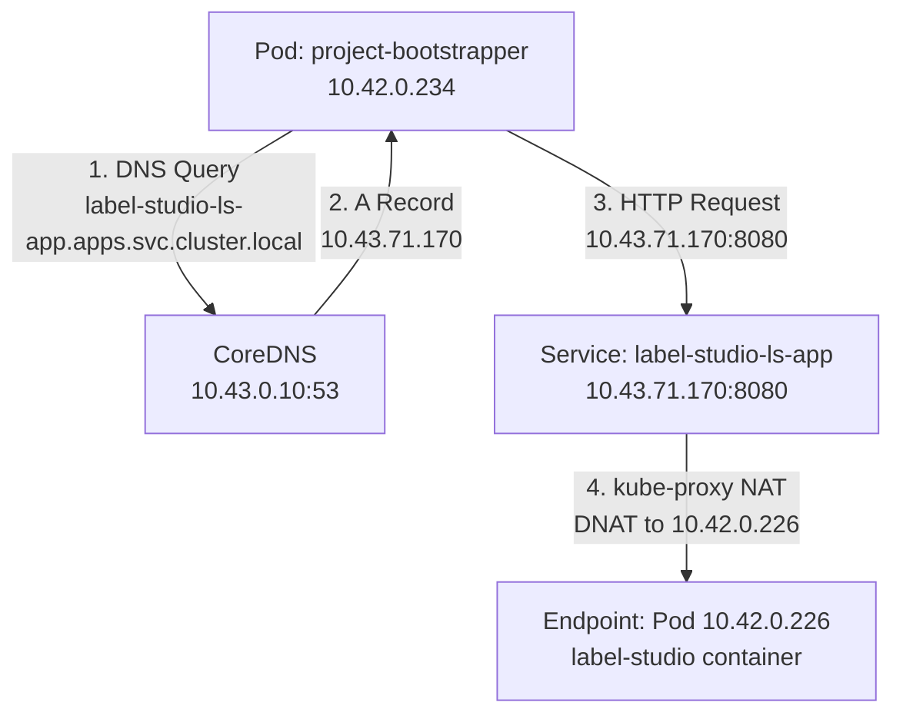

### Service Discovery Patterns

**Fully Qualified Domain Name (FQDN)**:
```
<service>.<namespace>.svc.cluster.local
```

Examples:
- `label-studio-ls-app.apps.svc.cluster.local` → Label Studio service
- `kubernetes.default.svc.cluster.local` → Kubernetes API
- `kube-dns.kube-system.svc.cluster.local` → CoreDNS

**Short Names** (within same namespace):
```
<service>
```

Example from `apps` namespace:
- `label-studio-ls-app` → Resolves to Label Studio in same namespace

### Service Types

| Type | Purpose | Example | IP Allocation |
|------|---------|---------|---------------|
| ClusterIP | Internal cluster services | label-studio-ls-app | 10.43.x.x |
| NodePort | Expose on node IP:port | (not used) | N/A |
| LoadBalancer | Cloud LB integration | (not used) | N/A |
| ExternalName | CNAME to external DNS | (not used) | N/A |

**Note**: We use **ClusterIP** exclusively, with ingress via Cloudflare Tunnel or WARP.

---

## Security Zones & Firewall Rules

### Network Security Model

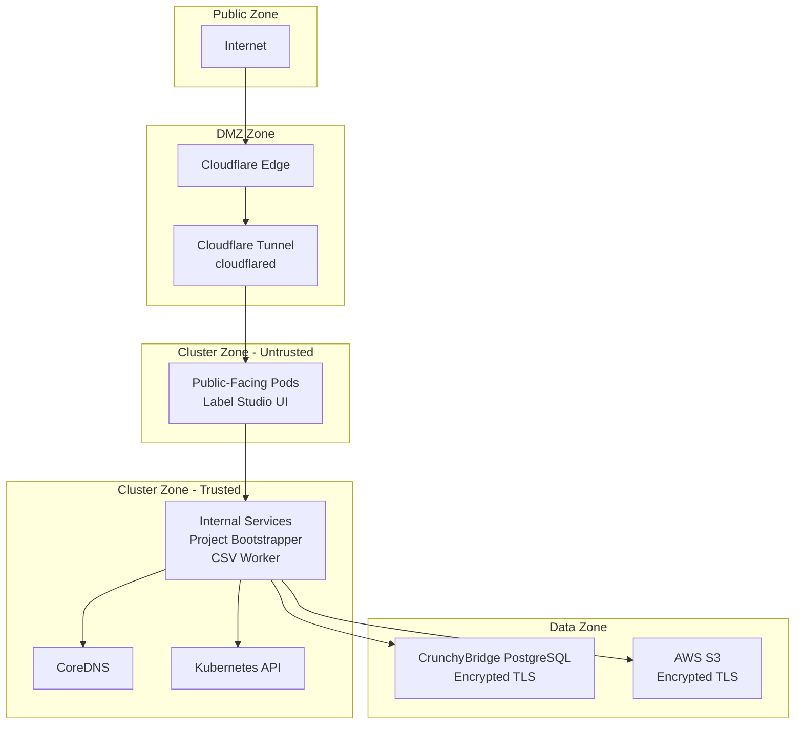

### CrunchyBridge Firewall

**Network**: `ebisu-network` (ID: `ooer7tenangenjelkxbkgz6sdi`)

**Current Allowlist** (as of 2025-10-13):
| CIDR | Description | Justification |
|------|-------------|---------------|
| `157.173.210.123/32` | Unified K8s egress via Tailscale (tethys) | Exit node public IP |

**Pending Removal** (once exit node active):
| CIDR | Description | Reason for Removal |
|------|-------------|-------------------|
| `191.101.1.3/32` | Legacy styx direct egress | Node down, replaced by unified egress |
| `192.168.2.80/32` | Legacy calypso direct egress | Replaced by unified egress |

**Database Endpoint**:
- Host: `p.3x4xvkn3xza2zjwiklcuonpamy.db.postgresbridge.com`
- Port: `5432`
- TLS: Required (`sslmode=require`)

### Kubernetes Network Policies

**Status**: ⚠️ **NOT YET IMPLEMENTED**

**Recommended Policies** (future enhancement):

1. **Deny all ingress by default** (namespace-scoped)
2. **Allow CoreDNS** from all pods
3. **Allow Label Studio → PostgreSQL** only
4. **Deny pod-to-pod** across namespaces (except explicitly allowed)

Example policy (not yet deployed):
```yaml
apiVersion: networking.k8s.io/v1
kind: NetworkPolicy
metadata:
  name: deny-all-ingress
  namespace: apps
spec:
  podSelector: {}
  policyTypes:
    - Ingress
```

---

## DNS Resolution

### Resolution Flow

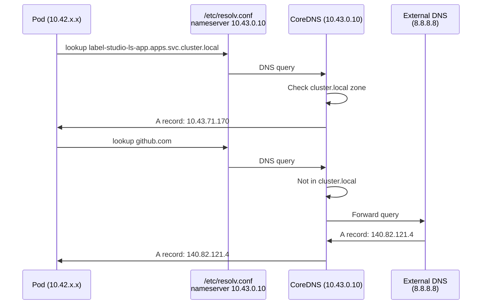

### CoreDNS Configuration

**Corefile** (default K3s config):
```
.:53 {
    errors
    health {
        lameduck 5s
    }
    ready
    kubernetes cluster.local in-addr.arpa ip6.arpa {
        pods insecure
        fallthrough in-addr.arpa ip6.arpa
        ttl 30
    }
    prometheus :9153
    forward . /etc/resolv.conf
    cache 30
    loop
    reload
    loadbalance
}
```

**Key Features**:
- Serves `.cluster.local` zone from Kubernetes API
- Forwards external queries to upstream (8.8.8.8, 8.8.4.4)
- Cache TTL: 30 seconds
- Health checks on `:8080/health`

### DNS Search Domains

Pods in `apps` namespace have the following search domains:
```
search apps.svc.cluster.local svc.cluster.local cluster.local
```

**Resolution order**:
1. `label-studio-ls-app` → tries `label-studio-ls-app.apps.svc.cluster.local` ✅
2. `label-studio-ls-app` → tries `label-studio-ls-app.svc.cluster.local`
3. `label-studio-ls-app` → tries `label-studio-ls-app.cluster.local`
4. `label-studio-ls-app` → tries external DNS

---

## Network Troubleshooting

### Common Issues & Diagnostics

#### Issue 1: "network is unreachable" from pods

**Symptoms**:
```
dial tcp 10.43.71.170:80: connect: network is unreachable
```

**Possible Causes**:
1. Flannel VXLAN tunnel down between nodes
2. Node routing table corrupted
3. IP forwarding disabled on node

**Diagnostics**:
```bash
# Check Flannel on node
ip addr show flannel.1
ip route | grep 10.42

# Check IP forwarding
sysctl net.ipv4.ip_forward
sysctl net.ipv6.conf.all.forwarding

# Check VXLAN tunnel
ip -d link show flannel.1

# Test connectivity between nodes
kubectl run nettest --rm -i --image=nicolaka/netshoot -- ping 10.42.0.1
```

**Fix**:
```bash
# Restart Flannel (K3s)
systemctl restart k3s  # Control plane
systemctl restart k3s-agent  # Worker nodes
```

#### Issue 2: DNS resolution failing

**Symptoms**:
```
dial tcp: lookup label-studio-ls-app on 10.43.0.10:53: no such host
```

**Diagnostics**:
```bash
# Check CoreDNS pods
kubectl get pods -n kube-system -l k8s-app=kube-dns

# Test DNS from pod
kubectl run dnstest --rm -i --image=busybox -- nslookup kubernetes.default

# Check CoreDNS logs
kubectl logs -n kube-system -l k8s-app=kube-dns
```

**Fix**:
```bash
# Restart CoreDNS
kubectl rollout restart deployment/coredns -n kube-system
```

#### Issue 3: Service not routing to pods

**Symptoms**:
- Service exists but connection refused
- Endpoint list is empty

**Diagnostics**:
```bash
# Check service
kubectl get svc label-studio-ls-app -n apps

# Check endpoints (backing pods)
kubectl get endpoints label-studio-ls-app -n apps

# Verify pod selector matches
kubectl get svc label-studio-ls-app -n apps -o yaml | grep selector
kubectl get pods -n apps -l app.kubernetes.io/name=ls-app
```

**Fix**:
- Ensure pod labels match service selector
- Check pod readiness probes passing

#### Issue 4: Tailscale exit node not routing

**Symptoms**:
- Pods show non-unified egress IP
- Database connections failing despite unified IP in allowlist

**Diagnostics**:
```bash
# Check Tailscale status
kubectl -n tailscale-system exec tailscale-exit-node-xxx -- tailscale status

# Verify exit node advertising
kubectl -n tailscale-system logs tailscale-exit-node-xxx | grep "exit-node"

# Test egress from specific node
kubectl run egress-test --rm -i --image=curlimages/curl:latest \
  --overrides='{"spec":{"nodeSelector":{"kubernetes.io/hostname":"calypso"}}}' \
  -- curl -s https://ipinfo.io/ip
```

**Fix**:
- See [AUDIT_REPORT_TAILSCALE_DAEMONSET.md](../../AUDIT_REPORT_TAILSCALE_DAEMONSET.md) for activation checklist

### Network Debugging Tools

**Install netshoot pod**:
```bash
kubectl run netshoot --rm -i --image=nicolaka/netshoot -- /bin/bash
```

**Available tools in netshoot**:
- `curl`, `wget` - HTTP testing
- `nslookup`, `dig` - DNS debugging
- `ping`, `traceroute` - ICMP testing
- `nc` (netcat) - Port scanning
- `tcpdump` - Packet capture
- `iperf3` - Bandwidth testing

**Example diagnostics**:
```bash
# Test service connectivity
kubectl run netshoot --rm -i --image=nicolaka/netshoot -- \
  curl -v http://label-studio-ls-app.apps.svc.cluster.local:8080/health

# Test DNS resolution
kubectl run netshoot --rm -i --image=nicolaka/netshoot -- \
  nslookup label-studio-ls-app.apps.svc.cluster.local

# Test database connectivity
kubectl run netshoot --rm -i --image=nicolaka/netshoot -- \
  nc -zv p.3x4xvkn3xza2zjwiklcuonpamy.db.postgresbridge.com 5432
```

---

## Appendix: Network Flow Examples

### Example 1: Developer kubectl Command

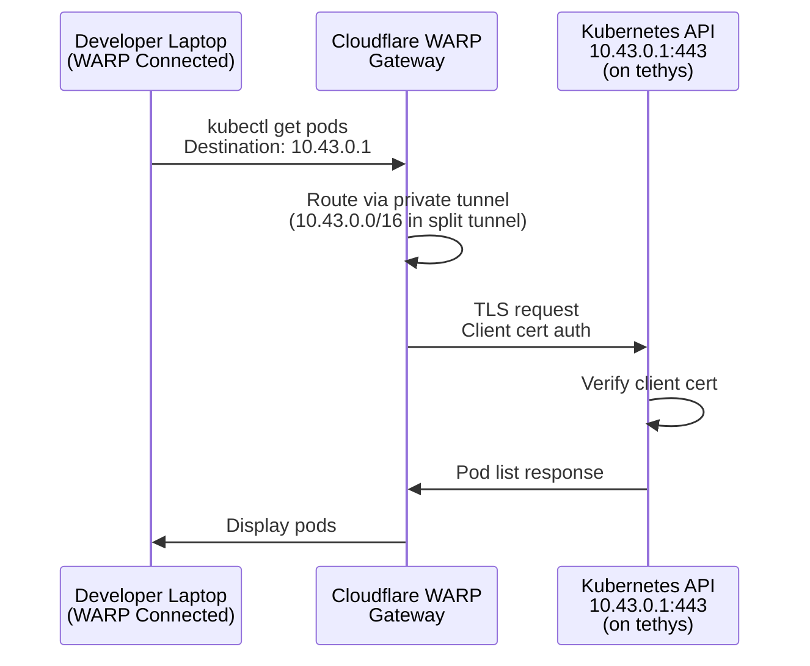

### Example 2: Label Studio Database Query

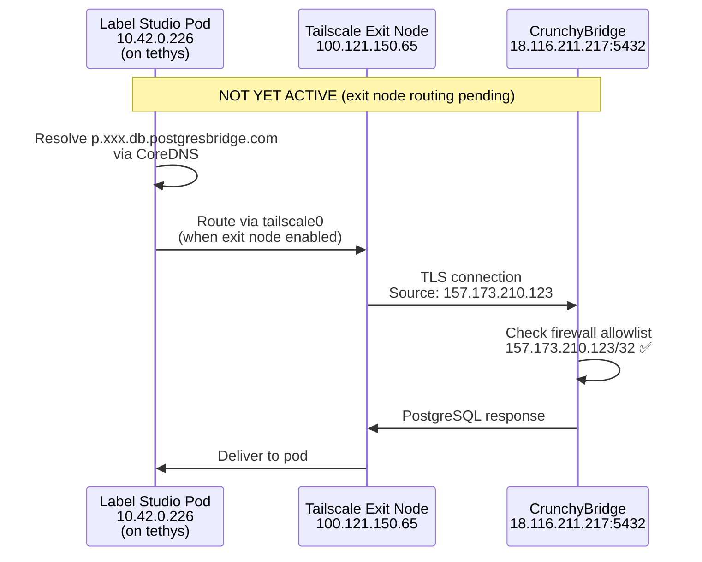

### Example 3: Public User Accessing Label Studio

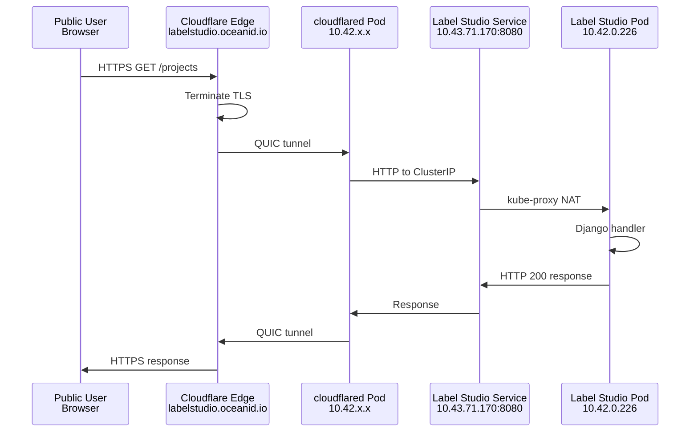

---

## References

- [TAILSCALE_DAEMONSET_SUCCESS.md](../../TAILSCALE_DAEMONSET_SUCCESS.md) - Tailscale implementation details
- [AUDIT_REPORT_TAILSCALE_DAEMONSET.md](../../AUDIT_REPORT_TAILSCALE_DAEMONSET.md) - Network security audit
- [K3s Networking](https://docs.k3s.io/networking) - Flannel configuration
- [Tailscale Kubernetes](https://tailscale.com/kb/1236/kubernetes-operator/) - Mesh networking

---

**Document Status**: ✅ Production Deployed (with pending exit node activation)
**Last Verified**: 2025-10-13
**Next Review**: After exit node activation
