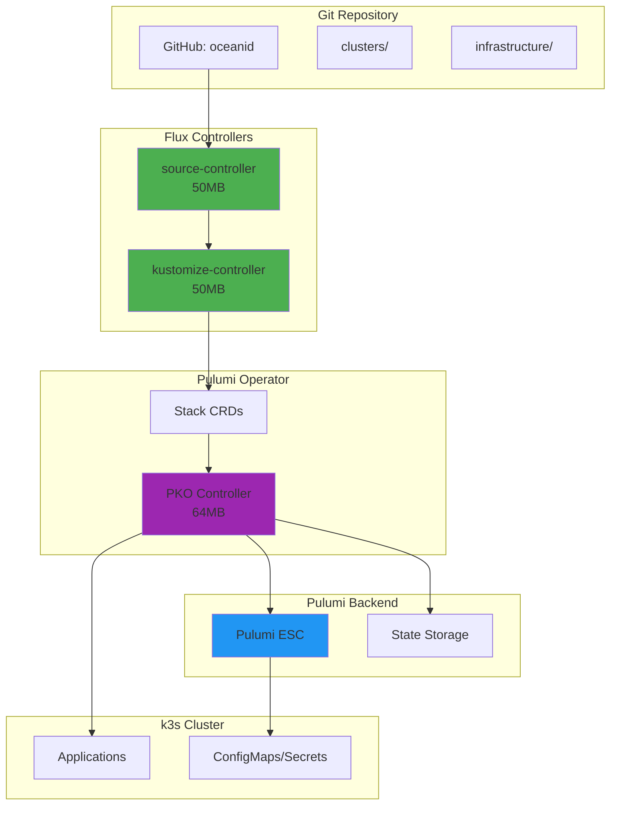
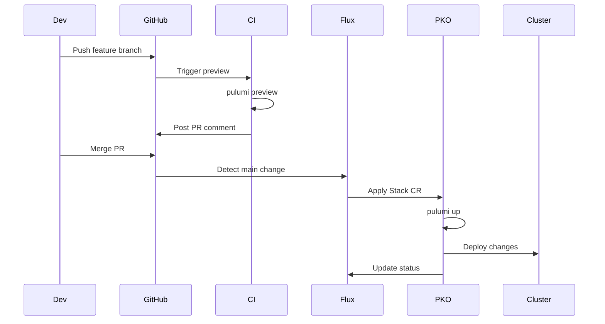

# GitOps Implementation Guide - Flux + PKO

## Overview

This guide implements a lightweight GitOps pattern using **FluxCD** and **Pulumi Kubernetes Operator (PKO)** - perfect for resource-constrained K3s clusters while maintaining full Pulumi + ESC integration.

## Why Flux + PKO?

### Perfect for Solo Operators

- **Minimal footprint**: <200MB total RAM overhead
- **No UI bloat**: Pure controller-based reconciliation
- **Native Pulumi**: Keep existing IaC patterns
- **ESC integration**: Unified secrets management

### Comparison with Alternatives

| Solution | Memory | Complexity | Pulumi Native | UI |
|----------|---------|------------|---------------|-----|
| **Flux + PKO** | ~200MB | Low | ✅ Yes | ❌ No |
| ArgoCD + PKO | ~750MB | Medium | ✅ Yes | ✅ Yes |
| Flux alone | ~100MB | Low | ❌ No | ❌ No |
| Manual | 0MB | High | ✅ Yes | ❌ No |

## Architecture



## Repository Structure

```
oceanid/
├── .flux.yaml                    # Flux validation config
├── clusters/                     # Flux managed configs
│   ├── base/                    # Shared across all clusters
│   │   ├── flux-system/         # Flux controllers
│   │   ├── pulumi-system/       # PKO installation
│   │   └── stacks/             # Base Stack definitions
│   ├── tethys/                 # Control plane cluster
│   │   ├── flux-system/        # Flux bootstrap
│   │   └── kustomization.yaml  # Cluster-specific overrides
│   └── production/             # Production overlays
│       └── stacks/            # Prod Stack configs
├── infrastructure/             # Pulumi programs
│   ├── cluster/               # Current k3s IaC
│   ├── apps/                 # Application infrastructure
│   └── networking/           # Network configs
└── apps/                      # Application manifests
    ├── base/                 # Base app configs
    └── overlays/            # Environment-specific
```

## Installation Guide

### Prerequisites

```bash
# Install Flux CLI
brew install fluxcd/tap/flux

# Verify k3s cluster access
kubectl get nodes

# GitHub token with repo access
export GITHUB_TOKEN=<your-token>
```

### Phase 1: Bootstrap Flux

```bash
# 1. Check prerequisites
flux check --pre

# 2. Bootstrap Flux on control plane (tethys)
flux bootstrap github \
  --owner=goldfish-inc \
  --repository=oceanid \
  --branch=main \
  --path=clusters/tethys \
  --components=source-controller,kustomize-controller \
  --toleration-keys=node-role.kubernetes.io/control-plane

# 3. Verify installation
kubectl get pods -n flux-system
```

### Phase 2: Install Pulumi Kubernetes Operator

Create `clusters/base/pulumi-system/namespace.yaml`:

```yaml
apiVersion: v1
kind: Namespace
metadata:
  name: pulumi-system
  labels:
    pod-security.kubernetes.io/enforce: restricted
```

Create `clusters/base/pulumi-system/helm-release.yaml`:

```yaml
apiVersion: source.toolkit.fluxcd.io/v1beta2
kind: HelmRepository
metadata:
  name: pulumi
  namespace: pulumi-system
spec:
  interval: 1h
  url: https://pulumi.github.io/pulumi-kubernetes-operator
---
apiVersion: helm.toolkit.fluxcd.io/v2beta1
kind: HelmRelease
metadata:
  name: pulumi-operator
  namespace: pulumi-system
spec:
  interval: 10m
  chart:
    spec:
      chart: pulumi-kubernetes-operator
      version: "v0.4.0"
      sourceRef:
        kind: HelmRepository
        name: pulumi
  values:
    deploymentStrategy: Recreate
    resources:
      limits:
        memory: 128Mi
        cpu: 200m
      requests:
        memory: 64Mi
        cpu: 100m
    nodeSelector:
      node-role.kubernetes.io/control-plane: "true"
```

### Phase 3: Configure ESC Integration

Create `clusters/base/pulumi-system/esc-secret.yaml`:

```yaml
apiVersion: v1
kind: Secret
metadata:
  name: pulumi-esc-credentials
  namespace: pulumi-system
type: Opaque
stringData:
  PULUMI_ACCESS_TOKEN: ${PULUMI_ACCESS_TOKEN}
  PULUMI_CONFIG_PASSPHRASE: ${PULUMI_CONFIG_PASSPHRASE}
```

### Phase 4: Define Pulumi Stacks

Create `clusters/base/stacks/cluster-stack.yaml`:

```yaml
apiVersion: pulumi.com/v1
kind: Stack
metadata:
  name: oceanid-cluster
  namespace: pulumi-system
spec:
  # Git source
  projectRepo: https://github.com/goldfish-inc/oceanid
  branch: main
  repoDir: infrastructure/cluster

  # Pulumi config
  stack: prod

  # ESC environment
  envRefs:
    PULUMI_ACCESS_TOKEN:
      type: Secret
      secret:
        name: pulumi-esc-credentials
        key: PULUMI_ACCESS_TOKEN
    PULUMI_CONFIG_PASSPHRASE:
      type: Secret
      secret:
        name: pulumi-esc-credentials
        key: PULUMI_CONFIG_PASSPHRASE

  # Configuration
  config:
    oceanid-cluster:environment: prod

  # Reconciliation
  continueResyncOnCommitMatch: true
  resyncFrequencySeconds: 300
  retryOnUpdateConflict: true

  # Resources
  resources:
    limits:
      memory: 512Mi
      cpu: 500m
    requests:
      memory: 256Mi
      cpu: 200m
```

### Phase 5: Create Kustomization

Create `clusters/tethys/kustomization.yaml`:

```yaml
apiVersion: kustomize.config.k8s.io/v1beta1
kind: Kustomization
resources:
  - ../base/flux-system
  - ../base/pulumi-system
  - ../base/stacks
patches:
  - target:
      kind: Stack
      name: oceanid-cluster
    patch: |-
      - op: replace
        path: /spec/stack
        value: oceanid-cluster-tethys
```

## Workflow Patterns

### Development Flow



### Secret Rotation Flow

```yaml
# 1. Update secret in ESC
esc env set default/oceanid-cluster my.secret "new-value" --secret

# 2. Trigger Stack reconciliation
kubectl annotate stack oceanid-cluster \
  pulumi.com/refresh=true \
  --overwrite \
  -n pulumi-system

# 3. PKO automatically runs pulumi up with new secrets
```

## Operations

### Monitoring GitOps

```bash
# Watch Flux reconciliation
flux get all

# Check Stack status
kubectl get stacks -n pulumi-system

# View PKO logs
kubectl logs -n pulumi-system -l app.kubernetes.io/name=pulumi-kubernetes-operator

# Get Stack details
kubectl describe stack oceanid-cluster -n pulumi-system
```

### Manual Interventions

```bash
# Force reconciliation
flux reconcile source git flux-system

# Suspend GitOps
flux suspend kustomization flux-system

# Resume GitOps
flux resume kustomization flux-system

# Rollback via Git
git revert HEAD
git push
# Flux automatically reconciles
```

### Debugging Issues

```bash
# Check Flux events
kubectl get events -n flux-system --sort-by='.lastTimestamp'

# PKO troubleshooting
kubectl logs -n pulumi-system deployment/pulumi-kubernetes-operator

# Stack state
kubectl get stack oceanid-cluster -n pulumi-system -o yaml
```

## Multi-Cluster Expansion

### Adding a New Cluster

```bash
# 1. Bootstrap Flux on new cluster
flux bootstrap github \
  --owner=goldfish-inc \
  --repository=oceanid \
  --branch=main \
  --path=clusters/new-cluster \
  --components=source-controller,kustomize-controller

# 2. Create cluster-specific overlay
mkdir -p clusters/new-cluster
cp clusters/tethys/kustomization.yaml clusters/new-cluster/

# 3. Customize for new cluster
vim clusters/new-cluster/kustomization.yaml
```

### Cluster-Specific Configurations

```yaml
# clusters/styx/kustomization.yaml
apiVersion: kustomize.config.k8s.io/v1beta1
kind: Kustomization
resources:
  - ../base/flux-system
  - ../base/pulumi-system
  - ../base/stacks
patches:
  - target:
      kind: Stack
      name: oceanid-cluster
    patch: |-
      - op: replace
        path: /spec/stack
        value: oceanid-cluster-styx
      - op: add
        path: /spec/config/oceanid-cluster:node
        value: styx
```

## Best Practices

### 1. Separate Configs by Concern

```
clusters/
├── base/           # Shared configs
├── <cluster>/      # Cluster-specific
└── <env>/         # Environment overlays
```

### 2. Use ESC for All Secrets

```yaml
# Never put secrets in Git
# Always reference from ESC
envRefs:
  MY_SECRET:
    type: Secret
    secret:
      name: esc-secrets
      key: my-secret
```

### 3. Resource Limits for PKO

```yaml
# Prevent PKO from consuming too much
resources:
  limits:
    memory: 512Mi  # Max for pulumi up
    cpu: 500m
  requests:
    memory: 256Mi  # Normal operation
    cpu: 200m
```

### 4. Gradual Rollout

```yaml
# Use progressive delivery
spec:
  continueResyncOnCommitMatch: true
  destroyOnFinalize: false  # Safety first
```

## Migration Checklist

- [ ] Install Flux CLI locally
- [ ] Bootstrap Flux on tethys
- [ ] Deploy PKO via Flux
- [ ] Create first Stack CR
- [ ] Verify Pulumi up runs
- [ ] Move all Pulumi programs to Stack CRs
- [ ] Set up CI for PR previews
- [ ] Document runbooks
- [ ] Train on GitOps workflow

## Troubleshooting

### Common Issues

#### Flux not syncing

```bash
# Check source status
flux get sources git

# Force reconciliation
flux reconcile source git flux-system --with-source
```

#### PKO Stack stuck

```bash
# Check Stack status
kubectl get stack -A

# View detailed errors
kubectl describe stack oceanid-cluster -n pulumi-system

# Reset Stack
kubectl delete stack oceanid-cluster -n pulumi-system
kubectl apply -f clusters/base/stacks/cluster-stack.yaml
```

#### Memory issues

```bash
# Increase PKO limits temporarily
kubectl edit stack oceanid-cluster -n pulumi-system
# Increase spec.resources.limits.memory
```

## Resources

- [Flux Documentation](https://fluxcd.io/docs/)
- [Pulumi Kubernetes Operator](https://github.com/pulumi/pulumi-kubernetes-operator)
- [PKO + Flux Example](https://github.com/pulumi/examples/tree/master/kubernetes-ts-operator)
- [GitOps Toolkit](https://toolkit.fluxcd.io/)

---

*This lightweight GitOps setup uses <200MB RAM while providing full declarative management with Pulumi + ESC integration.*
