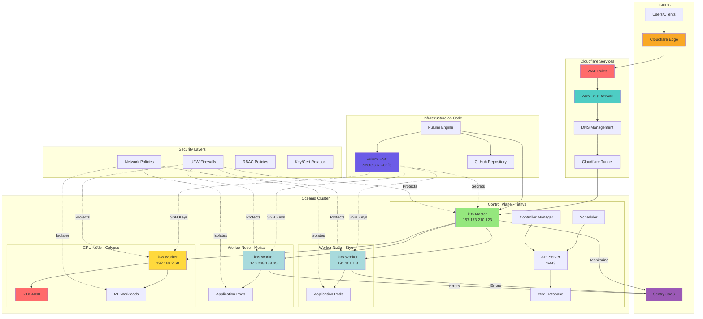
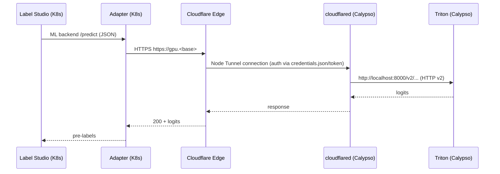
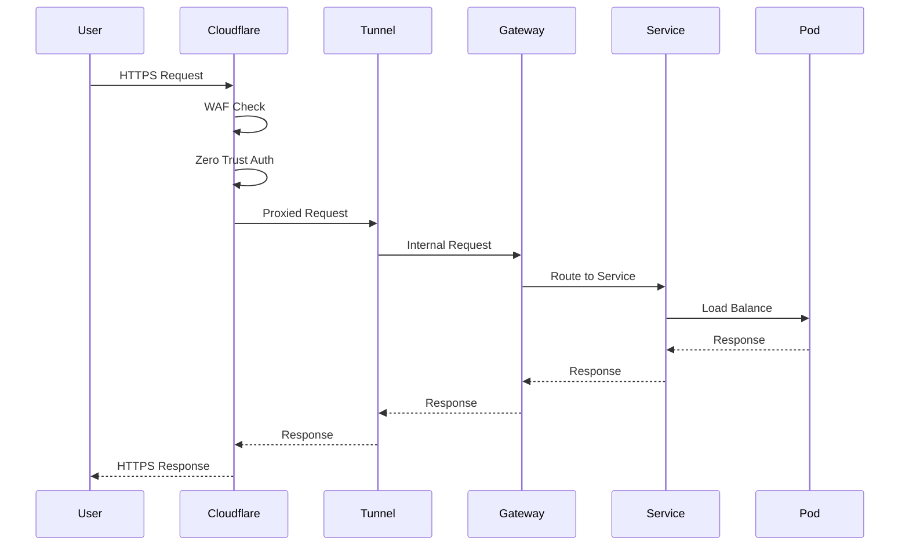
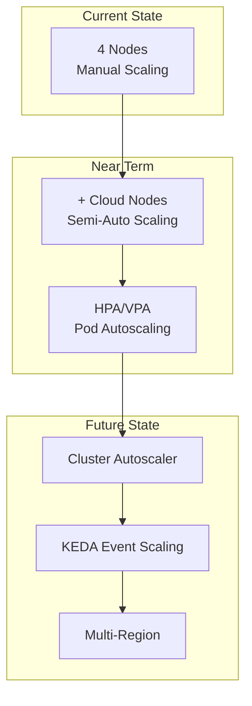
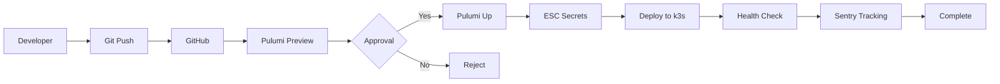
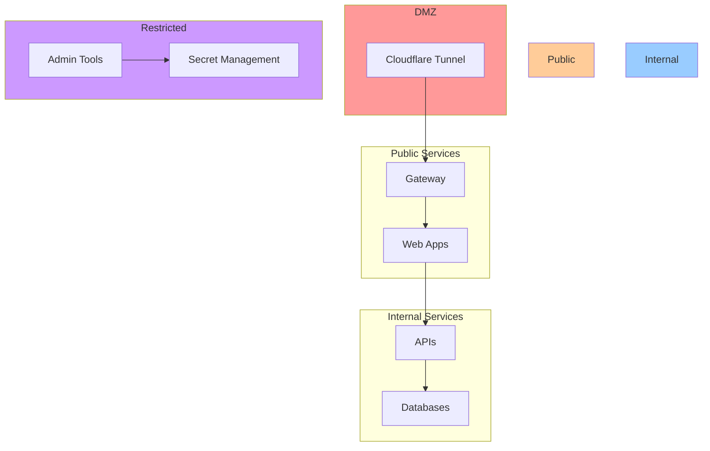

# Oceanid Cluster Architecture

## Network Topology

## Calypso Access Path (GPU)

Component ownership:

- Pulumi `HostCloudflared` ensures systemd unit + config on Calypso.
- Pulumi `HostDockerService` ensures `tritonserver.service` with GPU flags.
- DNS `gpu.<base>` CNAME is created when NodeTunnels are disabled (host connector path) or by NodeTunnels component otherwise.

## Traffic Flow

## Security Architecture

```mermaid
graph LR
    subgraph "External Security"
        A[Cloudflare WAF] --> B[DDoS Protection]
        B --> C[Bot Management]
        C --> D[Zero Trust Access]
    end

    subgraph "Network Security"
        E[UFW Firewall] --> F[Network Policies]
        F --> G[Service Mesh<br/>*Future*]
        G --> H[mTLS]
    end

    subgraph "Application Security"
        I[RBAC] --> J[Pod Security]
        J --> K[Secret Management]
        K --> L[Image Scanning<br/>*Future*]
    end

    subgraph "Data Security"
        M[Encryption at Rest] --> N[Encryption in Transit]
        N --> O[Key Rotation]
        O --> P[Backup Encryption]
    end

    D --> E
    H --> I
    L --> M
```

## Component Overview

### Core Infrastructure

- **K3s**: Lightweight Kubernetes distribution
- **Cloudflare Tunnel**: Secure ingress without exposed IPs
- **Gateway API**: Modern ingress management (2025 standard)
- **cert-manager**: Automatic TLS certificate management

### Node Configuration

| Node | Role | IP | Provider | Resources | Purpose |
|------|------|-----|----------|-----------|---------|
| Tethys | Control Plane | 157.173.210.123 | Hostinger | 2 vCPU, 2GB RAM | Master node |
| Styx | Worker | 191.101.1.3 | Hostinger | 2 vCPU, 2GB RAM | Application workloads |
| Meliae | Worker | 140.238.138.35 | Oracle Cloud | 1 OCPU, 1GB RAM | Light workloads |
| Calypso | GPU Worker | 192.168.2.68 | Local | RTX 4090, 32GB RAM | ML/AI workloads |

### Security Features

- **Zero-Trust Architecture**: No implicit trust
- **Network Segmentation**: Namespace isolation
- **Automatic Rotation**: 90-day SSH, 90-day TLS, 365-day K3s
- **External Monitoring**: Sentry (no cluster overhead)
- **Firewall Layers**: Cloudflare WAF + UFW + NetworkPolicies

### Infrastructure as Code

- **Pulumi**: TypeScript-based IaC
- **ESC**: Environment, Secrets, Configuration management
- **GitOps Ready**: Prepared for ArgoCD/Flux integration
- **Automated Provisioning**: Node joining automation

## Scalability Design

## Deployment Pipeline

## Resource Utilization

### Current Usage (Baseline)

- **Control Plane**: ~500MB RAM, 0.5 CPU
- **Worker Nodes**: ~300MB RAM each, 0.2 CPU
- **Total Cluster**: ~1.4GB RAM, 1.1 CPU

### With Monitoring

- **Sentry Relay**: 50MB RAM, 0.05 CPU
- **Error Collector**: 32MB RAM, 0.01 CPU
- **Health Reporter**: 32MB RAM, 0.01 CPU
- **Total Monitoring**: ~114MB RAM, 0.07 CPU

### Reserved for Applications

- **Available RAM**: ~6GB across cluster
- **Available CPU**: ~4 cores
- **GPU**: RTX 4090 (dedicated for ML)

## High Availability Considerations

### Current Limitations

- Single control plane (Tethys)
- No etcd backup automation
- Manual disaster recovery

### Future Improvements

1. Add HA control plane nodes
2. Implement Velero for backups
3. Multi-region deployment
4. Automated failover

## Network Segmentation

