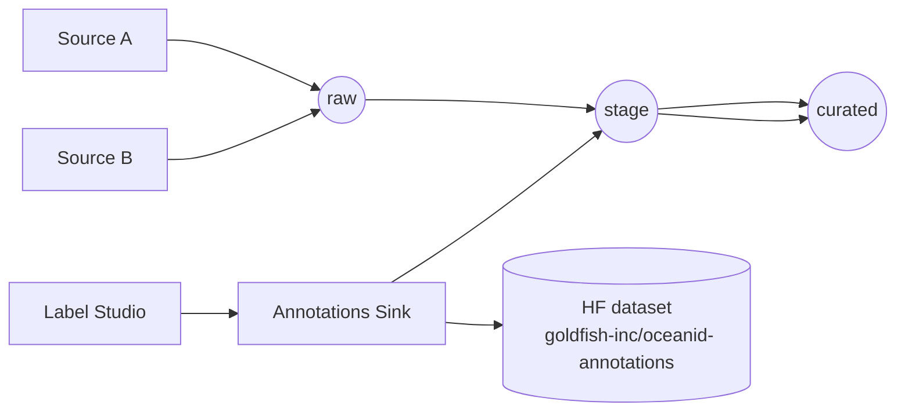

# Oceanid Intelligence Staging — Project Plan

This document defines the end goal, architecture, scope, and milestones for the intelligence staging layer that supports SME pre‑labeling, annotation, and curation.

## End Goal

- Provide a robust staging pipeline where:
  - SMEs upload documents, receive pre‑labels, and annotate in Label Studio.
  - Annotations are versioned and stored in a Hugging Face dataset repo.
  - Cleaned extractions (structured data) are persisted in Postgres with strong lineage.
  - Multiple raw sources land into per‑source tables, tracked for freshness and provenance.
  - Curated aggregates align to Ebisu’s production schema and can be published downstream.

## Architecture Overview

### High‑Level Dataflow



### K8s + Calypso Components

```mermaid
flowchart TB
  subgraph Calypso
    TR[Triton 2.60.0\nONNX models\nGPU]
  end
  subgraph K8s (apps)
    LS[Label Studio]
    AD[LS‑Triton Adapter]
    AK[Annotations Sink]
    PG[(Postgres)]
  end
  CF[Cloudflare Tunnel]

  LS -- ML backend --> AD
  AD -- HTTP v2 --> CF --> TR
  LS -- Webhook --> AK
  AK -- JSONL --> HF[(Hugging Face)]
  AK -- Cleaned Extractions --> PG
```

## Data Model (Medallion)

- raw
  - raw.<source>_documents(source_doc_id, fetched_at, content, content_sha, url, metadata, ingestion_run_id)
- stage
  - stage.documents(id, source_id, source_doc_id, collected_at, text, content_sha, metadata)
  - stage.extractions(document_id, label, value, start, end, confidence, db_mapping, annotator, updated_at)
- label
  - label.annotation_refs(project_id, task_id, hf_repo, path, commit_sha, annotated_at, schema_version)
- curated (Ebisu‑aligned)
  - curated.vessels, curated.vessel_info, curated.vessel_associates, curated.entity_persons, curated.entity_organizations
- control
  - control.sources(name, sla_minutes, enabled), control.ingestion_runs, control.schema_versions

## Versioning & Evolution

- NER labels: managed via ESC; adapter maps indices using NER_LABELS; stage stores label strings.
- Schema version: stored per JSONL record and referenced by curated transformations.
- Model updates: re‑export ONNX and adjust Triton config dims; no change needed in stage.extractions.

## Milestones

### Phase 1: Data Ingestion Pipeline (Completed Oct 2025)

1) **GPU + Pre‑labels** ✅
   - Triton on GPU, Cloudflare tunnel, Adapter, DistilBERT support

2) **Annotations Sink** ✅
   - Write annotations to HF; persist cleaned extractions to PG

3) **CSV Ingestion Worker** ✅
   - Go microservice processing Label Studio webhooks
   - Confidence scoring and rule-based data cleaning
   - Bulk PostgreSQL inserts with pq.CopyInSchema
   - Deployed to Kubernetes with <128Mi footprint

4) **Cleandata Database** ✅
   - Separate database for data pipeline (cleandata)
   - Consolidated schema with all tables and indexes
   - Full medallion architecture: raw → stage → curated
   - Database migrations via GitHub Actions

### Phase 2: Data Processing & Quality (In Progress)

5) **Review Queue Manager** (Planned)
   - Human-in-the-loop validation system
   - Priority-based review assignment
   - Integration with Label Studio annotations

6) **Curated Layer Population** (Planned)
   - SQL/dbt jobs to populate curated.* aligned with Ebisu
   - IMO registry reconciliation
   - RFMO vessel deduplication

### Phase 3: Production Readiness (Planned)

7) **CI & QA**
   - Smoke tests for adapter/sink
   - Data quality checks on stage/curated
   - Automated testing for CSV worker

8) **Monitoring & Observability**
   - Prometheus metrics integration
   - Data freshness monitoring
   - Pipeline health dashboards

## Acceptance Criteria

- Pre‑labels served reliably; latency acceptable for SMEs.
- Annotations appear in HF JSONL with schema_version and provenance.
- Cleaned extractions are queryable in Postgres; freshness and lineage available.
- Curated aggregates map correctly to Ebisu schema, with reproducible lineage.

## Configuration Keys

- hfAccessToken (ESC): Hugging Face write token
- schemaVersion (ESC): Staging schema version; default 1.0.0
- nerLabels (ESC): JSON label list (order defines index mapping)
- postgres_password (Pulumi): enables in‑cluster Postgres when provided

## Operational Notes

- LS Webhooks: configure ANNOTATION_CREATED/UPDATED to Annotations Sink.
- Model swaps: prefer per-request model override in Adapter; default remains DistilBERT.
- Cloudflare: ensure node tunnel credentials match the tunnel ID.
