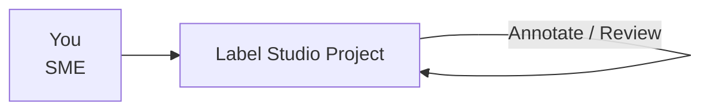
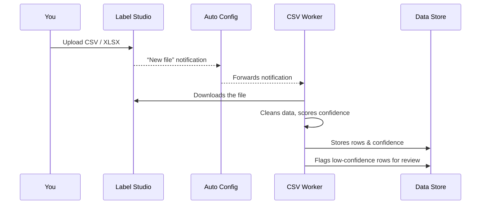
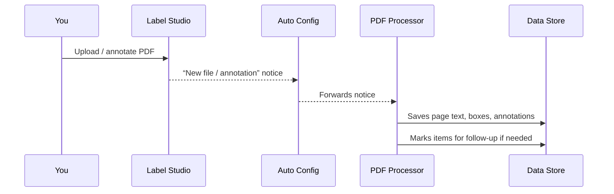

# What Happens After You Upload in Label Studio

**Audience:** Subject Matter Experts (SMEs)
**Goal:** Show, in plain language, what Oceanid does with the files you upload.
**Good news:** You only need to work inside Label Studio. Everything else runs automatically.

---

## 1. Your Experience (the only steps you take)

- Pick the right project in Label Studio.
- Upload your CSV spreadsheet or PDF document.
- Add annotations or confirm the system’s suggestions.

That’s it for you. The next sections simply explain what happens in the background.

---

## 2. Behind the scenes (automatic)

### CSV Uploads

What this means for you:
- Low-confidence rows appear back in Label Studio for quick review.
- Cleaned data is stored safely and can be used for reports or model training.

### PDF Uploads

What this means for you:
- Your highlights and comments are stored and can be searched later.
- Corrections you make teach the system how to parse similar PDFs in the future.

---

## 3. Where the data goes (in plain language)

| Stage | What it stores | Why it matters |
|-------|----------------|----------------|
| “Documents” | Every file you upload + basic info | We can trace who uploaded what |
| “Cleaned cells / PDF boxes” | The structured version of your upload | Power dashboards, allow search, train models |
| “Review queue” | Rows or regions that weren’t clear | You see them again in Label Studio to confirm |
| “Training examples” | Corrections you make | Used to improve the AI assistants |

All of this lives inside Oceanid’s secure data store—no extra tools for you to learn.

---

## 4. What we can do with your work

- **Dashboards & Reports:** Clean, structured data feeds our internal dashboards.
- **Better Automation:** Human feedback tunes models so you see fewer low-confidence items over time.
- **Curated Exports:** Once reviewed, data is promoted to trusted datasets that other teams use.

---

## 5. FAQ

**Do I have to trigger anything after uploading?**
No. Webhooks and processors run automatically within ~30 seconds.

**How do I know my corrections were captured?**
If you fixed a row/annotation, it disappears from the review queue. Behind the scenes it’s logged for retraining.

**Can I see the cleaned data?**
Ask the Ops/Analytics team; they can share dashboards or exports powered by the cleaned tables.

**Something looks wrong—who do I tell?**
Ping `#oceanid-ops` in Slack or your team’s Oceanid contact. They can check the logs and data store.

---

### Summary
- **You stay in Label Studio** – upload, review, annotate as usual.
- **Oceanid handles the rest** – cleaning, storage, reviews, model training.
- **Your input matters** – every correction teaches the system and improves future automation.
