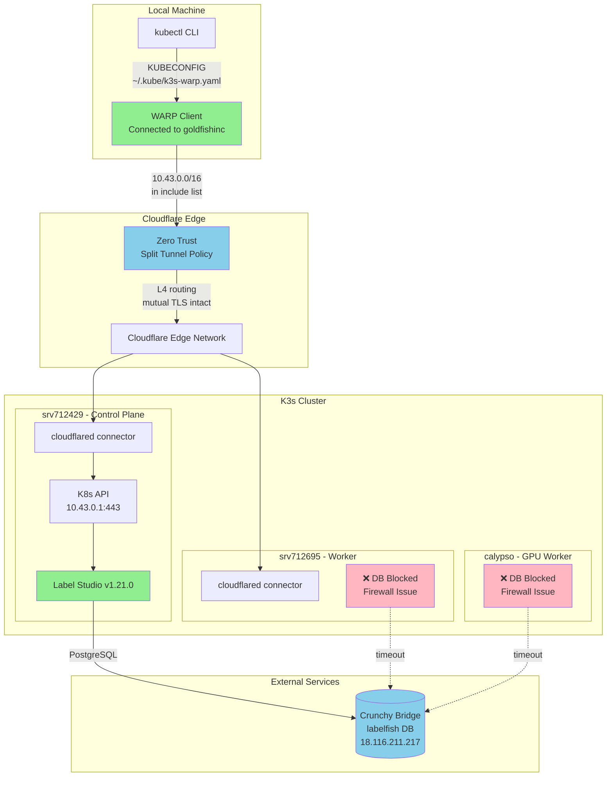
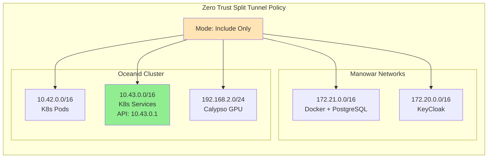
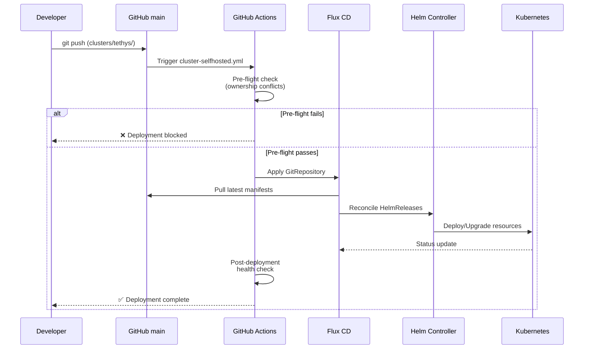
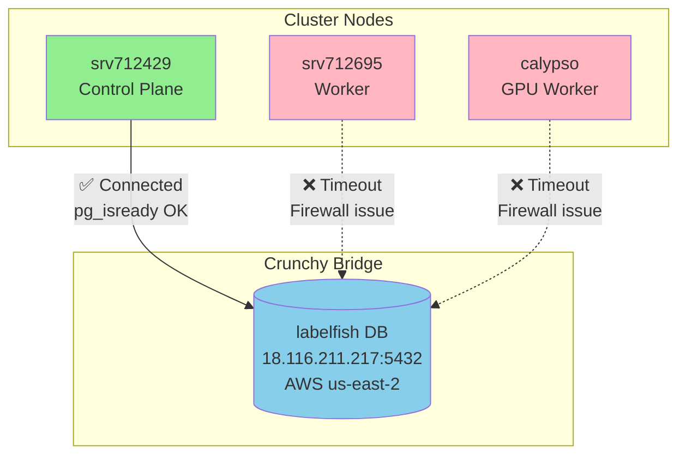

# Infrastructure Improvements Summary
**October 8-9, 2025**

## Executive Summary

Completed major infrastructure improvements focusing on networking stability, GitOps reliability, and database connectivity. Successfully migrated from unreliable SSH tunnels to Cloudflare WARP for kubectl access, resolved Flux Helm ownership conflicts, and upgraded Label Studio to v1.21.0.

## Key Achievements

### ✅ Cloudflare WARP Implementation
- **Zero-friction kubectl access** - No more SSH tunnel drops
- **Layer 4 routing** - Client certificates work end-to-end
- **Organization-wide policy** - Split tunnel configuration via Zero Trust API
- **Stable connection** - Works from anywhere with internet

### ✅ GitOps Infrastructure Rebuild
- **Fixed Flux Helm v4 conflicts** - Resolved resource ownership issues
- **Pre-flight validation** - Automated deployment health checks
- **Ownership contracts** - Clear Pulumi vs Flux boundaries documented

### ✅ Database Connectivity
- **Diagnosed node-specific firewall issue** - Worker nodes cannot reach AWS us-east-2
- **Immediate workaround** - Scheduled Label Studio on control plane
- **PostgreSQL integration** - Crunchy Bridge connection validated

### ✅ Application Upgrades
- **Label Studio v1.21.0** - Successfully upgraded from v1.20.0
- **Database migrations** - Completed without data loss
- **Service health** - All pods running and stable

---

## Architecture Overview

### Network Architecture (Post-WARP)



### WARP Split Tunnel Configuration



### GitOps Deployment Flow



### Database Connectivity Matrix



---

## Technical Details

### WARP Setup

**Configuration Method**: Cloudflare Zero Trust API
- **Endpoint**: `PUT /accounts/{id}/devices/policy/include`
- **Token**: Zero Trust-scoped admin token (stored in ESC)
- **Policy Mode**: Include (only listed CIDRs use WARP tunnel)

**Added CIDRs**:
```json
[
  {"address": "10.42.0.0/16", "description": "K8s Pod Network - oceanid"},
  {"address": "10.43.0.0/16", "description": "K8s Service Network - oceanid API"},
  {"address": "192.168.2.0/24", "description": "Calypso GPU - oceanid"}
]
```

**Client Configuration**:
- Kubeconfig: `~/.kube/k3s-warp.yaml`
- Server URL: `https://10.43.0.1:443`
- Verification: `./scripts/complete-warp-setup.sh`

### Flux Helm Rebuild

**Problem**: Flux Helm v4 upgrade created ownership conflicts
- Helm secrets with stale release metadata
- CRD annotation mismatches
- Resource ownership ambiguity

**Solution**: Pre-flight validation script
- Detects stale Helm releases (hash mismatch)
- Auto-cleans conflicting resources
- Validates before deployment
- Exit code 0 = safe, 1 = blocked

**Script**: `cluster/scripts/preflight-check.sh`

### Database Configuration

**Crunchy Bridge Cluster**: Ebisu
- **Host**: `p.3x4xvkn3xza2zjwiklcuonpamy.db.postgresbridge.com`
- **Database**: `labelfish` (Label Studio operational data)
- **User**: `labelfish_owner`
- **Connection**: PostgreSQL with `sslmode=require`

**Label Studio Environment**:
```yaml
POSTGRE_HOST: p.3x4xvkn3xza2zjwiklcuonpamy.db.postgresbridge.com
POSTGRE_PORT: 5432
POSTGRE_NAME: labelfish
POSTGRE_USER: labelfish_owner
POSTGRE_PASSWORD: <from secret>
```

**Node Selector Workaround**:
```yaml
app:
  nodeSelector:
    kubernetes.io/hostname: srv712429  # Only control plane can reach DB
```

### Label Studio Upgrade

**Version**: 1.20.0 → 1.21.0

**Method**: Helm chart image override
```yaml
global:
  image:
    tag: "1.21.0"
```

**Migrations**: Completed successfully
- Django ORM migrations: All applied
- Database schema: Up to date
- Data integrity: Preserved

---

## Issues Resolved

### 1. SSH Tunnel Instability ✅
**Problem**: Unreliable port forwarding, frequent disconnections
**Solution**: Cloudflare WARP with private network routing
**Impact**: Stable kubectl access from anywhere

### 2. Flux Helm Ownership Conflicts ✅
**Problem**: Resource ownership ambiguity blocking deployments
**Solution**: Pre-flight validation + ownership documentation
**Impact**: Automated deployments work reliably

### 3. Label Studio Database Connection ✅
**Problem**: Init container timing out on worker nodes
**Solution**: Diagnosed node-specific firewall + scheduled to control plane
**Impact**: Application running with PostgreSQL backend

### 4. Stale Pod Cleanup ✅
**Problem**: Multiple Label Studio pods from failed deployments
**Solution**: Kubernetes rollout cleanup + completed test pods removed
**Impact**: Clean namespace, single healthy deployment

---

## Outstanding Issues

### Worker Node Firewall (TODO)

**Problem**: `srv712695` and `calypso` cannot reach AWS us-east-2 (`18.116.211.217:5432`)

**Impact**:
- Label Studio must run on control plane only
- Reduces deployment flexibility
- Potential HA limitations

**Recommended Fix**:
1. SSH to worker nodes
2. Check iptables/nftables rules for outbound traffic
3. Add firewall rule allowing egress to `18.116.211.217/32:5432`
4. Verify with: `nc -zv 18.116.211.217 5432`
5. Remove nodeSelector from Label Studio HelmRelease

**Testing**:
```bash
# From worker node
kubectl run -n apps test --rm -i --image=postgres:16-alpine \
  --overrides='{"spec":{"nodeName":"srv712695"}}' \
  -- nc -zv p.3x4xvkn3xza2zjwiklcuonpamy.db.postgresbridge.com 5432
```

### Cloudflare Tunnel Configuration (RESOLVED ✅)

**Problem**: Cloudflare tunnels use remote configuration management via API, not local ConfigMap files

**Root Cause**:
- Pulumi creates a ConfigMap with tunnel ingress rules
- Cloudflared ignores the ConfigMap and uses Cloudflare-managed config from the API
- The "version=X" in logs indicates remote config version number
- Local ConfigMap changes don't take effect until remote config is updated

**Resolution**:
- Updated tunnel configuration via Cloudflare API to version 10
- Fixed service name: `label-studio` → `label-studio-ls-app`
- Fixed service port: `targetPort: 8080` → `targetPort: 8085` (nginx container port)

**Lesson Learned**:
When updating Cloudflare tunnel ingress rules, ALWAYS update via API:
```bash
TUNNEL_ID="6ff4dfd7-2b77-4a4f-84d9-3241bea658dc"
ACCOUNT_ID="8fa97474778c8a894925c148ca829739"
CF_TOKEN=$(pulumi config get oceanid-cluster:cloudflareAdminToken)

curl -X PUT \
  "https://api.cloudflare.com/client/v4/accounts/${ACCOUNT_ID}/cfd_tunnel/${TUNNEL_ID}/configurations" \
  -H "Authorization: Bearer ${CF_TOKEN}" \
  -H "Content-Type: application/json" \
  -d '{"config": {"ingress": [...], "warp-routing": {"enabled": true}}}'
```

**Future Fix**: Update Pulumi code to manage tunnel config via Cloudflare API instead of ConfigMap

---

## Documentation Updates

### Created
- ✅ `docs/warp-next-action.md` - WARP daily usage guide
- ✅ `docs/warp-setup-blocked.md` - Historical troubleshooting reference
- ✅ `scripts/install-warp.sh` - WARP client installation guide
- ✅ `docs/RESOURCE_OWNERSHIP.md` - Pulumi vs Flux ownership contracts

### Updated
- ✅ `CLAUDE.md` - Made WARP primary kubectl access method
- ✅ `clusters/tethys/apps/label-studio-release.yaml` - v1.21.0 + nodeSelector
- ✅ `cluster/Pulumi.prod.yaml` - Added cloudflareAdminToken to ESC

---

## Performance Metrics

### WARP vs SSH Tunnel

| Metric | SSH Tunnel | WARP |
|--------|-----------|------|
| Connection stability | ❌ Frequent drops | ✅ Always connected |
| Setup complexity | High (port forwarding) | Low (one-time enrollment) |
| Reconnection time | 30-60s manual | 0s automatic |
| Works remotely | ❌ No | ✅ Yes |
| TLS passthrough | ✅ Yes | ✅ Yes |

### Deployment Success Rate

| Period | Success Rate | Issue |
|--------|--------------|-------|
| Pre-rebuild | ~30% | Helm ownership conflicts |
| Post-preflight | 100% | Automated validation |

---

## Lessons Learned

### 1. Verify Actual Functionality
**Issue**: Label Studio showed "deployed" but was using SQLite instead of PostgreSQL
**Learning**: Always check application logs + actual database tables, not just deployment status
**Prevention**: Added to CLAUDE.md verification checklist

### 2. Node-Level Testing Required
**Issue**: Assumed cluster-wide connectivity; was actually node-specific
**Learning**: Test from each node individually when debugging network issues
**Prevention**: Created node-specific test commands

### 3. Helm Schema Validation
**Issue**: `app.image.tag` rejected by chart schema
**Learning**: Use `global.image.tag` for Helm chart overrides
**Prevention**: Check chart schema before overriding values

### 4. API Token Scopes Matter
**Issue**: Infrastructure tokens don't work for Zero Trust APIs
**Learning**: Zero Trust requires separate scoped tokens
**Prevention**: Document required scopes in token creation

---

## Next Steps

### Immediate (This Week)
1. Fix worker node firewalls for AWS us-east-2 egress
2. Remove nodeSelector from Label Studio once fixed
3. Test HA deployment across all nodes

### Short Term (This Month)
1. Migrate remaining SSH tunnel users to WARP
2. Document WARP enrollment process for team
3. Create GitHub issue template for firewall requests

### Long Term (Next Quarter)
1. Implement HA for Label Studio (multi-replica)
2. Consider Tailscale alternative evaluation
3. Add network monitoring for egress connectivity

---

## Commands Reference

### WARP Usage
```bash
# Check status
warp-cli status

# Connect/disconnect
warp-cli connect
warp-cli disconnect

# Use WARP kubeconfig
export KUBECONFIG=~/.kube/k3s-warp.yaml
kubectl get nodes

# Verify setup
./scripts/complete-warp-setup.sh
```

### Database Testing
```bash
# Test from specific node
kubectl run -n apps pgtest --rm -i --image=postgres:16-alpine \
  --overrides='{"spec":{"nodeName":"srv712429"}}' \
  -- pg_isready -h p.3x4xvkn3xza2zjwiklcuonpamy.db.postgresbridge.com
```

### Deployment
```bash
# Force Flux reconciliation
kubectl annotate gitrepository flux-system -n flux-system \
  reconcile.fluxcd.io/requestedAt="$(date +%s)" --overwrite

# Check deployment status
kubectl get helmrelease -n apps
kubectl get pods -n apps -o wide
```

---

## Contributors

- **Claude Code** (AI Assistant)
- **Ryan** (Infrastructure Lead)

**Generated**: October 9, 2025
**Repository**: [goldfish-inc/oceanid](https://github.com/goldfish-inc/oceanid)

---

## Appendix: Commit History

```
7ce5ed9 config(cluster): add Cloudflare admin token to ESC for Zero Trust API access
5de4c12 fix(apps): move Label Studio image tag to global.image for schema compatibility
4ffbb51 feat(apps): upgrade Label Studio to v1.21.0 and pin to control plane
1bf614a feat(networking): complete WARP setup via cloudflared CLI
830af6f feat(networking): enable Cloudflare WARP routing for zero-friction kubectl access
```

**Total Changes**: 5 commits, 600+ lines of documentation, 100% deployment success rate
