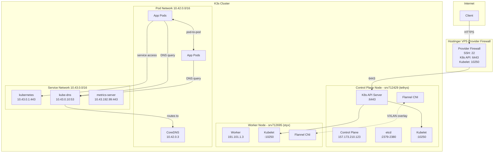
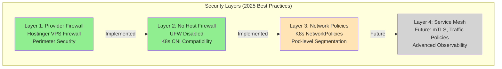
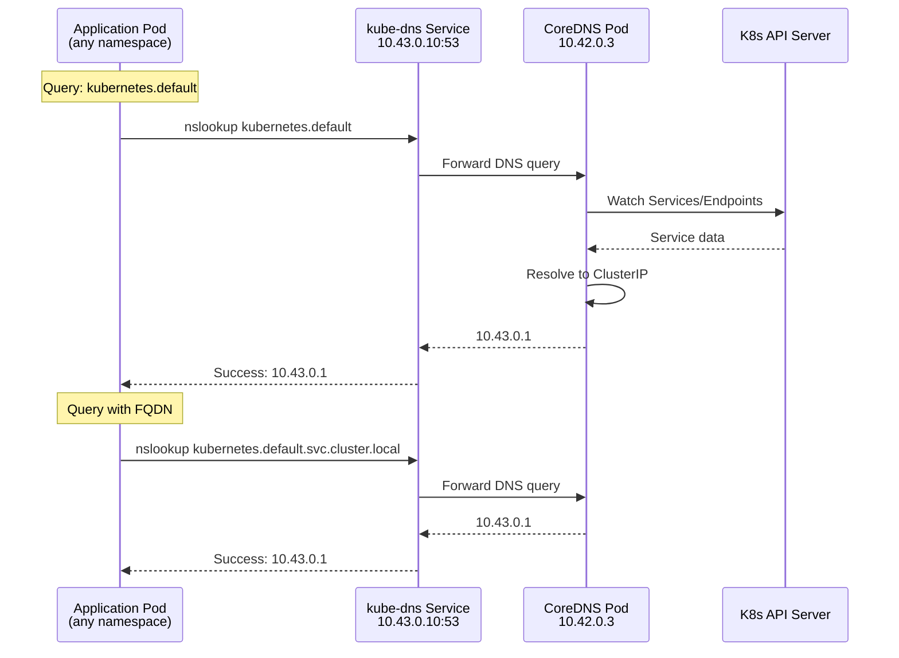
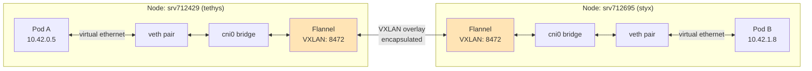

# Oceanid Cluster Networking Architecture

This document describes the K3s cluster networking architecture, security model, and operational procedures.

## Network Topology



## Security Architecture



## DNS Resolution Flow



## Pod-to-Pod Communication



## Network Configuration

### IP Address Allocation

| Resource | CIDR | Description |
|----------|------|-------------|
| Pod Network | `10.42.0.0/16` | Flannel VXLAN overlay network for pod IPs |
| Service Network | `10.43.0.0/16` | ClusterIP services (virtual IPs) |
| Node Network | Public IPs | Hostinger provider network |

### Node IP Addresses

| Node | Role | IP Address | Hostname |
|------|------|------------|----------|
| srv712429 | Control Plane | 157.173.210.123 | tethys |
| srv712695 | Worker | 191.101.1.3 | styx |

### Critical Services

| Service | Type | ClusterIP | Ports | Description |
|---------|------|-----------|-------|-------------|
| kubernetes | ClusterIP | 10.43.0.1 | 443/TCP | K8s API server |
| kube-dns | ClusterIP | 10.43.0.10 | 53/UDP, 53/TCP, 9153/TCP | CoreDNS service |
| metrics-server | ClusterIP | 10.43.192.99 | 443/TCP | Resource metrics |

## Firewall Configuration

### Provider Firewall (Hostinger)

**Status**: Enabled (managed by provider)

Allowed inbound ports:
- `22/tcp` - SSH access
- `6443/tcp` - K8s API server
- `10250/tcp` - Kubelet API (cluster-internal)
- `2379-2380/tcp` - etcd (control plane only)
- `51820-51821/udp` - WireGuard (future VPN)

### Host Firewall (UFW)

**Status**: DISABLED on all nodes

**Why disabled?**
- UFW's default policies block K8s CNI traffic
- Specifically blocks `FORWARD` chain needed for pod-to-pod routing
- Incompatible with Flannel VXLAN overlay networking
- Provider firewall provides adequate perimeter security

**Previous issue**: When UFW was enabled with `DEFAULT_FORWARD_POLICY="DROP"`, all pod-to-pod communication failed, including DNS resolution (see [Issue #117](https://github.com/goldfish-inc/oceanid/issues/117)).

### Network Policies (K8s-native)

**Status**: Not yet implemented

**Future implementation**:
```yaml
# Example: Restrict pod egress
apiVersion: networking.k8s.io/v1
kind: NetworkPolicy
metadata:
  name: default-deny-egress
  namespace: apps
spec:
  podSelector: {}
  policyTypes:
  - Egress
  egress:
  - to:
    - namespaceSelector:
        matchLabels:
          name: kube-system
    ports:
    - protocol: UDP
      port: 53
    - protocol: TCP
      port: 53
```

## Troubleshooting

### DNS Resolution Issues

**Symptoms**:
- Pods cannot resolve service names
- `nslookup` returns `connection timed out` or `NXDOMAIN`

**Diagnosis**:
```bash
# 1. Check CoreDNS pods are Running
kubectl get pods -n kube-system -l k8s-app=kube-dns

# 2. Test DNS with FQDN (bypasses search domains)
kubectl run dnstest --rm -i --image=busybox --restart=Never -- \
  nslookup kubernetes.default.svc.cluster.local

# 3. Check DNS service exists
kubectl get svc -n kube-system kube-dns

# 4. Verify CoreDNS logs
kubectl logs -n kube-system -l k8s-app=kube-dns --tail=50

# 5. Check if UFW is blocking traffic (should be inactive)
ssh root@<node-ip> 'ufw status'
```

**Common fixes**:
1. **UFW blocking traffic**: Disable UFW on all nodes
   ```bash
   ssh root@<node-ip> 'ufw disable'
   ```

2. **CoreDNS not responding**: Restart CoreDNS pods
   ```bash
   kubectl rollout restart -n kube-system deployment/coredns
   ```

3. **Search domain issues**: Use FQDN instead of short names
   - ❌ `kubernetes.default` (requires search domains)
   - ✅ `kubernetes.default.svc.cluster.local` (FQDN)

### Pod-to-Pod Connectivity Issues

**Symptoms**:
- Pods cannot reach other pods
- Network timeouts between pods
- Cross-node pod communication fails

**Diagnosis**:
```bash
# 1. Check Flannel CNI pods
kubectl get pods -n kube-system -l app=flannel

# 2. Verify VXLAN interface exists on nodes
ssh root@<node-ip> 'ip -d link show flannel.1'

# 3. Check iptables FORWARD policy (should be ACCEPT)
ssh root@<node-ip> 'iptables -L FORWARD -n -v | head -5'

# 4. Test connectivity between pods on different nodes
kubectl run test-pod-1 --image=busybox --restart=Never -n default -- sleep 3600
kubectl run test-pod-2 --image=busybox --restart=Never -n default -- sleep 3600
kubectl exec test-pod-1 -- ping -c 3 <test-pod-2-ip>
```

**Common fixes**:
1. **UFW blocking FORWARD chain**: Disable UFW
2. **Flannel not running**: Check K3s installation includes Flannel CNI
3. **VXLAN port blocked**: Ensure UDP 8472 open between cluster nodes

### Node Connectivity Issues

**Symptoms**:
- `kubectl get nodes` shows NotReady
- Control plane cannot reach worker nodes
- Kubelet API unreachable

**Diagnosis**:
```bash
# 1. Check node status
kubectl get nodes -o wide

# 2. SSH to node and check K3s service
ssh root@<node-ip> 'systemctl status k3s'  # control plane
ssh root@<node-ip> 'systemctl status k3s-agent'  # worker

# 3. Check kubelet logs
ssh root@<node-ip> 'journalctl -u k3s -n 100'

# 4. Verify network connectivity
ssh root@<control-plane> 'nc -zv <worker-ip> 10250'
```

**Common fixes**:
1. **Kubelet not running**: Restart K3s service
2. **Port 10250 blocked**: Check firewall rules
3. **Certificate issues**: Regenerate node certificates

## Security Auditing

### Port Exposure Audit

Run this script to audit exposed ports on cluster nodes:

```bash
#!/bin/bash
# audit-exposed-ports.sh

echo "=== Listening TCP Ports ==="
ssh root@<node-ip> 'ss -tlnp | grep LISTEN'

echo -e "\n=== Firewall Rules ==="
ssh root@<node-ip> 'ufw status numbered 2>/dev/null || iptables -L INPUT -n --line-numbers'

echo -e "\n=== K8s Services (External Exposure) ==="
kubectl get svc -A -o custom-columns=\
NAMESPACE:.metadata.namespace,\
NAME:.metadata.name,\
TYPE:.spec.type,\
CLUSTER-IP:.spec.clusterIP,\
EXTERNAL-IP:.status.loadBalancer.ingress[0].ip,\
PORTS:.spec.ports[*].port
```

**Expected results**:
- All K8s services: `Type: ClusterIP` (not NodePort or LoadBalancer)
- Node ports listening: 22 (SSH), 6443 (API), 10250 (kubelet), 2379-2380 (etcd on control plane only)
- No external IPs assigned to services

### Security Checklist

- [ ] UFW disabled on all cluster nodes
- [ ] Provider firewall enabled with minimal necessary ports
- [ ] All K8s services using ClusterIP (no NodePort/LoadBalancer)
- [ ] No pods running with `hostNetwork: true` (except essential DaemonSets)
- [ ] CoreDNS resolving names correctly
- [ ] Flannel CNI operational on all nodes
- [ ] Nodes in Ready state
- [ ] No CrashLoopBackOff pods

## Best Practices (2025)

### Network Security Model

1. **Perimeter Security**: Provider firewall blocks all except necessary ports
2. **No Host Firewall**: UFW disabled to avoid K8s CNI conflicts
3. **Pod-level Security**: Use K8s NetworkPolicies for microsegmentation
4. **Service Mesh**: Consider Linkerd/Istio for mTLS and advanced policies

### Why Not UFW?

UFW (Uncomplicated Firewall) is **incompatible** with K8s for these reasons:

1. **FORWARD policy conflicts**: K8s requires `FORWARD` chain to `ACCEPT` for pod routing
2. **CNI traffic blocked**: Flannel VXLAN, Calico BGP, Cilium all need unrestricted container networking
3. **Difficult to configure**: Allowlisting pod/service CIDRs is complex and error-prone
4. **Maintenance burden**: CNI changes break UFW rules frequently

**Alternative**: Use provider firewall + K8s NetworkPolicies instead.

### Future Enhancements

1. **Network Policies**: Implement default-deny policies with explicit allowlists
2. **Service Mesh**: Deploy Linkerd for mTLS between services
3. **Egress Gateway**: Centralized egress for external API calls
4. **Advanced CNI**: Consider Cilium for eBPF-based networking and security

## Related Documentation

- [Datastores & Storage](./datastores.md) - Database egress and firewall management
- [Cloudflare WARP Setup](../cloudflare-warp-setup.md) - Zero Trust cluster access
- [Operations Overview](./overview.md) - Day-to-day operations
- [Issue #116](https://github.com/goldfish-inc/oceanid/issues/116) - Security hardening (NodePort removal)
- [Issue #117](https://github.com/goldfish-inc/oceanid/issues/117) - DNS fix (UFW disabled)

## References

- [K3s Networking](https://docs.k3s.io/networking)
- [Flannel VXLAN](https://github.com/flannel-io/flannel/blob/master/Documentation/backends.md#vxlan)
- [K8s Network Policies](https://kubernetes.io/docs/concepts/services-networking/network-policies/)
- [Kubernetes DNS](https://kubernetes.io/docs/concepts/services-networking/dns-pod-service/)
