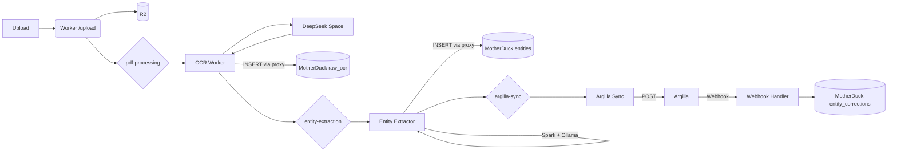

# Operations Guide

This guide covers the day‑to‑day flows for the Oceanid stack with 2× VPS and 1× GPU workstation.

## Topology

- K3s on primary VPS (tethys). Argilla runs in `apps` namespace and is exposed via the Cloudflare tunnel at `https://label.boathou.se`.
- Calypso (GPU workstation) runs a host‑level cloudflared connector and a simple GPU HTTP service at `https://gpu.boathou.se`.
- All secrets and tokens are stored in Pulumi ESC (`default/oceanid-cluster`).

### Calypso Contract

- DNS: `gpu.<base>` CNAME points to the Node Tunnel target `<TUNNEL_ID>.cfargotunnel.com`.
- Host tunnel: systemd `cloudflared-node.service`, config under `/etc/cloudflared/config.yaml` routing `gpu.<base>` → `http://localhost:8000`.
- Triton: systemd `tritonserver.service` (Docker), ports 8000/8001/8002; models mounted from `/opt/triton/models`.
- Adapter: calls `TRITON_BASE_URL=https://gpu.<base>` and presents Cloudflare Access service token when enabled.
- Pulumi ownership: `HostCloudflared` and `HostDockerService` components render/update these units.

## Deployment Model

- Cloud resources (`cloud/`): Deployed by GitHub Actions with OIDC on push to `main`.
- Cluster resources (`cluster/`): Deployed by Pulumi Deployments using a self‑hosted agent (pool: `oceanid-cluster`). Do not run `pulumi up` from GitHub runners.

Monitor deployments:
- Cloud: GitHub Actions → cloud-infrastructure
- Cluster: Pulumi Cloud → Deployments → Runs (stack `ryan-taylor/oceanid-cluster/prod`)

Agent setup (once, on a host with kubeconfig):
- Install agent and register to pool `oceanid-cluster`
- Enable service on boot and confirm it’s online in Pulumi Cloud

## Validate

- If kubectl is flaky, ensure a local API tunnel:
  - `scripts/k3s-ssh-tunnel.sh tethys`
  - `export KUBECONFIG=cluster/kubeconfig.yaml`
- Basic smoke tests:
  - `make smoke` (uses label.boathou.se and gpu.boathou.se)
  - Triton HTTP V2 live:
    - `curl -s https://gpu.boathou.se/v2/health/ready`
    - `curl -s https://gpu.boathou.se/v2/models`
  - Docling model present:
    - `curl -s https://gpu.<base>/v2/models/docling_granite_python`

## Hands‑off Training and Deployment (ESC‑only)

- GitHub Actions (`.github/workflows/train-ner.yml`) trains (nightly or on demand) from the HF dataset and publishes an updated ONNX to a private HF model repo.
- Calypso runs a `model-puller` systemd timer that fetches the latest ONNX into `/opt/triton/models/distilbert-base-uncased/<n>/`.
- Triton repository polling reloads new versions automatically.

Configure once in Pulumi ESC (no GitHub Secrets/Vars required):

- `pulumiConfig.oceanid-cluster:hfAccessToken` → HF write token (used by sink + CI)
- `pulumiConfig.oceanid-cluster:hfDatasetRepo` → default dataset repo (fallback)
- `pulumiConfig.oceanid-cluster:hfDatasetRepoNER` → NER annotations dataset (preferred for NER)
- `pulumiConfig.oceanid-cluster:hfDatasetRepoDocling` → Docling annotations dataset
- `pulumiConfig.oceanid-cluster:hfModelRepo` → e.g., `goldfish-inc/oceanid-ner-distilbert`
- `pulumiConfig.oceanid-cluster:postgres_url` → CrunchyBridge PG 17 URL (for migrations)

ESC commands:

```bash
esc env set default/oceanid-cluster pulumiConfig.oceanid-cluster:hfAccessToken "<HF_WRITE_TOKEN>" --secret
esc env set default/oceanid-cluster pulumiConfig.oceanid-cluster:hfDatasetRepo "goldfish-inc/oceanid-annotations"
esc env set default/oceanid-cluster pulumiConfig.oceanid-cluster:hfDatasetRepoNER "goldfish-inc/oceanid-annotations-ner"
esc env set default/oceanid-cluster pulumiConfig.oceanid-cluster:hfDatasetRepoDocling "goldfish-inc/oceanid-annotations-docling"
esc env set default/oceanid-cluster pulumiConfig.oceanid-cluster:hfModelRepo "goldfish-inc/oceanid-ner-distilbert"
esc env set default/oceanid-cluster pulumiConfig.oceanid-cluster:postgres_url "postgres://<user>:<pass>@p.<cluster-id>.db.postgresbridge.com:5432/postgres" --secret
esc env set default/oceanid-cluster pulumiConfig.oceanid-cluster:nautilusSyncToken "<GITHUB_PAT_WITH_repo_WRITE_ON_goldfish-inc/nautilus>" --secret
```

Workflows:

- `train-ner.yml` pulls HF token + repo names from ESC via OIDC.
- `database-migrations.yml` pulls DB URL from ESC and applies SQL migrations V3–V6; ensures extensions `pgcrypto`, `postgis`, `btree_gist`. Skips gracefully if DB URL not set.
- Check connector health in Cloudflare Zero Trust → Tunnels.

### Hugging Face cache on Calypso

Calypso’s 2 TB NVMe is mounted at `/mnt/nvme`. Run the helper script once to point Hugging Face tooling at the fast cache and silence the deprecated `TRANSFORMERS_CACHE` warning:

```bash
ssh calypso
./scripts/configure-hf-cache.sh /mnt/nvme/hf-cache
source /etc/profile.d/huggingface.sh
```

This writes `/etc/profile.d/huggingface.sh` with:

```bash
export HF_HOME=/mnt/nvme/hf-cache
export HF_HUB_CACHE=${HF_HOME}/hub
export HUGGINGFACE_HUB_CACHE=${HF_HOME}/hub
```

From now on, every shell and service on Calypso uses the NVMe cache automatically.

## Access Controls

- GPU endpoint `gpu.<base>` is protected by a Cloudflare Zero Trust Access application that only allows a service token issued to the in-cluster adapter. The adapter is provisioned with `CF_ACCESS_CLIENT_ID` and `CF_ACCESS_CLIENT_SECRET` automatically.
- Kubernetes API `api.<base>` is exposed via the node tunnel and protected by Cloudflare Access. Use `cloudflared access tcp` to connect.

### K8s API via Access (recommended)

```bash
cloudflared access tcp --hostname api.<base> --url 127.0.0.1:6443 &
export KUBECONFIG=~/.kube/k3s-config.yaml
kubectl cluster-info
```

Ensure your email domain or emails are included in Access policy.

Mermaid (Argilla path):

```mermaid
flowchart LR
  Upload[Cloudflare upload handler] --> OCR[DeepSeek OCR worker]
  OCR --> NER[Ollama Worker (Spark)]
  NER --> Sync[Argilla sync worker]
  Sync --> Argilla[Argilla UI]
  Argilla --> Export[argilla-export worker]
  Export --> MD[MotherDuck]
```

## Argilla + MotherDuck Pipeline (WIP)

- Argilla replaces Label Studio completely. Deployment details live in `ARGILLA_DEPLOYMENT.md`.
- Dataset imports are handled by `clusters/tethys/apps/argilla-importer.yaml` + `ARGILLA_IMPORT.md` (server-side Hugging Face importer).
- The Cloudflare Workers pipeline that feeds Argilla is tracked in `VESSEL_NER_CLOUDFLARE_WORKPLAN.md` (archived). Current flow: upload handler → OCR → NER via Spark + Ollama Worker → Argilla sync/export → MotherDuck corrections → Postgres/PostGraphile.
- `ls-triton-adapter` remains as the shared inference endpoint until the Argilla sync worker takes over suggestions.
- All former Label Studio helpers (ML auto-connect, S3 helper, PAT scripts) were removed; use the workplan to coordinate new functionality.

## Secrets & Config

- ESC keys to verify:
  - `cloudflareNodeTunnelId`, `cloudflareNodeTunnelToken`, `cloudflareNodeTunnelHostname`, `cloudflareNodeTunnelTarget`
  - `cloudflareAccountId`, `cloudflareApiToken`, `cloudflareZoneId`
  - `argillaPostgresPassword`, `argillaAuthSecret`, `argillaAdminPassword`, `argillaAdminApiKey`, `argillaRedisUrl`
  - `huggingFaceToken`
  - `nautilusSyncToken` - GitHub token used by the docs sync workflow to dispatch builds to `goldfish-inc/nautilus`
- The node tunnel token can be either:
  - Base64‑encoded credentials.json, or
  - Raw TUNNEL_TOKEN string
  The NodeTunnels + HostCloudflared components auto‑detect both.

## Troubleshooting

- Cloudflare record exists: delete the existing DNS record (e.g., `label.boathou.se`) or remove Pulumi management for that hostname.
- cloudflared “control stream failure”:
  - Ensure `protocol: auto` and `dnsPolicy: ClusterFirstWithHostNet` are active.
  - Verify Calypso has the label `oceanid.cluster/tunnel-enabled=true` if using the K8s DaemonSet.
- SSH provisioning timeouts:
  - Keep `enableNodeProvisioning=false` while stabilizing tunnels.
- Calypso sudo:
  - `oceanid` must have passwordless sudo for apt/systemd.

### Calypso quick checks

```bash
ssh calypso 'systemctl status cloudflared-node --no-pager; systemctl status tritonserver --no-pager'
ssh calypso 'curl -sf http://localhost:8000/v2/health/ready && echo OK'
curl -sk https://gpu.<base>/v2/health/ready
```

### CrunchyBridge Postgres

- Configure sink to use external DB:
  - `pulumi -C cluster config set --secret oceanid-cluster:postgres_url 'postgresql://<user>:<pass>@<host>:5432/<db>'`
  - `make up`
- Apply schema migrations locally:
  - `export DATABASE_URL='postgresql://<user>:<pass>@<host>:5432/<db>'`
  - `make db-migrate`
- Quick checks:
  - `make db-psql`
  - `psql "$DATABASE_URL" -c "select * from stage.v_documents_freshness;"`

### Argilla Workspace Storage

- Argilla uses an in-cluster PostgreSQL + Elasticsearch StatefulSet (see `clusters/tethys/apps/argilla.yaml`). No external CrunchyBridge database is required.
- Secrets come from `argilla-secrets` (managed by Pulumi; see `cluster/src/index.ts`). Update ESC values listed above if credentials change.
- Public host remains `label.<base>` but the service is Argilla.
- Tunnel ingress/DNS: `label.<base>` CNAME → `<cluster_tunnel_id>.cfargotunnel.com` (proxied) with ingress mapping to LS service.

Verify:

- `curl -I https://label.<base>/` → `302 Found` to `/user/login/`
- First start creates app tables: `psql …/labelfish -c "\dt labelfish.*"`

## Add a new GPU host (host‑level)

1. Provision SSH user + key; add to ESC.
2. Add a `HostCloudflared` + optional `HostGpuService` for the host.
3. Point a new `gpuX.<base>` route via Cloudflare DNS.

## Using Triton with Docling/Granite

- If you have a ready Docker image (e.g., a Docling‑Granite HTTP server), you can run it instead of Triton. Ask and we’ll switch the host service to that container and route `gpu.<base>` to its HTTP port.
- To use a model with Triton, place it under `/opt/triton/models/<model_name>/1/` on Calypso and add a `config.pbtxt`. Triton supports TensorRT, ONNX, PyTorch, TensorFlow and Python backends.
- For Docling‑Granite via Python backend, this repo includes a skeleton at `triton-models/docling_granite_python/`. Copy it to Calypso and customize `model.py` as needed.

Example (on Calypso):

```bash
sudo mkdir -p /opt/triton/models
scp -r triton-models/docling_granite_python calypso:/tmp/
ssh calypso "sudo mv /tmp/docling_granite_python /opt/triton/models/ && sudo systemctl restart tritonserver"
curl -s https://gpu.<base>/v2/models

GPU pinning
- `distilbert-base-uncased` is pinned to GPU0; `docling_granite_python` is pinned to GPU1 (see `instance_group.gpus` in each `config.pbtxt`). Adjust if hardware layout changes.
```

Adapter usage (PDF):

```bash
kubectl -n apps port-forward svc/ls-triton-adapter 9090:9090 &
PDF64=$(base64 -w0 sample.pdf)
curl -s -X POST http://localhost:9090/predict \
  -H 'Content-Type: application/json' \
  -d '{"model":"docling_granite_python","pdf_base64":"'"$PDF64"'","prompt":"Extract vessel summary"}' | jq .
```
## Current Pipeline (High-Level)



See also: `docs/operations/pipeline-overview.md` and `docs/operations/networking-topology.md`.
