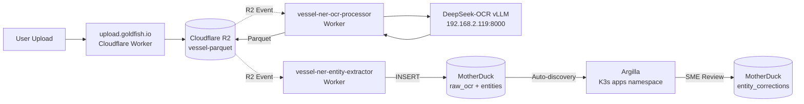

# Operations Guide

**Last Updated**: 2025-11-11
**Status**: Production (Argilla + vessel-ner Workers)

This guide covers the day‑to‑day operations for the Oceanid stack with K3s cluster and Cloudflare Workers.

## Topology

- **K3s Cluster**: Primary VPS (tethys) + GPU worker (calypso). Argilla runs in `apps` namespace.
- **Cloudflare Workers**: vessel-ner stack (OCR + entity extraction) running serverless at edge.
- **DGX Spark**: DeepSeek-OCR vLLM service (192.168.2.119:8000) for OCR processing.
- **MotherDuck**: SQL warehouse for OCR results, entities, and annotations.
- All secrets and tokens are stored in Pulumi ESC (`default/oceanid-cluster`).

### Legacy Services (Deprecated)

The following services have been replaced by the new architecture:

- **Triton Adapter** (`ls-triton-adapter`): ❌ Removed - Replaced by vessel-ner Cloudflare Workers
- **Label Studio**: ❌ Removed - Replaced by Argilla
- **Calypso GPU Tunnel**: ⚠️ Legacy - DGX Spark now provides OCR via vLLM (DeepSeek-OCR)

### Current Architecture

- **Upload Portal**: `upload.goldfish.io` (Cloudflare Worker)
- **OCR Processing**: vessel-ner-ocr-processor (Worker) → DeepSeek-OCR vLLM (DGX Spark)
- **Entity Extraction**: vessel-ner-entity-extractor (Worker)
- **Storage**: Cloudflare R2 (vessel-parquet bucket) + MotherDuck (SQL warehouse)
- **Annotation**: Argilla (K3s cluster, `apps` namespace)

## Deployment Model

- Cloud resources (`cloud/`): Deployed by GitHub Actions with OIDC on push to `main`.
- Cluster resources (`cluster/`): Deployed by Pulumi Deployments using a self‑hosted agent (pool: `oceanid-cluster`). Do not run `pulumi up` from GitHub runners.

Monitor deployments:
- Cloud: GitHub Actions → cloud-infrastructure
- Cluster: Pulumi Cloud → Deployments → Runs (stack `ryan-taylor/oceanid-cluster/prod`)

Agent setup (once, on a host with kubeconfig):
- Install agent and register to pool `oceanid-cluster`
- Enable service on boot and confirm it’s online in Pulumi Cloud

## Validate

- If kubectl is flaky, ensure a local API tunnel:
  - `scripts/k3s-ssh-tunnel.sh tethys`
  - `export KUBECONFIG=cluster/kubeconfig.yaml`
- Basic smoke tests:
  - **Argilla**: `curl -I https://label.boathou.se/` → `302` redirect to login
  - **DeepSeek-OCR vLLM** (from authorized network): `curl http://192.168.2.119:8000/health`
  - **Upload Portal**: `curl https://upload.goldfish.io/health`
  - **MotherDuck**: Check `md-query-proxy` pod health in `apps` namespace

## Training and Model Updates (Legacy)

**Status**: ⚠️ **Deprecated** - NER training workflow paused during Argilla migration.

Previous workflow (Label Studio era):
- GitHub Actions trained models from HF datasets
- Triton server auto-reloaded updated ONNX models

**Current Approach**:
- Argilla annotations exported to MotherDuck (`md.annotated` table)
- Future: Training pipeline will consume MotherDuck exports

Configure once in Pulumi ESC (no GitHub Secrets/Vars required):

- `pulumiConfig.oceanid-cluster:hfAccessToken` → HF write token (used by sink + CI)
- `pulumiConfig.oceanid-cluster:hfDatasetRepo` → default dataset repo (fallback)
- `pulumiConfig.oceanid-cluster:hfDatasetRepoNER` → NER annotations dataset (preferred for NER)
- `pulumiConfig.oceanid-cluster:hfDatasetRepoDocling` → Docling annotations dataset
- `pulumiConfig.oceanid-cluster:hfModelRepo` → e.g., `goldfish-inc/oceanid-ner-distilbert`
- `pulumiConfig.oceanid-cluster:postgres_url` → CrunchyBridge PG 17 URL (for migrations)

ESC commands:

```bash
esc env set default/oceanid-cluster pulumiConfig.oceanid-cluster:hfAccessToken "<HF_WRITE_TOKEN>" --secret
esc env set default/oceanid-cluster pulumiConfig.oceanid-cluster:hfDatasetRepo "goldfish-inc/oceanid-annotations"
esc env set default/oceanid-cluster pulumiConfig.oceanid-cluster:hfDatasetRepoNER "goldfish-inc/oceanid-annotations-ner"
esc env set default/oceanid-cluster pulumiConfig.oceanid-cluster:hfDatasetRepoDocling "goldfish-inc/oceanid-annotations-docling"
esc env set default/oceanid-cluster pulumiConfig.oceanid-cluster:hfModelRepo "goldfish-inc/oceanid-ner-distilbert"
esc env set default/oceanid-cluster pulumiConfig.oceanid-cluster:postgres_url "postgres://<user>:<pass>@p.<cluster-id>.db.postgresbridge.com:5432/postgres" --secret
esc env set default/oceanid-cluster pulumiConfig.oceanid-cluster:nautilusSyncToken "<GITHUB_PAT_WITH_repo_WRITE_ON_goldfish-inc/nautilus>" --secret
```

Workflows:

- `train-ner.yml` pulls HF token + repo names from ESC via OIDC.
- `database-migrations.yml` pulls DB URL from ESC and applies SQL migrations V3–V6; ensures extensions `pgcrypto`, `postgis`, `btree_gist`. Skips gracefully if DB URL not set.
- Check connector health in Cloudflare Zero Trust → Tunnels.

### Hugging Face cache on Calypso

Calypso’s 2 TB NVMe is mounted at `/mnt/nvme`. Run the helper script once to point Hugging Face tooling at the fast cache and silence the deprecated `TRANSFORMERS_CACHE` warning:

```bash
ssh calypso
./scripts/configure-hf-cache.sh /mnt/nvme/hf-cache
source /etc/profile.d/huggingface.sh
```

This writes `/etc/profile.d/huggingface.sh` with:

```bash
export HF_HOME=/mnt/nvme/hf-cache
export HF_HUB_CACHE=${HF_HOME}/hub
export HUGGINGFACE_HUB_CACHE=${HF_HOME}/hub
```

From now on, every shell and service on Calypso uses the NVMe cache automatically.

## Access Controls

- **Argilla**: Exposed via Cloudflare WARP for developer access (private network routing)
- **Upload Portal**: Public endpoint (`upload.goldfish.io`) for PDF uploads
- **DeepSeek-OCR vLLM**: Private LAN access only (192.168.2.119) - accessed by vessel-ner Workers via Cloudflare Magic WAN
- **Kubernetes API**: Accessible via Cloudflare WARP with kubectl direct routing

### K8s API via Access (recommended)

```bash
cloudflared access tcp --hostname api.<base> --url 127.0.0.1:6443 &
export KUBECONFIG=~/.kube/k3s-config.yaml
kubectl cluster-info
```

Ensure your email domain or emails are included in Access policy.

Mermaid (Argilla path):

```mermaid
flowchart LR
  Upload[Cloudflare upload handler] --> OCR[DeepSeek OCR worker]
  OCR --> NER[Ollama Worker (Spark)]
  NER --> Sync[Argilla sync worker]
  Sync --> Argilla[Argilla UI]
  Argilla --> Export[argilla-export worker]
  Export --> MD[MotherDuck]
```

## Argilla + MotherDuck Pipeline (Production)

**Status**: ✅ **Active** - Migrated from Label Studio November 2025

**Architecture**:
1. **Upload**: User uploads PDF to `upload.goldfish.io` (Cloudflare Worker)
2. **Storage**: PDF stored in R2 bucket (`vessel-parquet`)
3. **OCR**: R2 event triggers `vessel-ner-ocr-processor` → calls DeepSeek-OCR vLLM
4. **Parquet**: OCR results written to R2 as Parquet files
5. **Entity Extraction**: R2 event triggers `vessel-ner-entity-extractor` → reads Parquet, extracts entities
6. **MotherDuck**: Entities written to `md.raw_ocr` and `md.entities` tables
7. **Argilla**: Auto-discovers records from MotherDuck for SME annotation
8. **Corrections**: SME edits synced back to `md.entity_corrections` table

**Key Documentation**:
- `docs/architecture/ocr-argilla-motherduck.md` - Architecture overview
- `docs/operations/pipeline-overview.md` - End-to-end flow
- `workers/vessel-ner/ARCHITECTURE.md` - Cloudflare Workers design
- `sql/motherduck/ARGILLA_SCHEMA.md` - Database schema

## Secrets & Config

- ESC keys to verify:
  - `cloudflareNodeTunnelId`, `cloudflareNodeTunnelToken`, `cloudflareNodeTunnelHostname`, `cloudflareNodeTunnelTarget`
  - `cloudflareAccountId`, `cloudflareApiToken`, `cloudflareZoneId`
  - `argillaPostgresPassword`, `argillaAuthSecret`, `argillaAdminPassword`, `argillaAdminApiKey`, `argillaRedisUrl`
  - `huggingFaceToken`
  - `nautilusSyncToken` - GitHub token used by the docs sync workflow to dispatch builds to `goldfish-inc/nautilus`
- The node tunnel token can be either:
  - Base64‑encoded credentials.json, or
  - Raw TUNNEL_TOKEN string
  The NodeTunnels + HostCloudflared components auto‑detect both.

## Troubleshooting

- Cloudflare record exists: delete the existing DNS record (e.g., `label.boathou.se`) or remove Pulumi management for that hostname.
- cloudflared “control stream failure”:
  - Ensure `protocol: auto` and `dnsPolicy: ClusterFirstWithHostNet` are active.
  - Verify Calypso has the label `oceanid.cluster/tunnel-enabled=true` if using the K8s DaemonSet.
- SSH provisioning timeouts:
  - Keep `enableNodeProvisioning=false` while stabilizing tunnels.
- Calypso sudo:
  - `oceanid` must have passwordless sudo for apt/systemd.

### Quick Health Checks

```bash
# Argilla (via WARP)
curl http://argilla.apps.svc.cluster.local/api/health

# DeepSeek-OCR vLLM (from authorized network)
ssh sparky@192.168.2.119 'curl http://localhost:8000/health'

# Upload portal
curl https://upload.goldfish.io/health

# MotherDuck connectivity (via md-query-proxy)
kubectl -n apps port-forward svc/md-query-proxy 8080:8080 &
curl http://localhost:8080/health
```

### CrunchyBridge Postgres

- Configure sink to use external DB:
  - `pulumi -C cluster config set --secret oceanid-cluster:postgres_url 'postgresql://<user>:<pass>@<host>:5432/<db>'`
  - `make up`
- Apply schema migrations locally:
  - `export DATABASE_URL='postgresql://<user>:<pass>@<host>:5432/<db>'`
  - `make db-migrate`
- Quick checks:
  - `make db-psql`
  - `psql "$DATABASE_URL" -c "select * from stage.v_documents_freshness;"`

### Argilla Workspace Storage

- Argilla uses an in-cluster PostgreSQL + Elasticsearch StatefulSet (see `clusters/tethys/apps/argilla.yaml`). No external CrunchyBridge database is required.
- Secrets come from `argilla-secrets` (managed by Pulumi; see `cluster/src/index.ts`). Update ESC values listed above if credentials change.
- Public host remains `label.<base>` but the service is Argilla.
- Tunnel ingress/DNS: `label.<base>` CNAME → `<cluster_tunnel_id>.cfargotunnel.com` (proxied) with ingress mapping to LS service.

Verify:

- `curl -I https://label.<base>/` → `302 Found` to `/user/login/`
- First start creates app tables: `psql …/labelfish -c "\dt labelfish.*"`

## OCR Processing (DeepSeek-OCR vLLM)

**Current Setup**: DGX Spark (192.168.2.119) running DeepSeek-OCR via vLLM as systemd service.

**Model**: `deepseek-ai/DeepSeek-OCR` (17GB, vision-language model)
**Endpoint**: `http://192.168.2.119:8000/v1/chat/completions` (OpenAI-compatible)
**GPU**: NVIDIA H100 (80GB VRAM)

### Test OCR Processing

```bash
# From workstation with network access to 192.168.2.119
curl -X POST http://192.168.2.119:8000/v1/chat/completions \
  -H "Content-Type: application/json" \
  -d '{
    "model": "deepseek-ai/DeepSeek-OCR",
    "messages": [{
      "role": "user",
      "content": [
        {"type": "text", "text": "<|grounding|>Convert the document to markdown."},
        {"type": "image_url", "image_url": {"url": "https://example.com/doc.pdf"}}
      ]
    }],
    "max_tokens": 4096,
    "temperature": 0
  }'
```

### Managing vLLM Service

```bash
# SSH to DGX Spark
ssh sparky@192.168.2.119

# Check service status
systemctl status deepseek-ocr-vllm

# View logs
journalctl -u deepseek-ocr-vllm -f

# Restart service
sudo systemctl restart deepseek-ocr-vllm
```

See: `/Users/rt/Developer/deepseek-ocr-vllm/QUICKSTART.md` for deployment details.
## Current Pipeline (Production)



**Key Points**:
- Serverless architecture (Cloudflare Workers at edge)
- Event-driven processing (R2 triggers)
- Direct GPU access via private LAN (vLLM on DGX Spark)
- SQL-based storage (MotherDuck replaces Label Studio DB)

See also: `docs/operations/pipeline-overview.md` and `docs/architecture/ocr-argilla-motherduck.md`.
