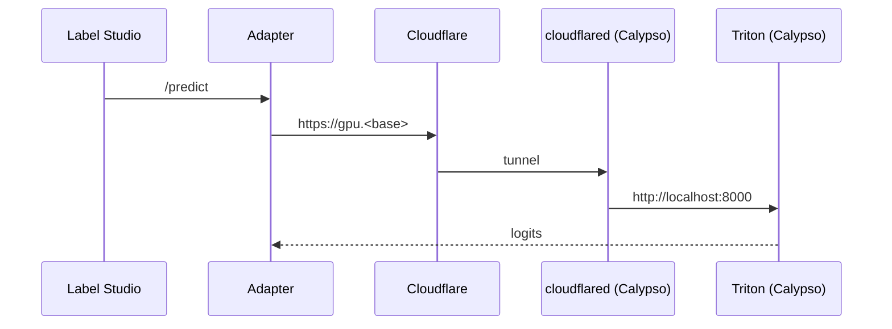

# Oceanid Infrastructure Status Summary

**Last Updated:** September 30, 2025
**Status:** Pre-labels pipeline operational (GPU via Calypso). PKO not in scope.

## Cluster Overview

### Nodes (All Ready)
- **srv712429** (tethys): Control plane, 157.173.210.123
- **srv712695** (styx): Worker, 191.101.1.3
- **calypso**: GPU workstation (RTX 4090), 192.168.2.80
  - Tainted: `workload-type=gpu-compute:NoSchedule`

### Component Status

#### ✅ Fully Operational
- **K3s Cluster**: v1.33.4+k3s1 on all nodes
- **Cloudflare Tunnels**:
  - Cluster tunnel: `label.<base>` (Zero Trust)
  - Node tunnel (Calypso): `gpu.<base>` → Triton 8000
- **Adapter**: ls-triton-adapter healthy (FastAPI)
- **Triton (Calypso)**: GHCR 2.60.0, DistilBERT ONNX served on GPU
- **SSH Access**: Working via tunnel on port 16443

#### ℹ️ Notes
- **Apps stack**: Postgres only (MinIO/Airflow deferred)
- **Postgres**: CrunchyBridge external DB used for staging (sink writes via DATABASE_URL)
- **Annotations Sink**: deployed; writes HF JSONL and cleaned extractions to Postgres stage when enabled

## Recent Fixes & Improvements

### 1. SSH Tunnel Configuration
**Problem:** Multiple conflicting kubeconfig files with different ports
**Solution:**
- Consolidated to single `~/.kube/k3s-config.yaml`
- Standardized on port 16443 locally → 6443 on tethys
- Documented in README with troubleshooting steps

### 2. Calypso GPU Path Stabilized
**Done:**
- Host cloudflared systemd unit (`cloudflared-node`)
- DNS `gpu.<base>` → node tunnel target
- Triton 2.60.0 (GHCR) w/ GPU + DistilBERT ONNX

### 3. Field Manager Conflicts
**Problem:** Multiple Pulumi field managers conflicting
**Solution:**
- Deleted resources with conflicts
- Refreshed Pulumi state
- Redeployed cleanly

### 4. Secret Management Enforcement
**Achievement:** All secrets now managed through Pulumi ESC
- No hardcoded tokens or credentials
- GitHub push protection active
- Documented in SECRET_MANAGEMENT.md

## Current Issues Analysis

### Calypso Contract (Mermaid)


## Access Instructions

```bash
# SSH tunnel setup (required for kubectl)
ssh -L 16443:localhost:6443 -N tethys &

# Use cluster
export KUBECONFIG=~/.kube/k3s-config.yaml
kubectl get nodes

# Troubleshooting connection issues
lsof -i :16443           # Check for conflicts
pkill -f "ssh.*16443"     # Kill old tunnels
```

## GitHub Issues Status

| Issue | Title | Status | Notes |
|-------|-------|--------|-------|
| #35 | Validate K3s cluster | ✅ Closed | All nodes ready |
| #36 | Deploy Cloudflare tunnel | ✅ Closed | Running with latest image |
| #37 | Pod Security Standards | ✅ Closed | Enforced on namespaces |
| #38 | Flux CD deployment | ✅ Closed | All controllers operational |
| #39 | PKO deployment | 🔄 In Progress | Image pull issues |

## Next Actions

1. **Fix PKO deployment**
   - Update HelmRelease with correct image version
   - Or switch to using latest tag

2. **Set up Flux image automation**
   - Configure ImageRepository for cloudflared
   - Create ImageUpdateAutomation resource

3. **Complete documentation**
   - Update architecture diagrams (Calypso contract)
   - Document Calypso path in README/Architecture/Operations

## Key Architecture Decisions

1. **SSH tunnel for management**: More reliable than Cloudflare for kubectl
2. **Cloudflare for applications**: DDoS protection and SSL for public services
3. **Pulumi ESC for secrets**: No exceptions, all secrets centralized
4. **GPU node isolation**: Tainted to prevent non-GPU workloads

## Cluster Resources

```
Namespaces with workloads:
- cert-manager     (cert infrastructure)
- cloudflared      (tunnel pods)
- flux-system      (GitOps controllers)
- kube-system      (core k8s)
- pulumi-system    (PKO - currently broken)
```

---

**Repository:** github.com/ry4n-s/oceanid
**Pulumi Stack:** ryan-taylor/oceanid-cluster/prod
**Domain:** boathou.se
