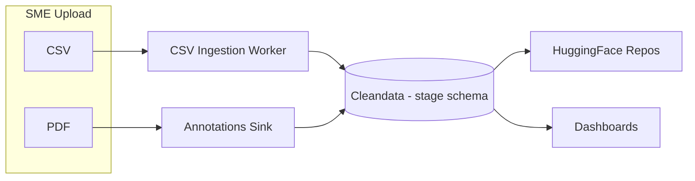
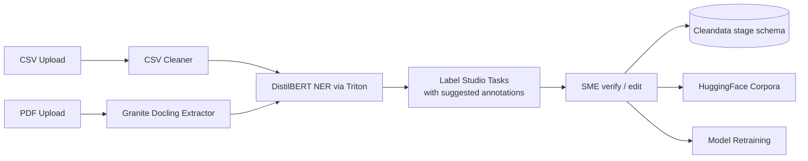

# Workplan: Automated Pre-Annotation Pipeline

**Stakeholders:** SMEs, ML Platform, Data Engineering
**Last updated:** 2025-10-16

---

## 1. Problem Statement

We operate multiple ML services (DistilBERT NER, Granite Docling, Triton, Label Studio adapters), but **none of our uploads are pre-annotated** before SMEs review them. Every task remains manual, so:

- SME effort is spent labeling from scratch instead of validating.
- Models do not receive a continuous stream of human-verified predictions.
- Our data pipeline (CSV worker, annotations-sink, HuggingFace mirrors) only captures human annotations.

Goal: create an end-to-end **active learning loop** so uploads receive ML predictions automatically, SMEs verify/correct, and we store both the model output and human feedback.

---

## 2. Current vs Desired Architecture

### Today (manual only)

### Target (pre-annotation + feedback loop)

---

## 3. Objectives

1. **Generate pre-annotations** (entities, tables) for both CSV and PDF uploads.
2. **Surface predictions in Label Studio** so SMEs approve/correct rather than start from blank.
3. **Persist predictions + SME feedback** into Cleandata + HuggingFace for retraining.
4. **Close the loop** by fine-tuning models on the verified data periodically.

---

## 4. Critical Questions (Phase 0 – Discovery)

| Area | Question | Owner | Notes |
|------|----------|-------|-------|
| Adapter | Does `ls-triton-adapter` already support pre-annotation endpoints? | ML Platform | Review repo & deployment configuration |
| Label Studio | Which API is best for bulk task creation with predictions? | Platform | LS `/api/tasks/bulk/` with `predictions` payload? |
| Data schema | How do we represent model predictions vs SME edits in Cleandata? | Data Eng | Need consistent lineage (prediction_id, annotated_by, etc.) |
| PDFs | Do we always run Docling first, or only when certain formats detected? | ML Platform | Determine heuristics for PDF vs image |
| Infra | Where should new worker run? (existing namespace, new deployment) | DevOps | Possibly reuse apps namespace |

Deliverable: discovery notes + updated requirements before implementation starts.

---

## 5. Workplan (Phased)

### Phase 1 – Enable Prediction Ingestion (CSV first)
1. **Audit `ls-triton-adapter`:** confirm it can call Triton DistilBERT and return entity spans.
2. **Design prediction payload:** final JSON schema for Label Studio tasks (entities, confidence, metadata).
3. **Build `csv-predictor` worker:**
   - Triggered after `csv-ingestion-worker` stores a document.
   - Fetches cleaned rows.
   - Calls DistilBERT via adapter.
   - Creates/updates Label Studio tasks with `predictions`.
4. **Persist predictions:**
   - Extend `stage.csv_extractions` (or new table) to store model suggestion + confidence + version.
   - Link SME edits back to prediction id.
5. **SME rollout + training:** update SME guide (“You will now see suggested tags”) and monitor accuracy.

**Exit criteria:** For a pilot project, CSV uploads show suggested entities and SMEs only need to verify.

### Phase 2 – Extend to PDFs
1. **Granite Docling integration:**
   - Extract plain text + table cells.
   - Normalise output to the same schema CSV worker uses.
2. **Run through DistilBERT (and/or PDF NER models).**
3. **Create Label Studio tasks with predictions** (regions + text).
4. **Update `annotations-sink`:** capture predictions vs final annotations for feedback.
5. **Backfill existing PDFs** to measure accuracy and SME time savings.

### Phase 3 – Close the Training Loop
1. Define promotion rules (confidence, SME approval) to send data to `training_corpus`.
2. Automate model fine-tuning jobs (nightly/weekly) using HuggingFace repos.
3. Push new model artifacts to Triton & track versions.
4. Add monitoring dashboards (precision, recall, SME overrides) to validate improvements.

### Phase 4 – Automation & Safety Nets
- Canary deploys for new models (subset of projects).
- Confidence thresholds to skip pre-annotation when model uncertain.
- Alerting when SME override rate spikes (model drift).

---

## 6. Deliverables & Owners

| Deliverable | Description | Owner | Due |
|-------------|-------------|-------|-----|
| Discovery report | Answers to Phase 0 questions | ML Platform | TBD |
| CSV pre-annotation MVP | Worker, schema updates, LS integration | ML Platform + Data Eng | TBD |
| SME comms | Update documentation/training | Ops Enablement | TBD |
| PDF pre-annotation | Docling integration + predictions | ML Platform | TBD |
| Retraining pipeline | Automated fine-tuning + deployment | ML Platform | TBD |

---

## 7. Risks & Mitigations

| Risk | Impact | Mitigation |
|------|--------|------------|
| Poor model suggestions frustrate SMEs | Adoption drops | Start with high-confidence entity types, allow “clear all suggestions” button |
| API rate limits / performance | Slower uploads | Batch predictions, monitor Triton latency |
| Schema drift between predictions and corrections | Data mismatch | Versioned prediction schema, add integration tests |
| PDF parsing failures | Missing suggestions for complex docs | Log fallbacks, surface alerts to ML team |

---

## 8. Next Steps

1. Schedule Phase 0 discovery meeting (Adapter + ML + Data Eng).
2. Document existing `ls-triton-adapter` capabilities and gaps.
3. Draft prediction payload schema (entities, offsets, confidence).
4. Prototype CSV prediction worker in dev cluster.
5. Update SME guide once pilot ready.

> **Reminder:** SMEs stay entirely inside Label Studio. Our job is to meet them there with high-quality suggestions, capture their corrections, and feed the improvements back into Triton.
