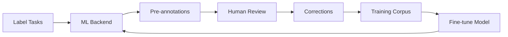

# ML Backend Connection Script

Programmatically connect the Triton ML backend to Label Studio projects.

## Recommended: Manual per-project connection

The recommended approach is to connect the ML backend from the Label Studio UI on a per‑project basis:

- Project → Settings → Model → Connect model
- URL: `http://ls-triton-adapter.apps.svc.cluster.local:9090`
- Authentication: none

This avoids coupling infrastructure to a personal user token.

## Quick Start

```bash
# 1. Get your Label Studio API key
# Navigate to: https://label.boathou.se → Account & Settings → Access Token

# 2. Set environment variables
export LABEL_STUDIO_URL=https://label.boathou.se
export LABEL_STUDIO_API_KEY='your_token_here'

# 3. Install dependencies (one-time)
pip install label-studio-sdk requests

# 4. Run the script
python3 scripts/connect-ml-backend.py
```

## What This Script Does (optional)

1. **Connects to Label Studio** using your user access token
2. **Finds your project** by name (default: "SME 2025")
3. **Adds ML backend** URL to project settings
4. **Enables pre-annotations** for automatic labeling
5. **Tests backend health** to verify connectivity

## Configuration

Override defaults with environment variables:

```bash
# Custom project name
export PROJECT_NAME="My Project"

# Custom ML backend URL (if not using default cluster service)
export ML_BACKEND_URL="http://custom-backend.example.com:9090"

# Run script
python3 scripts/connect-ml-backend.py
```

## Defaults

- **Label Studio URL**: `https://label.boathou.se`
- **ML Backend URL**: `http://ls-triton-adapter.apps.svc.cluster.local:9090`
- **Project Name**: `SME 2025`

## ML Backend Capabilities

The `ls-triton-adapter` backend provides:

### Named Entity Recognition (NER)
- **Model**: DistilBERT base uncased
- **Task Type**: Text annotation
- **Entities**: Configured via ESC (vessel_name, IMO, IRCS, etc.)

### PDF Document Extraction
- **Model**: Docling Granite 258M
- **Task Type**: Document processing
- **Extracts**: Tables (TEDS 0.97), formulas (F1 0.968), code (F1 0.988), text (F1 0.84)

## Using Pre-Annotations

After connecting the backend:

1. **Import tasks** into your project
   - Text files for NER
   - PDF URLs for document extraction

2. **Generate predictions**
   - UI: Settings → Machine Learning → "Retrieve predictions"
   - API: Use `/api/projects/{project_id}/predictions` endpoint

3. **Review and correct**
   - Pre-labels appear automatically
   - Human annotators review and correct
   - Corrections feed back into training pipeline

## Troubleshooting

### "LABEL_STUDIO_API_KEY environment variable not set"

Get your API key from Label Studio:
1. Navigate to https://label.boathou.se
2. Click your profile → Account & Settings
3. Go to Access Token section
4. Copy token: `export LABEL_STUDIO_API_KEY='token_here'`

### "Project 'SME 2025' not found"

List available projects:
```python
from label_studio_sdk.client import LabelStudio
ls = LabelStudio(base_url='...', api_key='...')
for p in ls.projects.list():
    print(f"{p.title} (ID: {p.id})")
```

Or specify exact project name:
```bash
export PROJECT_NAME="My Exact Project Name"
```

### "Could not reach ML backend directly"

This is expected when running from outside the cluster. The backend is accessible to Label Studio pods via internal cluster networking. To test manually:

```bash
# From within cluster
kubectl port-forward -n apps svc/ls-triton-adapter 9090:9090 &
curl http://localhost:9090/health
```

### "403 Forbidden" or "401 Unauthorized"

- Verify API key is correct
- Check token hasn't expired
- Ensure user has project access permissions

## Advanced Usage

### Connect Multiple Projects

```bash
for project in "SME 2025" "Maritime Data" "Vessel Registry"; do
  export PROJECT_NAME="$project"
  python3 scripts/connect-ml-backend.py
done
```

### Custom Backend Configuration

Edit script to customize:
- `is_interactive`: Enable/disable live predictions during annotation
- `title`: Display name for backend
- `description`: Backend description shown in UI

## API Reference

The script uses these Label Studio API endpoints:

- `GET /api/projects` - List projects
- `GET /api/ml?project={id}` - List ML backends for project
- `POST /api/ml` - Add ML backend
- `PATCH /api/projects/{id}` - Update project settings

Full API docs: https://api.labelstud.io

## Integration with Training Pipeline



1. Tasks enter system
2. ML backend generates predictions
3. Human annotators review/correct
4. Corrections stored in HuggingFace dataset
5. Nightly GitHub Action retrains model
6. Updated model deployed to Triton
7. Improved predictions for next batch

## See Also

- `cluster/src/components/lsTritonAdapter.ts` - Backend implementation
- `OPERATIONS.md` - Full infrastructure guide
- `SME_READINESS.md` - Onboarding guide
