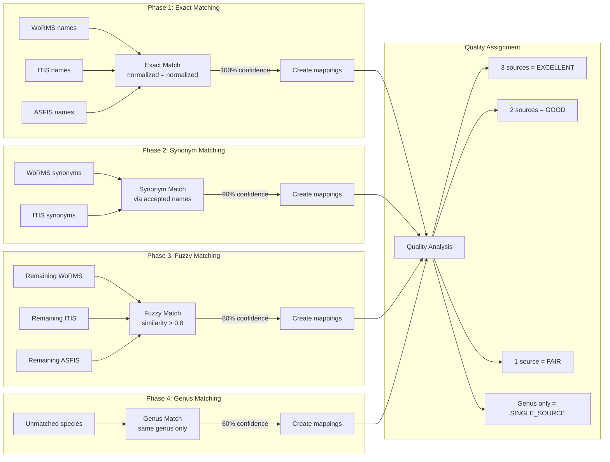
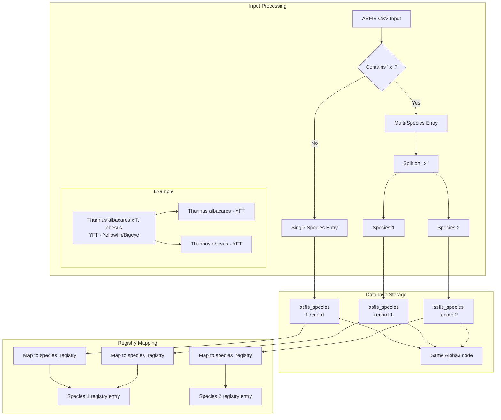
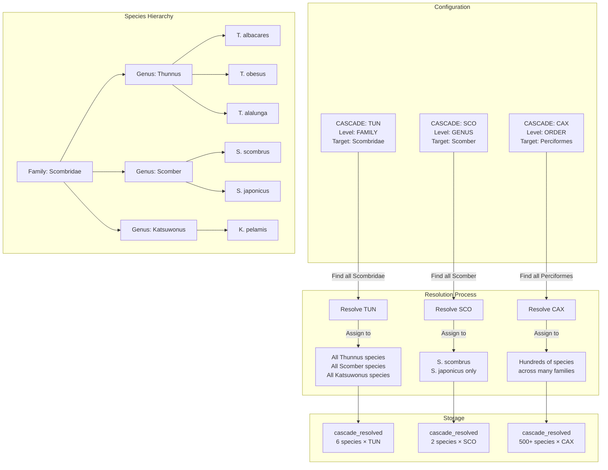
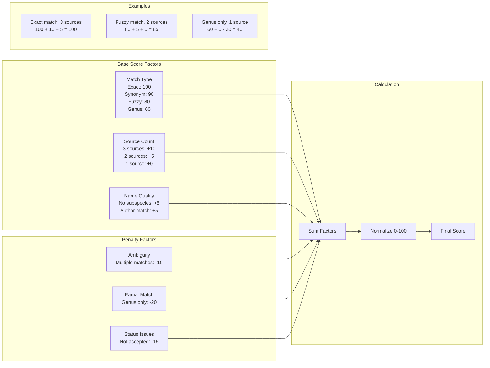
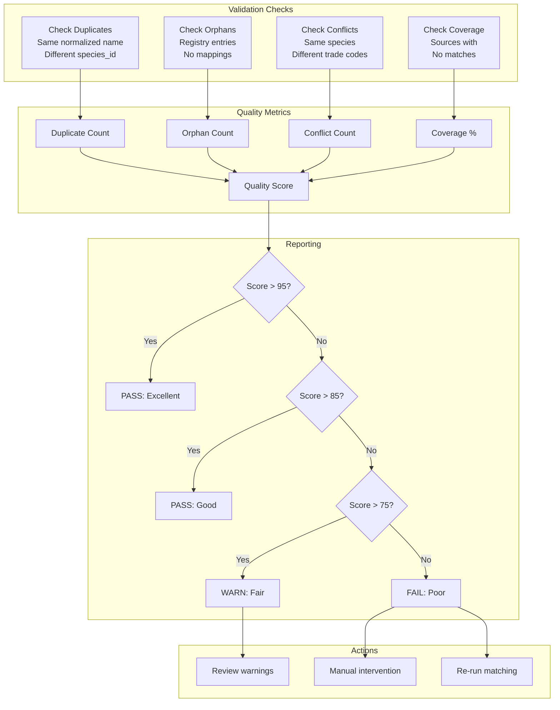
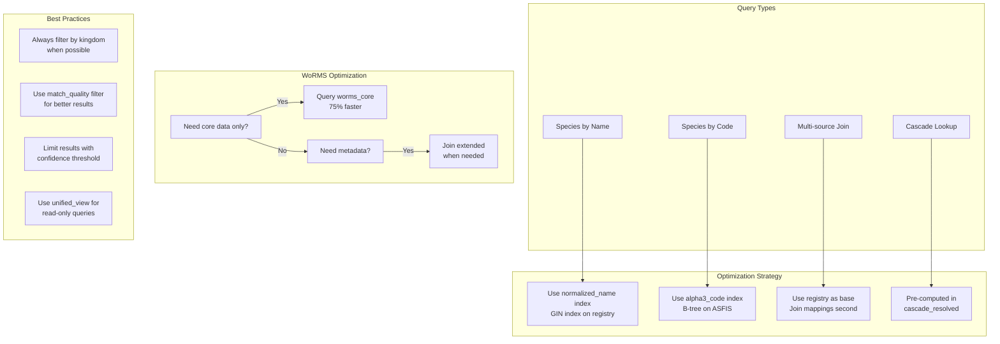
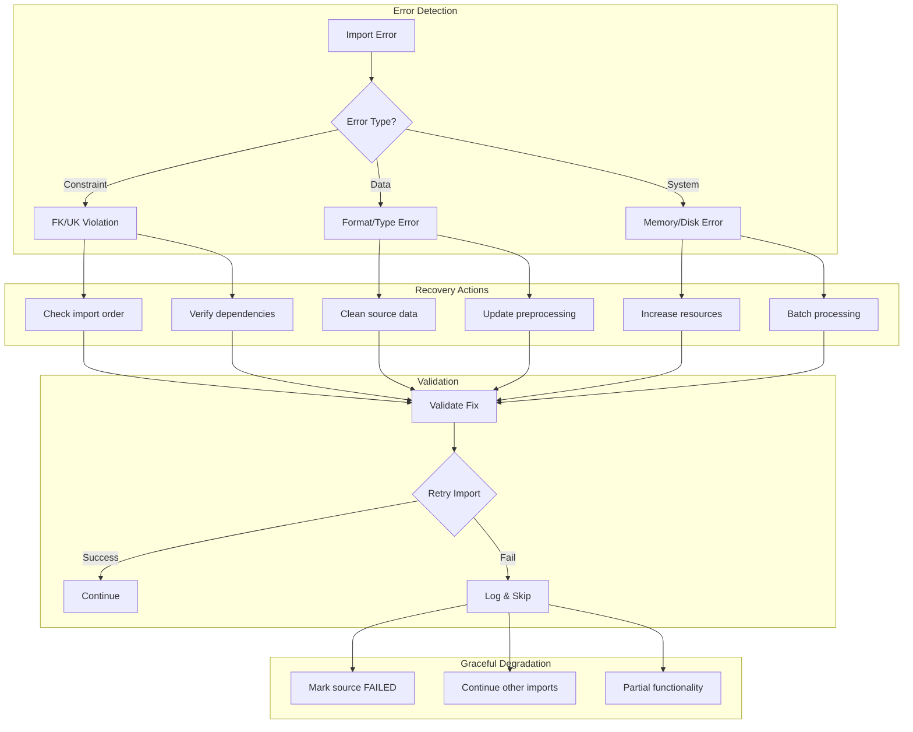
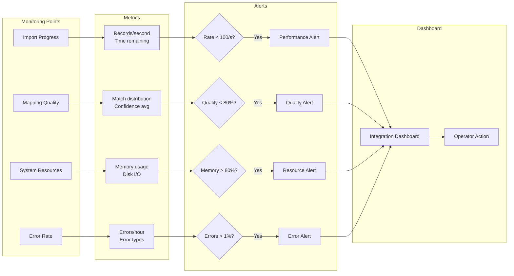
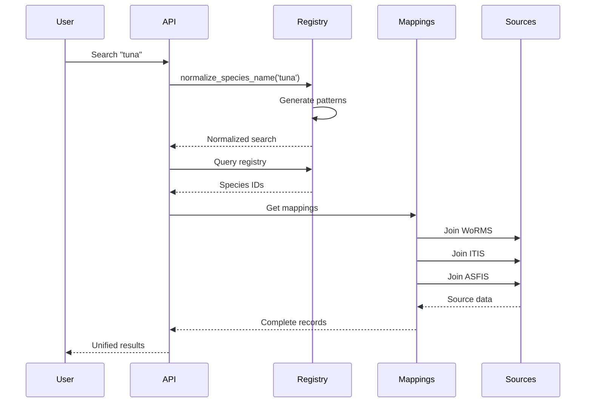
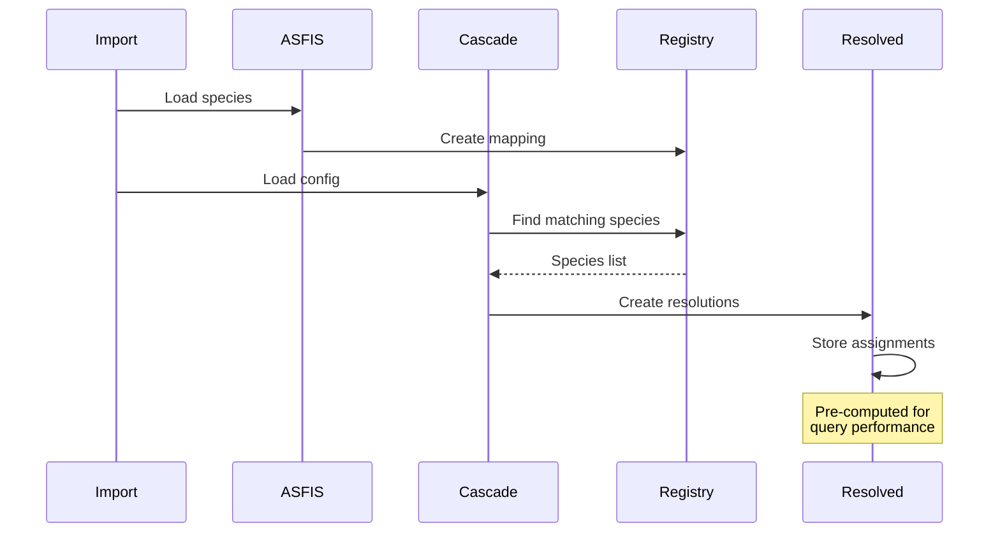

# Species Integration Workflow Diagrams

Detailed visualization of how species data flows through the integration system.

## Species Name Normalization Process

```mermaid
flowchart TD
    subgraph "Input Sources"
        W[WoRMS<br/>Carcharodon carcharias<br/>Linnaeus, 1758]
        I[ITIS<br/>Carcharodon carcharias<br/>(Linnaeus, 1758)]
        A[ASFIS<br/>Carcharodon carcharias<br/>WSH - White shark]
    end

    subgraph "Normalization Pipeline"
        W --> N1[normalize_species_name()]
        I --> N1
        A --> N1

        N1 --> S1[Trim whitespace]
        S1 --> S2[Lowercase]
        S2 --> S3[Remove special chars]
        S3 --> S4[Remove suffixes<br/>sp, spp, var]
        S4 --> NR[carcharodon carcharias]
    end

    subgraph "Grouping Key Generation"
        NR --> G1[Extract genus: carcharodon]
        NR --> G2[Extract species: carcharias]
        G1 --> GK[generate_grouping_key()]
        G2 --> GK
        GK --> KEY[carcharodon_carcharias]
    end

    subgraph "Registry Entry"
        KEY --> REG[species_name_registry]
        NR --> REG
        REG --> R1[species_id: uuid]
        REG --> R2[normalized_name: carcharodon carcharias]
        REG --> R3[grouping_key: carcharodon_carcharias]
        REG --> R4[confidence_score: 95.5]
        REG --> R5[match_quality: EXCELLENT]
    end
```

## Multi-Source Matching Algorithm



## ASFIS Multi-Species Handling



## Cascade Trade Code System



## Confidence Score Calculation



## Data Quality Validation Flow



## Query Performance Optimization



## Error Recovery Workflow



## Real-time Integration Monitoring



## Usage Example Flows

### Finding a Species


### Trade Code Assignment

