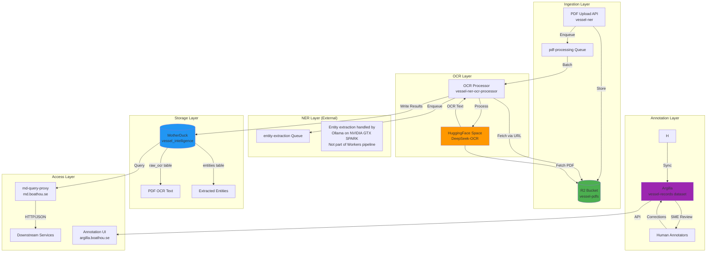
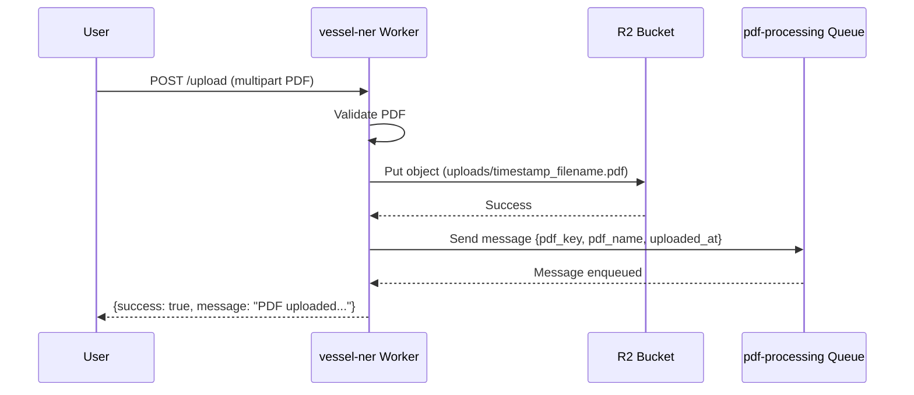
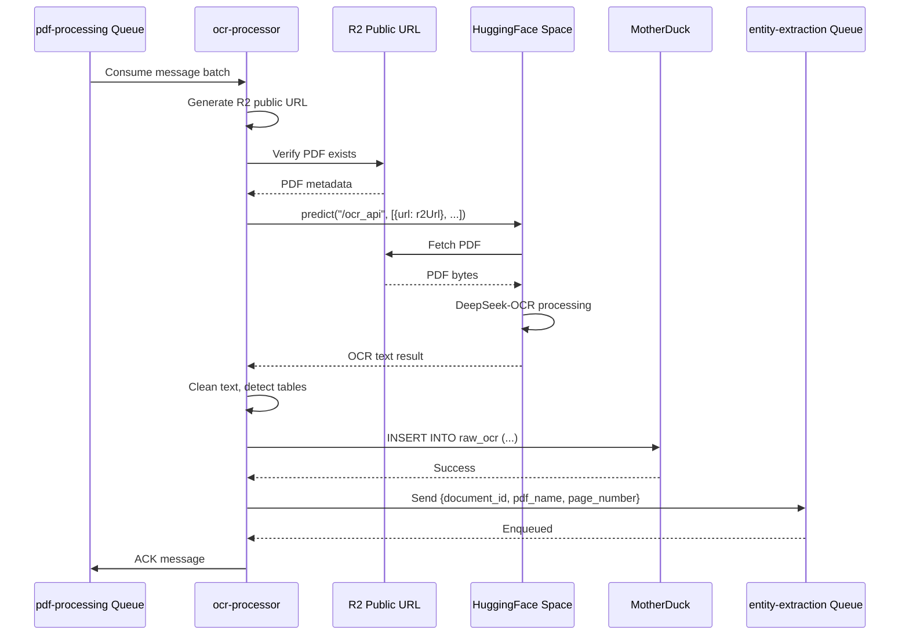
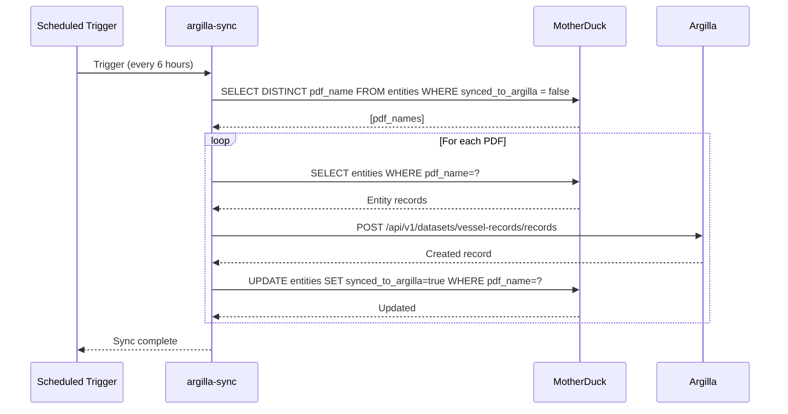
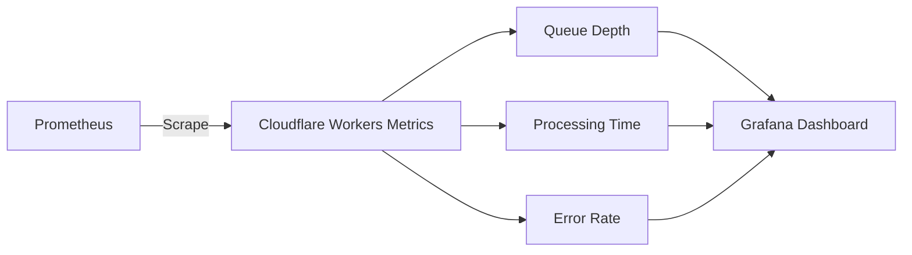
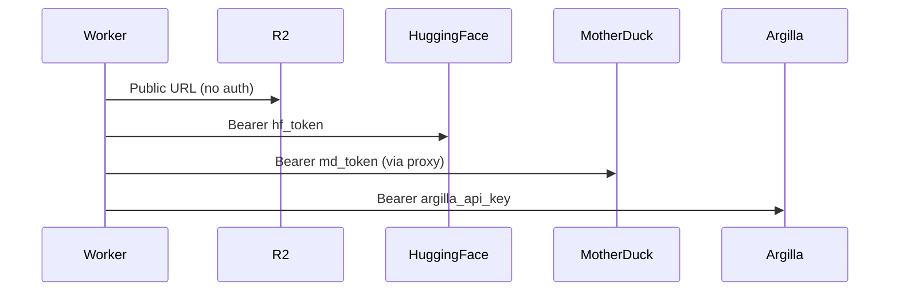

# Vessel NER Pipeline Architecture

## System Overview

Multi-worker pipeline for processing vessel registry PDFs, performing OCR, extracting structured entities, and syncing to Argilla for annotation.



## Data Flow

### 1. Upload & Queue (vessel-ner)



**Config**: `wrangler.toml`
**Endpoint**: `https://vessel-ner.ryan-8fa.workers.dev/upload`

### 2. OCR Processing (ocr-processor)



**Config**: `wrangler.ocr-processor.toml`
**Queue**: `pdf-processing` (consumer)
**Output**: `raw_ocr` table in MotherDuck

### 3. Entity Extraction (External - Ollama/SPARK)

**Note**: Entity extraction is handled externally by Ollama on NVIDIA GTX SPARK cluster, not by Cloudflare Workers.

**Queue**: `entity-extraction` (messages enqueued by OCR processor)
**Processing**: SPARK jobs consume queue and run NER via Ollama
**Output**: `entities` table in MotherDuck

The Workers pipeline ends at OCR processing. Entity extraction is handled by:
- NVIDIA GTX SPARK cluster
- Ollama for NER inference
- Separate SPARK jobs (not documented here)

### 4. Argilla Sync (argilla-sync)



**Config**: `wrangler.argilla-sync.toml`
**Trigger**: Cron (every 6 hours)
**Schedule**: `0 */6 * * *`

## Component Details

### Workers

| Worker | Purpose | Config | Queue Role |
|--------|---------|--------|-----------|
| vessel-ner | Upload API | wrangler.toml | Producer (pdf-processing) |
| ocr-processor | OCR via HuggingFace | wrangler.ocr-processor.toml | Consumer (pdf-processing)<br/>Producer (entity-extraction) |
| ~~entity-extractor~~ | ~~Removed - NER via Ollama/SPARK~~ | ~~N/A~~ | ~~External~~ |
| argilla-sync | Batch sync to Argilla | wrangler.argilla-sync.toml | Cron trigger |

### Queues

| Queue | Max Batch | Timeout | Retries | DLQ |
|-------|-----------|---------|---------|-----|
| pdf-processing | 1 | 30s | 3 | pdf-processing-dlq |
| entity-extraction | 10 | 60s | 3 | entity-extraction-dlq |

### Storage

#### R2 Bucket: vessel-pdfs

**Structure**:
```
vessel-pdfs/
├── uploads/                    # Uploaded PDFs
│   └── 2025-11-10T03-42-45-939Z_document.pdf
├── errors/                     # Processing errors (JSON logs)
│   └── 1762746172611_document.pdf.json
└── queue-triggers/             # Queue trigger markers
    └── 1762746171302_batch-1.json
```

**Public URL**: `https://pub-da3225d6239c43eab499f9ec0095e66c.r2.dev`

#### MotherDuck: vessel_intelligence

**Tables**:

**raw_ocr**:
```sql
CREATE TABLE raw_ocr (
  pdf_name VARCHAR,
  page_number INTEGER,
  text TEXT,
  clean_text TEXT,
  has_tables BOOLEAN,
  timestamp TIMESTAMP,
  metadata JSON,
  PRIMARY KEY (pdf_name, page_number)
);
```

**entities**:
```sql
CREATE TABLE entities (
  id UUID PRIMARY KEY,
  pdf_name VARCHAR,
  page_number INTEGER,
  entity_text VARCHAR,
  entity_type VARCHAR,
  confidence FLOAT,
  start_pos INTEGER,
  end_pos INTEGER,
  timestamp TIMESTAMP,
  synced_to_argilla BOOLEAN DEFAULT false,
  argilla_record_id VARCHAR,
  FOREIGN KEY (pdf_name, page_number) REFERENCES raw_ocr(pdf_name, page_number)
);
```

**Indexes**:
```sql
CREATE INDEX idx_entities_pdf ON entities(pdf_name);
CREATE INDEX idx_entities_type ON entities(entity_type);
CREATE INDEX idx_entities_sync ON entities(synced_to_argilla);
```

#### Argilla: vessel-records Dataset

**Schema**:
```python
{
  "fields": [
    {"name": "text", "type": "text"},
    {"name": "pdf_name", "type": "text"},
    {"name": "page_number", "type": "integer"}
  ],
  "questions": [
    {
      "name": "entities",
      "type": "span",
      "labels": [
        "VESSEL_NAME", "IMO_NUMBER", "FLAG_STATE",
        "REGISTRATION_NUMBER", "PORT", "DATE"
      ]
    }
  ]
}
```

### External Services

#### HuggingFace Space: goldfish-inc/deepseekocr

**Hardware**: T4 GPU (16GB VRAM)
**Model**: DeepSeek-OCR (3B parameters)
**API**: Gradio `/ocr_api` endpoint

**Access**:
- Private Space (requires HF token)
- Token stored as Worker secret
- URL-based file handling (fetches from R2 public URL)

**Configuration** (app.py):
```python
api_process_btn.click(
    fn=ocr_api,
    inputs=[api_pdf_input, api_base_size, api_save_checkbox, api_filename_input],
    outputs=api_output_text,
    api_name="ocr_api"  # Expose REST endpoint
)

demo.launch(show_api=True, show_error=True)
```

#### MotherDuck Proxy: md.boathou.se

**Purpose**: HTTP/JSON interface to MotherDuck database
**Protocol**: POST /query with JSON body
**Authentication**: Bearer token (service token)

**Request**:
```json
{
  "database": "vessel_intelligence",
  "query": "SELECT * FROM raw_ocr LIMIT 10"
}
```

**Response**:
```json
{
  "data": [
    {"pdf_name": "...", "page_number": 1, "text": "..."},
    ...
  ]
}
```

#### Argilla: argilla.boathou.se

**Purpose**: Annotation UI for SME review
**API**: REST API v1
**Dataset**: vessel-records

**Access**:
- Web UI: https://argilla.boathou.se
- API endpoint: https://argilla.boathou.se/api/v1
- Authentication: API key stored as Worker secret

## Environment Variables

### Shared Across Workers

```toml
[vars]
MOTHERDUCK_DATABASE = "vessel_intelligence"
MD_QUERY_PROXY_URL = "https://md.boathou.se"
```

### Secrets (via `wrangler secret put`)

```bash
# Required for all workers
MOTHERDUCK_TOKEN=md_...

# Required for ocr-processor
HF_TOKEN=hf_...

# Required for argilla-sync and entity-extractor
ARGILLA_API_KEY=argilla.apikey...
ARGILLA_API_URL=https://argilla.boathou.se
```

### Worker-Specific

**ocr-processor**:
```toml
DEEPSEEK_OCR_SPACE_URL = "https://huggingface.co/spaces/goldfish-inc/deepseekocr"
USE_DIRECT_UPLOAD = "false"
```

**entity-extractor**:
```toml
NER_CONFIDENCE_THRESHOLD = "0.7"
ARGILLA_DATASET_NAME = "vessel-records"
```

**argilla-sync**:
```toml
SYNC_BATCH_SIZE = "100"
```

## Deployment

### All Workers

```bash
cd workers/vessel-ner

# Deploy all workers in order
pnpm exec wrangler deploy --config wrangler.toml
pnpm exec wrangler deploy --config wrangler.ocr-processor.toml
pnpm exec wrangler deploy --config wrangler.entity-extractor.toml
pnpm exec wrangler deploy --config wrangler.argilla-sync.toml
```

### Verify Deployment

```bash
# Check worker status
pnpm exec wrangler list

# Check queue depth
pnpm exec wrangler queues list

# Monitor logs
pnpm exec wrangler tail vessel-ner --format pretty
pnpm exec wrangler tail vessel-ner-ocr-processor --format pretty
pnpm exec wrangler tail vessel-ner-entity-extractor --format pretty
```

## Monitoring

### Queue Metrics



**Key Metrics**:
- Queue depth (messages waiting)
- Processing time (p50, p95, p99)
- Error rate (failed/total)
- Retry count (messages retried)

### Alerting

**Conditions**:
- Queue depth > 100 for 5 minutes
- Error rate > 10% over 15 minutes
- Dead letter queue has messages
- MotherDuck connection failures

### Logging

**Structured JSON Logs**:
```json
{
  "event": "ocr_processing_started",
  "pdf_key": "uploads/2025-11-10T03-42-45-939Z_test.pdf",
  "pdf_name": "test.pdf",
  "timestamp": "2025-11-10T03:42:51.584Z"
}
```

**Log Levels**:
- `event`: Informational (normal flow)
- `error`: Processing errors (retryable)
- `warning`: Degraded performance (high latency)

## Performance

### Throughput

| Stage | Time | Bottleneck |
|-------|------|-----------|
| Upload | < 1s | Network |
| OCR (1 page) | 2-15s | HuggingFace GPU |
| Entity Extraction | 0.5-2s | CPU (tokenization) |
| Argilla Sync | 0.1-0.5s | Network |

**Total Pipeline**: 3-20 seconds per page

### Scaling

**Horizontal**:
- Workers auto-scale based on queue depth
- HuggingFace Space limited to 1 concurrent request (T4 GPU)
- MotherDuck scales automatically (cloud service)

**Optimization**:
- Batch entity extraction (10 pages per batch)
- Argilla sync runs every 6 hours (not real-time)
- Cache NER model in entity-extractor memory

## Security

### Authentication Flow



### Token Management

**Storage**: Cloudflare Workers Secrets (encrypted at rest)
**Rotation**: Manual via `wrangler secret put`
**Scope**: Minimum required permissions

**HF Token**:
- Read-only access to private Spaces
- No repository write access

**MotherDuck Token**:
- Service token (not user token)
- Scoped to `vessel_intelligence` database
- Read/write access to specific tables

**Argilla API Key**:
- Admin-level access (create/update records)
- Scoped to `vessel-records` dataset

### Data Privacy

**R2 Public URLs**:
- PDFs publicly readable (unpredictable URLs)
- No authentication required
- Consider signed URLs for sensitive content

**MotherDuck**:
- Private database (proxy authentication)
- No public endpoints
- TLS encrypted (HTTPS)

**Argilla**:
- Private dataset (API key required)
- OAuth2 for web UI
- Role-based access control (RBAC)

## Disaster Recovery

### Backup Strategy

**R2 Bucket**:
- Cloudflare multi-region replication (automatic)
- No manual backups required
- Lifecycle policy: retain for 90 days

**MotherDuck**:
- Daily snapshots (automatic)
- Point-in-time recovery (7 days)
- Export to Parquet: `COPY (SELECT * FROM raw_ocr) TO 's3://backups/raw_ocr.parquet'`

**Argilla**:
- PostgreSQL backups (automatic)
- Elasticsearch snapshots (manual)
- Export dataset: `argilla export vessel-records --output backup.jsonl`

### Failure Scenarios

**HuggingFace Space Down**:
1. Messages retry 3 times (exponential backoff)
2. After max retries → dead letter queue
3. Manual reprocessing when Space recovers

**MotherDuck Unavailable**:
1. Workers retry with backoff
2. Queues buffer messages (up to 1M messages)
3. Cloudflare guarantees at-least-once delivery

**Worker Deployment Failure**:
1. Previous version remains active
2. Rollback via Wrangler: `wrangler rollback`
3. Zero-downtime deployment

## Cost Analysis

### Cloudflare Workers

**Pricing** (Paid plan):
- 10M requests/month included
- $0.50 per additional million requests
- 30M CPU-ms/month included

**Estimated Usage**:
- 1,000 PDFs/day × 3 workers = 3,000 requests/day
- 90,000 requests/month (well within free tier)

### R2 Storage

**Pricing**:
- Storage: $0.015/GB-month
- Class A operations (write): $4.50 per million
- Class B operations (read): $0.36 per million
- Public URL bandwidth: First 10GB free, then $0.09/GB

**Estimated Usage** (1,000 PDFs/day, 500KB average):
- Storage: 15GB/month × $0.015 = $0.23
- Writes: 30,000/month × $4.50/1M = $0.14
- Reads (OCR): 30,000/month × $0.36/1M = $0.01
- Bandwidth: ~15GB/month = $0.45

**Total R2**: ~$0.83/month

### Queues

**Pricing**:
- First 1M operations/month: Free
- Additional operations: $0.40 per million

**Estimated Usage**:
- 1,000 PDFs/day × 2 queues = 60,000 ops/month (free)

### MotherDuck

**Pricing**: Contact for quote (usage-based)
**Estimated**: ~$50-100/month (based on query volume)

### HuggingFace Spaces

**Pricing**: Free for private Spaces (T4 GPU)
**Limitations**: 1 concurrent request, may have cold starts

### Total Monthly Cost

| Service | Cost |
|---------|------|
| Cloudflare Workers | $0 (free tier) |
| R2 Storage | $0.83 |
| Queues | $0 (free tier) |
| MotherDuck | ~$75 |
| HuggingFace | $0 (free) |
| **Total** | **~$76/month** |

## Future Enhancements

### Phase 2: Improved NER

- Fine-tune DistilBERT on vessel registry data
- Add specialized entity types (vessel type, tonnage, etc.)
- Implement entity linking (resolve vessel names to IMO numbers)

### Phase 3: Advanced OCR

- Multi-language support (Spanish, French, etc.)
- Table extraction and parsing
- Form field detection

### Phase 4: Data Quality

- Confidence scoring for entities
- Automated validation rules
- Deduplication across PDFs

### Phase 5: API Integration

- RESTful API for vessel lookups
- GraphQL endpoint for complex queries
- Webhook notifications for new entities

---

**Version**: 1.0.0
**Last Updated**: 2025-11-10
**Maintainer**: Infrastructure Team
