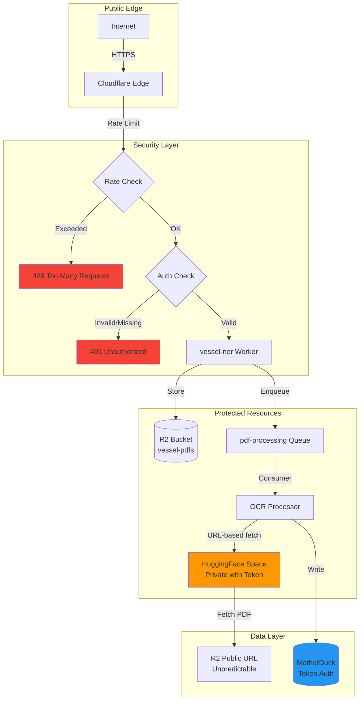

# Bulk Upload Function - Security Documentation

## Overview

The bulk upload function enables high-volume PDF processing via HuggingFace DeepSeek-OCR integration. This document covers security hardening to prevent abuse and unauthorized access.

## Architecture



## Threat Model

### Current Exposure Points

| Component | Access | Risk | Mitigation |
|-----------|--------|------|------------|
| Upload API | Public HTTPS | ⚠️ HIGH - Abuse via bulk upload | Rate limiting, auth token |
| R2 Public URLs | Public HTTPS | ⚠️ MEDIUM - URL guessing | Unpredictable URLs, lifecycle policy |
| HuggingFace Space | Private | ✅ LOW - Requires HF token | Token in Worker secrets |
| MotherDuck | Private | ✅ LOW - Requires MD token | Token in Worker secrets |

### Attack Vectors

**1. Bulk Upload Abuse**
- **Threat**: Attacker floods `/upload` endpoint with large PDFs
- **Impact**: R2 storage costs, queue backlog, OCR service degradation
- **Likelihood**: HIGH (public endpoint)

**2. R2 URL Enumeration**
- **Threat**: Attacker guesses R2 URLs to access uploaded PDFs
- **Impact**: Data exposure, privacy violation
- **Likelihood**: LOW (timestamp + UUID in filenames)

**3. API Token Theft**
- **Threat**: Attacker steals HF or MD tokens from logs/errors
- **Impact**: Unauthorized access to services
- **Likelihood**: LOW (tokens stored as secrets)

**4. Queue Poisoning**
- **Threat**: Attacker sends malicious messages to queues
- **Impact**: Worker crashes, DDoS
- **Likelihood**: LOW (queues not publicly accessible)

## Security Implementation

### 1. Authentication

**API Key Authentication**:
```typescript
// src/index.ts
export default {
  async fetch(request: Request, env: Env): Promise<Response> {
    const authHeader = request.headers.get('Authorization');

    if (!authHeader || !authHeader.startsWith('Bearer ')) {
      return new Response('Unauthorized', {
        status: 401,
        headers: {
          'WWW-Authenticate': 'Bearer realm="Vessel NER API"'
        }
      });
    }

    const token = authHeader.substring(7); // Remove 'Bearer '

    // Validate against configured API keys
    const validTokens = env.API_KEYS?.split(',') || [];
    if (!validTokens.includes(token)) {
      console.error(JSON.stringify({
        event: 'auth_failed',
        token_prefix: token.substring(0, 8),
        timestamp: new Date().toISOString()
      }));

      return new Response('Invalid token', { status: 401 });
    }

    // Continue with upload processing...
  }
};
```

**Configuration**:
```bash
# Generate secure tokens (32+ characters)
openssl rand -hex 32

# Store in Worker secrets
pnpm exec wrangler secret put API_KEYS
# Enter comma-separated list: token1,token2,token3
```

**Usage**:
```bash
curl -X POST https://vessel-ner.ryan-8fa.workers.dev/upload \
  -H "Authorization: Bearer <your-api-key>" \
  -F "file=@document.pdf"
```

### 2. Rate Limiting

**Implementation**:
```typescript
// src/lib/rate-limit.ts
export class RateLimiter {
  private kv: KVNamespace;
  private limit: number;
  private window: number; // seconds

  constructor(kv: KVNamespace, limit: number = 100, window: number = 3600) {
    this.kv = kv;
    this.limit = limit;
    this.window = window;
  }

  async checkLimit(key: string): Promise<{ allowed: boolean; remaining: number }> {
    const now = Math.floor(Date.now() / 1000);
    const windowStart = now - this.window;
    const kvKey = `ratelimit:${key}:${Math.floor(now / this.window)}`;

    // Get current count
    const current = await this.kv.get(kvKey);
    const count = current ? parseInt(current) : 0;

    if (count >= this.limit) {
      return { allowed: false, remaining: 0 };
    }

    // Increment count
    await this.kv.put(kvKey, (count + 1).toString(), {
      expirationTtl: this.window * 2 // Allow for clock skew
    });

    return { allowed: true, remaining: this.limit - count - 1 };
  }
}
```

**Usage**:
```typescript
const rateLimiter = new RateLimiter(env.RATE_LIMIT_KV, 100, 3600);

// Check rate limit by IP or API key
const clientKey = token || request.headers.get('CF-Connecting-IP') || 'anonymous';
const { allowed, remaining } = await rateLimiter.checkLimit(clientKey);

if (!allowed) {
  return new Response('Rate limit exceeded', {
    status: 429,
    headers: {
      'Retry-After': '3600',
      'X-RateLimit-Limit': '100',
      'X-RateLimit-Remaining': '0',
      'X-RateLimit-Reset': (Math.floor(Date.now() / 1000) + 3600).toString()
    }
  });
}

// Add rate limit headers to successful responses
response.headers.set('X-RateLimit-Limit', '100');
response.headers.set('X-RateLimit-Remaining', remaining.toString());
```

**Configuration**:
```toml
# wrangler.toml
[[kv_namespaces]]
binding = "RATE_LIMIT_KV"
id = "your-kv-namespace-id"

[vars]
RATE_LIMIT_REQUESTS = "100"     # Requests per window
RATE_LIMIT_WINDOW = "3600"      # Window in seconds (1 hour)
```

### 3. File Size Limits

**Implementation**:
```typescript
// Enforce max file size (10MB default)
const MAX_FILE_SIZE = env.MAX_FILE_SIZE || 10 * 1024 * 1024; // 10MB

const formData = await request.formData();
const file = formData.get('file') as File;

if (!file) {
  return new Response('No file provided', { status: 400 });
}

if (file.size > MAX_FILE_SIZE) {
  console.error(JSON.stringify({
    event: 'file_too_large',
    size_bytes: file.size,
    max_bytes: MAX_FILE_SIZE,
    timestamp: new Date().toISOString()
  }));

  return new Response(
    `File too large. Maximum size: ${MAX_FILE_SIZE / 1024 / 1024}MB`,
    { status: 413 }
  );
}

// Validate file type
if (file.type !== 'application/pdf') {
  return new Response('Invalid file type. Only PDF files accepted.', {
    status: 415
  });
}
```

**Configuration**:
```toml
[vars]
MAX_FILE_SIZE = "10485760"  # 10MB in bytes
```

### 4. CORS Restrictions

**Implementation**:
```typescript
// Restrict CORS to specific origins
const allowedOrigins = env.ALLOWED_ORIGINS?.split(',') || [];

const origin = request.headers.get('Origin');
const corsHeaders: Record<string, string> = {};

if (origin && allowedOrigins.includes(origin)) {
  corsHeaders['Access-Control-Allow-Origin'] = origin;
  corsHeaders['Access-Control-Allow-Methods'] = 'POST, OPTIONS';
  corsHeaders['Access-Control-Allow-Headers'] = 'Content-Type, Authorization';
  corsHeaders['Access-Control-Max-Age'] = '86400';
}

// Handle preflight
if (request.method === 'OPTIONS') {
  return new Response(null, {
    status: 204,
    headers: corsHeaders
  });
}

// Add CORS headers to response
return new Response(body, {
  status: 200,
  headers: {
    ...corsHeaders,
    'Content-Type': 'application/json'
  }
});
```

**Configuration**:
```bash
# Store allowed origins
pnpm exec wrangler secret put ALLOWED_ORIGINS
# Enter comma-separated: https://app.example.com,https://admin.example.com
```

### 5. R2 URL Security

**Unpredictable Filenames**:
```typescript
// Generate unpredictable key with timestamp + UUID
import { v4 as uuidv4 } from 'uuid';

const timestamp = new Date().toISOString().replace(/[:.]/g, '-');
const safeFilename = file.name.replace(/[^a-zA-Z0-9._-]/g, '_');
const key = `uploads/${timestamp}_${uuidv4()}_${safeFilename}`;

await env.VESSEL_PDFS.put(key, file);
```

**Lifecycle Policy** (prevent long-term exposure):
```bash
# Configure via Cloudflare Dashboard or API
# R2 Bucket → Settings → Lifecycle Rules
# Rule: Delete objects older than 90 days in uploads/ prefix
```

**Disable Public Listing**:
```typescript
// Never list R2 objects publicly
// Workers can list via binding, but don't expose list endpoint
export default {
  async fetch(request: Request, env: Env) {
    // ❌ DO NOT expose this endpoint publicly
    if (request.url.endsWith('/list')) {
      return new Response('Not Found', { status: 404 });
    }
  }
};
```

### 6. Secret Management

**Current Secrets**:
| Secret | Purpose | Rotation | Access |
|--------|---------|----------|--------|
| `API_KEYS` | Upload authentication | Monthly | Upload API |
| `HF_TOKEN` | HuggingFace Space access | Quarterly | OCR Processor |
| `MOTHERDUCK_TOKEN` | Database access | Quarterly | All workers |
| `ARGILLA_API_KEY` | Annotation sync | Quarterly | Sync worker |

**Secret Rotation Procedure**:
```bash
# 1. Generate new token
openssl rand -hex 32

# 2. Update Worker secret
pnpm exec wrangler secret put API_KEYS

# 3. Deploy worker (picks up new secret automatically)
pnpm exec wrangler deploy

# 4. Verify deployment
curl -H "Authorization: Bearer <new-token>" \
  https://vessel-ner.ryan-8fa.workers.dev/health

# 5. Revoke old token (after 24h grace period)
```

**Never Log Secrets**:
```typescript
// ✅ Safe logging
console.log(JSON.stringify({
  event: 'auth_success',
  token_prefix: token.substring(0, 8), // Only first 8 chars
  timestamp: new Date().toISOString()
}));

// ❌ NEVER log full secrets
console.log({ token: token }); // DANGEROUS
```

### 7. Input Validation

**Comprehensive Validation**:
```typescript
interface UploadValidation {
  file: File;
  errors: string[];
}

async function validateUpload(request: Request): Promise<UploadValidation> {
  const errors: string[] = [];

  const formData = await request.formData();
  const file = formData.get('file') as File;

  // Check file exists
  if (!file) {
    errors.push('No file provided');
  }

  // Check file type (MIME)
  if (file && file.type !== 'application/pdf') {
    errors.push(`Invalid MIME type: ${file.type}. Expected: application/pdf`);
  }

  // Check file extension
  if (file && !file.name.toLowerCase().endsWith('.pdf')) {
    errors.push('Invalid file extension. Only .pdf files accepted');
  }

  // Check magic bytes (PDF signature)
  if (file) {
    const buffer = await file.slice(0, 4).arrayBuffer();
    const bytes = new Uint8Array(buffer);
    const isPdf = bytes[0] === 0x25 && bytes[1] === 0x50 &&
                  bytes[2] === 0x44 && bytes[3] === 0x46; // %PDF

    if (!isPdf) {
      errors.push('File does not appear to be a valid PDF');
    }
  }

  // Check filename length
  if (file && file.name.length > 255) {
    errors.push('Filename too long (max 255 characters)');
  }

  // Check for path traversal attempts
  if (file && (file.name.includes('..') || file.name.includes('/'))) {
    errors.push('Invalid filename (path traversal attempt)');
  }

  return { file, errors };
}

// Usage
const { file, errors } = await validateUpload(request);

if (errors.length > 0) {
  return new Response(JSON.stringify({
    success: false,
    errors
  }), {
    status: 400,
    headers: { 'Content-Type': 'application/json' }
  });
}
```

### 8. Monitoring & Alerting

**Security Events to Track**:
```typescript
// Log all security-relevant events
interface SecurityEvent {
  event: string;
  severity: 'info' | 'warning' | 'error' | 'critical';
  client_ip?: string;
  token_prefix?: string;
  details?: Record<string, unknown>;
  timestamp: string;
}

function logSecurityEvent(event: SecurityEvent) {
  console.log(JSON.stringify({
    ...event,
    timestamp: new Date().toISOString()
  }));

  // Alert on critical events
  if (event.severity === 'critical') {
    // TODO: Send to alerting system (Sentry, PagerDuty, etc.)
  }
}

// Examples
logSecurityEvent({
  event: 'auth_failed',
  severity: 'warning',
  client_ip: request.headers.get('CF-Connecting-IP'),
  token_prefix: token.substring(0, 8)
});

logSecurityEvent({
  event: 'rate_limit_exceeded',
  severity: 'error',
  client_ip: request.headers.get('CF-Connecting-IP'),
  details: { attempts: 150, limit: 100 }
});

logSecurityEvent({
  event: 'file_validation_failed',
  severity: 'warning',
  details: { errors, filename: file.name }
});
```

**Alert Conditions**:
- Failed auth attempts > 10 in 5 minutes
- Rate limit violations > 5 in 10 minutes
- File validation failures > 20 in 1 hour
- Unusual file sizes (> 50MB attempts)
- R2 storage growth > 10GB/day

## Cloudflare Features

### 1. Cloudflare Access (Optional)

**Zero Trust Access Control**:
```bash
# Configure via Cloudflare Dashboard
# Access → Applications → Add Application
# Type: Self-hosted
# Domain: vessel-ner.ryan-8fa.workers.dev
# Policy: Require email domain = your-company.com
```

**Benefits**:
- Additional authentication layer
- SSO integration (Google, GitHub, SAML)
- Access logs and audit trail

### 2. WAF Rules

**Custom WAF Rules** (Cloudflare Dashboard):
```
# Block suspicious user agents
(http.user_agent contains "bot" and not http.user_agent contains "googlebot")

# Block requests without Authorization header (except OPTIONS)
(http.request.method ne "OPTIONS" and not http.request.headers["authorization"][0] contains "Bearer")

# Rate limit by IP (backup to KV rate limiting)
(rate(1m) > 60)

# Block large payloads (backup to Worker validation)
(http.request.body.size > 10485760)
```

### 3. Bot Management

**Enable Bot Fight Mode** (Free tier):
- Cloudflare Dashboard → Security → Bots
- Turn on "Bot Fight Mode"
- Blocks known bad bots automatically

## Deployment Checklist

### Pre-Deployment

- [ ] Generate secure API keys (32+ chars)
- [ ] Store API keys in Worker secrets
- [ ] Configure rate limiting (KV namespace)
- [ ] Set max file size limit
- [ ] Configure allowed CORS origins
- [ ] Enable R2 lifecycle policy (90-day retention)
- [ ] Verify HF token is stored securely
- [ ] Verify MotherDuck token is stored securely

### Post-Deployment

- [ ] Test authentication (valid/invalid tokens)
- [ ] Test rate limiting (exceed limit)
- [ ] Test file size validation (> 10MB)
- [ ] Test file type validation (non-PDF)
- [ ] Verify R2 URLs are unpredictable
- [ ] Check security event logging
- [ ] Set up alerting for critical events
- [ ] Document API keys for authorized users

### Security Hardening

```bash
# 1. Deploy with auth enabled
cd workers/vessel-ner
pnpm exec wrangler secret put API_KEYS
# Enter: <secure-token-1>,<secure-token-2>

pnpm exec wrangler deploy

# 2. Create KV namespace for rate limiting
pnpm exec wrangler kv:namespace create "RATE_LIMIT"
# Copy namespace ID to wrangler.toml

# 3. Test authentication
curl -X POST https://vessel-ner.ryan-8fa.workers.dev/upload \
  -H "Authorization: Bearer invalid-token" \
  -F "file=@test.pdf"
# Expected: 401 Unauthorized

curl -X POST https://vessel-ner.ryan-8fa.workers.dev/upload \
  -H "Authorization: Bearer <valid-token>" \
  -F "file=@test.pdf"
# Expected: 200 OK

# 4. Test rate limiting
for i in {1..150}; do
  curl -X POST https://vessel-ner.ryan-8fa.workers.dev/upload \
    -H "Authorization: Bearer <valid-token>" \
    -F "file=@test.pdf"
done
# Expected: 429 after 100 requests

# 5. Verify logs
pnpm exec wrangler tail vessel-ner --format pretty
# Look for: auth_failed, rate_limit_exceeded, file_validation_failed
```

## Security Best Practices

### Do's ✅

1. **Always use HTTPS** - Cloudflare enforces TLS
2. **Validate all inputs** - File type, size, filename
3. **Rate limit aggressively** - 100 requests/hour default
4. **Rotate secrets regularly** - Quarterly for critical tokens
5. **Log security events** - Track failed auth, rate limits
6. **Monitor R2 costs** - Alert on unusual growth
7. **Use unpredictable URLs** - Timestamp + UUID
8. **Implement lifecycle policies** - Auto-delete after 90 days
9. **Restrict CORS** - Only allow specific origins
10. **Never log full secrets** - Use token prefixes only

### Don'ts ❌

1. **Don't expose list endpoints** - Never allow R2 object listing
2. **Don't skip authentication** - Every upload must have valid token
3. **Don't ignore rate limits** - Enforce both per-IP and per-token
4. **Don't trust file extensions** - Validate magic bytes
5. **Don't allow unlimited file sizes** - Enforce 10MB max
6. **Don't make R2 URLs predictable** - Use UUIDs
7. **Don't log sensitive data** - Redact tokens, IPs in logs
8. **Don't skip input validation** - Check file type, size, name
9. **Don't expose internal errors** - Return generic "Internal Error"
10. **Don't hardcode secrets** - Use Worker secrets only

## Cost Protection

### Spending Limits

**Cloudflare Workers**:
```bash
# Set spending limit via Dashboard
# Account → Billing → Spending Limits
# Workers: $20/month (prevents runaway costs)
```

**R2 Storage**:
```bash
# Monitor via Dashboard
# R2 → Metrics
# Alert if storage > 100GB or bandwidth > 50GB/month
```

**Estimated Costs with Protection**:
| Resource | Limit | Monthly Cost |
|----------|-------|--------------|
| Workers | $20 cap | $0-20 |
| R2 Storage | 100GB | $1.50 |
| R2 Operations | 1M writes | $4.50 |
| R2 Bandwidth | 50GB | $3.60 |
| **Total** | - | **$9.60-29.60** |

### Abuse Detection

**Automated Monitoring**:
```typescript
// Check for anomalous upload patterns
interface UsageMetrics {
  uploads_last_hour: number;
  storage_gb: number;
  bandwidth_gb: number;
}

async function checkAnomalies(metrics: UsageMetrics): Promise<string[]> {
  const alerts: string[] = [];

  if (metrics.uploads_last_hour > 500) {
    alerts.push('ALERT: Unusual upload volume (> 500/hour)');
  }

  if (metrics.storage_gb > 100) {
    alerts.push('ALERT: Storage limit approaching (100GB)');
  }

  if (metrics.bandwidth_gb > 50) {
    alerts.push('ALERT: Bandwidth limit approaching (50GB)');
  }

  return alerts;
}
```

## Incident Response

### 1. Detected Abuse

**Actions**:
```bash
# 1. Revoke compromised API key
pnpm exec wrangler secret put API_KEYS
# Enter remaining valid keys only

# 2. Deploy immediately
pnpm exec wrangler deploy

# 3. Review R2 for malicious uploads
pnpm exec wrangler r2 object list vessel-pdfs --prefix uploads/

# 4. Delete suspicious files
pnpm exec wrangler r2 object delete vessel-pdfs/uploads/suspicious-file.pdf

# 5. Check logs for attack pattern
pnpm exec wrangler tail vessel-ner --format pretty | grep auth_failed
```

### 2. Rate Limit Evasion

**Actions**:
```bash
# 1. Enable Cloudflare WAF rules (Dashboard)
# 2. Lower rate limit temporarily
pnpm exec wrangler secret put RATE_LIMIT_REQUESTS
# Enter: 50 (reduced from 100)

# 3. Add IP-based blocking (WAF)
# (ip.src in {1.2.3.4 5.6.7.8})
```

### 3. Data Breach (R2 URL Leak)

**Actions**:
```bash
# 1. Disable R2 public access immediately
pnpm exec wrangler r2 bucket dev-url disable vessel-pdfs

# 2. Implement pre-signed URLs instead
# (requires code changes)

# 3. Rotate R2 API credentials
# Dashboard → R2 → Settings → API Tokens → Regenerate

# 4. Audit access logs
# (Cloudflare logs not available for R2 public URLs)
```

## Compliance

### GDPR Considerations

- **Right to deletion**: Implement delete endpoint for users
- **Data retention**: 90-day lifecycle policy on R2
- **Access logs**: 7-day retention on Cloudflare
- **Data minimization**: Only store PDF + OCR text, no PII

### SOC 2 Controls

- **Access control**: API key authentication
- **Monitoring**: Security event logging
- **Encryption**: TLS in transit, encrypted at rest (R2)
- **Audit trail**: Cloudflare Access logs (if enabled)

---

**Version**: 1.0.0
**Last Updated**: 2025-11-10
**Next Review**: 2025-12-10 (30 days)
**Owner**: Security Team
