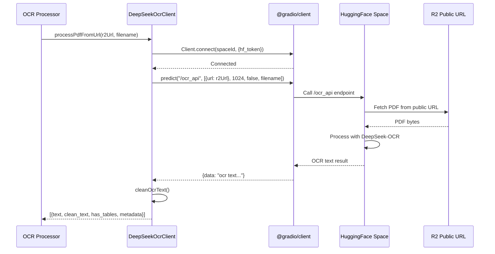
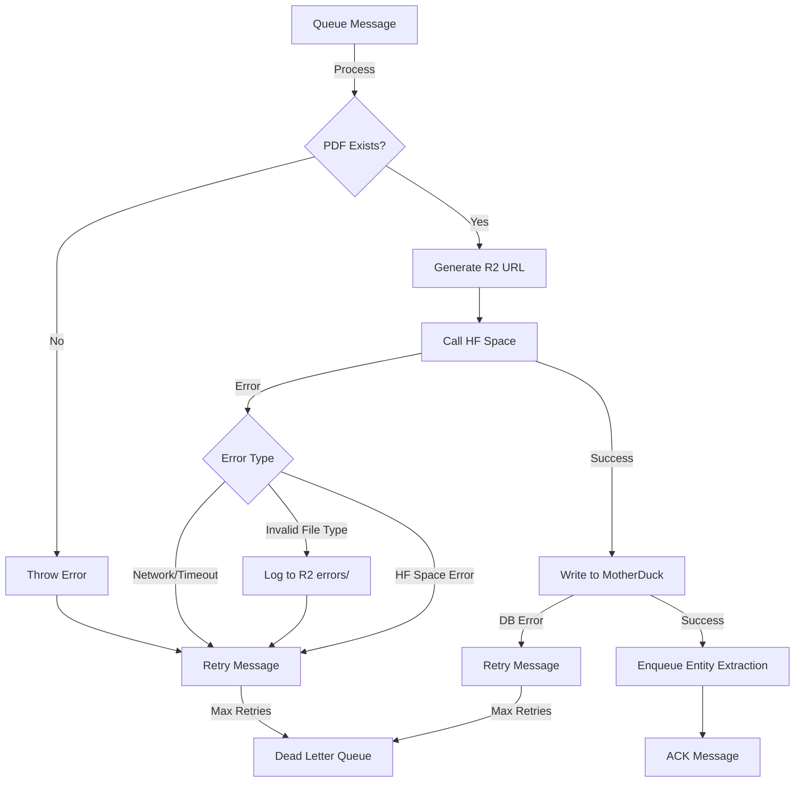

# HuggingFace DeepSeek OCR Integration

## Overview

Integration between Cloudflare Workers and HuggingFace Spaces for PDF OCR processing using DeepSeek-OCR model. Uses URL-based file handling to bypass @gradio/client compatibility issues with edge runtimes.

## Architecture

```mermaid
flowchart TB
    subgraph "Upload Flow"
        A[User Upload PDF] -->|POST /upload| B[vessel-ner Worker]
        B -->|Store PDF| C[R2 Bucket<br/>vessel-pdfs]
        B -->|Enqueue Message| D[pdf-processing Queue]
    end

    subgraph "OCR Processing Flow"
        D -->|Consume Message| E[ocr-processor Worker]
        E -->|1. Generate Public URL| F[R2 Public URL<br/>pub-{hash}.r2.dev]
        E -->|2. Call with URL| G[HuggingFace Space<br/>goldfish-inc/deepseekocr]
        G -->|3. Fetch PDF| F
        G -->|4. Process with DeepSeek-OCR| H[OCR Results]
        H -->|5. Return Text| E
        E -->|6. Write Results| I[MotherDuck<br/>vessel_intelligence.raw_ocr]
        E -->|7. Enqueue for NER| J[entity-extraction Queue]
    end

    subgraph "Entity Extraction Flow"
        J -->|Consume Message| K[entity-extractor Worker]
        K -->|Read OCR Text| I
        K -->|Extract Entities| L[MotherDuck<br/>vessel_intelligence.entities]
    end

    style G fill:#ff9800
    style F fill:#4caf50
    style I fill:#2196f3
```

## Key Components

### 1. R2 Bucket Configuration

**Bucket**: `vessel-pdfs`
**Public URL**: `https://pub-da3225d6239c43eab499f9ec0095e66c.r2.dev`
**Location**: ENAM (Eastern North America)
**Storage Class**: Standard

```bash
# Enable public access (already done)
pnpm exec wrangler r2 bucket dev-url enable vessel-pdfs

# Check bucket info
pnpm exec wrangler r2 bucket info vessel-pdfs
```

**URL Format**:
```
https://pub-da3225d6239c43eab499f9ec0095e66c.r2.dev/{key}

Example:
https://pub-da3225d6239c43eab499f9ec0095e66c.r2.dev/uploads/2025-11-10T03-42-45-939Z_test.pdf
```

### 2. HuggingFace Space

**Space**: `goldfish-inc/deepseekocr`
**Model**: DeepSeek-OCR (3B parameters)
**Hardware**: T4 GPU
**Access**: Private (requires HF token)

**API Endpoint**: `/ocr_api`

**Parameters**:
- `pdf_path`: FileData object with URL (`{ url: string }`)
- `base_size`: Image processing size (default: 1024)
- `save_results`: Save to HF dataset (default: false)
- `filename`: Filename for tracking (with .pdf extension)

### 3. DeepSeek OCR Client

Location: `src/lib/deepseek-ocr.ts`



**Key Methods**:

#### `processPdfFromUrl(pdfUrl: string, filename: string)`
URL-based OCR processing (recommended).

```typescript
const ocrResults = await deepseekOcr.processPdfFromUrl(
  'https://pub-da3225d6239c43eab499f9ec0095e66c.r2.dev/uploads/doc.pdf',
  'document.pdf'
);
```

**Implementation**:
```typescript
const result = await client.predict("/ocr_api", [
  { url: pdfUrl },  // FileData format - Gradio fetches from this URL
  1024,             // base_size parameter
  false,            // save_results - don't save to HF dataset
  safeName          // filename parameter (with .pdf extension)
]);
```

#### `processPdf(pdfBuffer: ArrayBuffer, filename: string)` ⚠️ DEPRECATED
Legacy blob upload method. Incompatible with Cloudflare Workers due to @gradio/client edge runtime limitations.

**Why deprecated**: The @gradio/client library requires Node.js modules (fs, os, stream, ws) not available in Cloudflare Workers edge runtime.

### 4. OCR Processor Worker

Location: `src/workers/ocr-processor.ts`
Config: `wrangler.ocr-processor.toml`

**Queue**: `pdf-processing`
**Batch Size**: 1
**Max Retries**: 3
**Dead Letter Queue**: `pdf-processing-dlq`

**Environment Variables**:
```toml
DEEPSEEK_OCR_SPACE_URL = "https://huggingface.co/spaces/goldfish-inc/deepseekocr"
MOTHERDUCK_DATABASE = "vessel_intelligence"
MD_QUERY_PROXY_URL = "https://md.boathou.se"
USE_DIRECT_UPLOAD = "false"  # Must be false - use @gradio/client with URLs
```

**Secrets** (via `wrangler secret put`):
- `HF_TOKEN`: HuggingFace API token
- `MOTHERDUCK_TOKEN`: MotherDuck service token

**Processing Flow**:

```typescript
// 1. Generate R2 public URL
const r2PublicUrl = `https://pub-da3225d6239c43eab499f9ec0095e66c.r2.dev/${pdf_key}`;

// 2. Verify PDF exists in R2
const pdfObject = await env.VESSEL_PDFS.get(pdf_key);
if (!pdfObject) throw new Error(`PDF not found: ${pdf_key}`);

// 3. Process with DeepSeek OCR using URL
const ocrResults = await deepseekOcr.processPdfFromUrl(r2PublicUrl, filename);

// 4. Write to MotherDuck
const rows = ocrResults.map((result, index) => ({
  pdf_name,
  page_number: index + 1,
  text: result.text,
  clean_text: result.clean_text,
  has_tables: result.has_tables,
  timestamp: new Date().toISOString(),
  metadata: { pdf_key, ...result.metadata }
}));
await motherduck.insertRawOcr(rows);

// 5. Enqueue for entity extraction
await env.ENTITY_EXTRACTION_QUEUE.send({
  document_id: `${pdf_name}_page_${i + 1}`,
  pdf_name,
  page_number: i + 1
});
```

### 5. MotherDuck Integration

Location: `src/lib/motherduck.ts`

**Database**: `vessel_intelligence`
**Proxy**: `https://md.boathou.se`

**Schema** (raw_ocr table):
```sql
CREATE TABLE IF NOT EXISTS raw_ocr (
  pdf_name VARCHAR,
  page_number INTEGER,
  text TEXT,
  clean_text TEXT,
  has_tables BOOLEAN,
  timestamp TIMESTAMP,
  metadata JSON,
  PRIMARY KEY (pdf_name, page_number)
);
```

**Query via Proxy**:
```typescript
const response = await fetch(`${proxyUrl}/query`, {
  method: 'POST',
  headers: {
    'Content-Type': 'application/json',
    'Authorization': `Bearer ${token}`
  },
  body: JSON.stringify({
    database: 'vessel_intelligence',
    query: 'INSERT INTO raw_ocr VALUES ...'
  })
});
```

## Technical Details

### Why URL-Based Approach?

**Problem**: @gradio/client library requires Node.js modules not available in Cloudflare Workers:
```
Error: Cannot find module 'fs'
Error: Cannot find module 'os'
Error: Cannot find module 'stream'
Error: Cannot find module 'ws'
```

**Solution**: Gradio supports URL-based file handling via `handle_file()`:

**Python Example** (from HuggingFace docs):
```python
from gradio_client import Client, handle_file

client = Client("goldfish-inc/deepseekocr")
result = client.predict(
    pdf_path=handle_file('https://example.com/document.pdf'),
    base_size=1024,
    save_results=False,
    filename="document.pdf",
    api_name="/ocr_api"
)
```

**TypeScript Equivalent**:
```typescript
const result = await client.predict("/ocr_api", [
  { url: 'https://example.com/document.pdf' },  // FileData format
  1024,
  false,
  "document.pdf"
]);
```

### FileData Format

Gradio's `handle_file()` translates to FileData object:
```typescript
interface FileData {
  url: string;        // Public URL to file
  path?: string;      // Optional server path
  meta?: {            // Optional metadata
    _type: "gradio.FileData"
  }
}
```

For URL-based uploads, minimal format works:
```typescript
{ url: "https://pub-da3225d6239c43eab499f9ec0095e66c.r2.dev/uploads/file.pdf" }
```

### Error Handling



**Error Logging**:
```typescript
try {
  // Process OCR...
} catch (error) {
  // Log detailed error to R2
  const errorKey = `errors/${Date.now()}_${pdf_name}.json`;
  await env.VESSEL_PDFS.put(errorKey, JSON.stringify({
    event: 'ocr_processing_error',
    error_message: error.message,
    error_stack: error.stack,
    message_body: { pdf_key, pdf_name },
    timestamp: new Date().toISOString()
  }, null, 2));

  // Retry message (up to max_retries)
  message.retry();
}
```

## Deployment

### Prerequisites

1. **HuggingFace Token**:
```bash
# Store in Cloudflare Workers secrets
pnpm exec wrangler secret put HF_TOKEN
# Paste token when prompted (starts with hf_)
```

2. **MotherDuck Token**:
```bash
# Store in Cloudflare Workers secrets
pnpm exec wrangler secret put MOTHERDUCK_TOKEN
# Paste service token when prompted
```

3. **R2 Bucket Public Access**:
```bash
# Already configured - verify:
pnpm exec wrangler r2 bucket info vessel-pdfs
# Should show public URL: https://pub-da3225d6239c43eab499f9ec0095e66c.r2.dev
```

### Deploy OCR Processor

```bash
cd workers/vessel-ner

# Deploy OCR processor worker
pnpm exec wrangler deploy --config wrangler.ocr-processor.toml

# Verify deployment
pnpm exec wrangler tail vessel-ner-ocr-processor --format pretty
```

**Expected Output**:
```
Worker Startup Time: 15 ms
Your Worker has access to the following bindings:
  env.ENTITY_EXTRACTION_QUEUE (entity-extraction)
  env.VESSEL_PDFS (vessel-pdfs)
  env.DEEPSEEK_OCR_SPACE_URL (...)
  env.MOTHERDUCK_DATABASE ("vessel_intelligence")
  env.MD_QUERY_PROXY_URL ("https://md.boathou.se")
  env.USE_DIRECT_UPLOAD ("false")

Deployed vessel-ner-ocr-processor triggers
  Consumer for pdf-processing
  Producer for entity-extraction
```

### Deploy Main Worker

```bash
# Deploy main upload handler
pnpm exec wrangler deploy --config wrangler.toml
```

### Deploy Entity Extractor

```bash
# Deploy entity extraction worker
pnpm exec wrangler deploy --config wrangler.entity-extractor.toml
```

## Testing

### 1. Upload PDF

```bash
# Upload test PDF
curl -X POST https://vessel-ner.ryan-8fa.workers.dev/upload \
  -F "file=@/path/to/test.pdf"

# Expected response:
# {"success":true,"message":"PDF uploaded and queued for processing"}
```

### 2. Monitor OCR Processing

```bash
# Watch OCR processor logs
pnpm exec wrangler tail vessel-ner-ocr-processor --format pretty

# Look for these log events:
# - queue_handler_triggered
# - r2_public_url_generated
# - deepseek_connecting
# - deepseek_connected
# - deepseek_calling_predict_with_url
# - deepseek_predict_completed
# - motherduck_insert_success
```

### 3. Verify MotherDuck Results

```bash
# Query raw_ocr table via proxy
curl -X POST https://md.boathou.se/query \
  -H "Content-Type: application/json" \
  -H "Authorization: Bearer $MOTHERDUCK_TOKEN" \
  -d '{
    "database": "vessel_intelligence",
    "query": "SELECT * FROM raw_ocr ORDER BY timestamp DESC LIMIT 5"
  }'
```

### 4. Check Entity Extraction

```bash
# Watch entity extractor logs
pnpm exec wrangler tail vessel-ner-entity-extractor --format pretty

# Verify entities table
curl -X POST https://md.boathou.se/query \
  -H "Content-Type: application/json" \
  -H "Authorization: Bearer $MOTHERDUCK_TOKEN" \
  -d '{
    "database": "vessel_intelligence",
    "query": "SELECT * FROM entities ORDER BY timestamp DESC LIMIT 10"
  }'
```

## Monitoring

### Queue Health

```bash
# Check queue depth
pnpm exec wrangler queues list

# Expected output:
# pdf-processing: 0 messages (healthy)
# entity-extraction: 0 messages (healthy)
# pdf-processing-dlq: 0 messages (no failures)
```

### Error Tracking

```bash
# List recent errors in R2
pnpm exec wrangler r2 object list vessel-pdfs --prefix errors/

# Download specific error for analysis
pnpm exec wrangler r2 object get vessel-pdfs/errors/1762746172611_test.pdf.json
```

### MotherDuck Query Stats

```sql
-- Check OCR processing volume
SELECT
  DATE_TRUNC('hour', timestamp) as hour,
  COUNT(*) as pages_processed,
  COUNT(DISTINCT pdf_name) as unique_pdfs
FROM raw_ocr
GROUP BY hour
ORDER BY hour DESC
LIMIT 24;

-- Check error rate (tables detected)
SELECT
  has_tables,
  COUNT(*) as count,
  AVG(LENGTH(text)) as avg_text_length
FROM raw_ocr
GROUP BY has_tables;
```

## Troubleshooting

### Issue: "Invalid file type" Error

**Symptom**:
```json
{
  "error_message": "Invalid file type. Please upload a file that is one of these formats: ['.pdf']"
}
```

**Cause**: Using deprecated `processPdf()` method with blob upload.

**Solution**: Ensure code uses `processPdfFromUrl()`:
```typescript
// ✅ Correct
const ocrResults = await deepseekOcr.processPdfFromUrl(r2PublicUrl, filename);

// ❌ Wrong
const ocrResults = await deepseekOcr.processPdf(pdfBuffer, filename);
```

### Issue: "Cannot read properties of undefined (reading 'length')"

**Symptom**:
```
TypeError: Cannot read properties of undefined (reading 'length')
at te.Lt (ocr-processor.js:1671:25)
```

**Cause**: @gradio/client `upload_files()` returning undefined in edge runtime.

**Solution**: Use URL-based approach, not blob uploads.

### Issue: HuggingFace Space Not Responding

**Check Space Status**:
```bash
# Via HuggingFace API
curl -H "Authorization: Bearer $HF_TOKEN" \
  https://huggingface.co/api/spaces/goldfish-inc/deepseekocr

# Look for:
# "runtime": {"stage": "RUNNING"}
```

**Force Rebuild**:
1. Go to https://huggingface.co/spaces/goldfish-inc/deepseekocr/settings
2. Click "Factory reboot"
3. Wait 2-3 minutes for rebuild
4. Verify Space is "Running"

### Issue: R2 URL Returns 404

**Verify Public Access**:
```bash
# Check if dev URL is enabled
pnpm exec wrangler r2 bucket info vessel-pdfs

# Should show public URL in output
# If not, enable it:
pnpm exec wrangler r2 bucket dev-url enable vessel-pdfs
```

**Test URL Directly**:
```bash
# Should return PDF bytes
curl -I https://pub-da3225d6239c43eab499f9ec0095e66c.r2.dev/uploads/test.pdf

# Expected: HTTP 200 OK
# Content-Type: application/pdf
```

### Issue: MotherDuck Connection Failed

**Verify Proxy**:
```bash
# Test proxy endpoint
curl -X POST https://md.boathou.se/query \
  -H "Content-Type: application/json" \
  -H "Authorization: Bearer $MOTHERDUCK_TOKEN" \
  -d '{
    "database": "vessel_intelligence",
    "query": "SELECT 42 AS answer"
  }'

# Expected: {"data":[{"answer":42}]}
```

**Check Secret**:
```bash
# Verify MOTHERDUCK_TOKEN is set
pnpm exec wrangler secret list

# Should show: MOTHERDUCK_TOKEN (set)
```

## Performance Considerations

### OCR Processing Time

**Factors**:
- PDF size (pages, images, complexity)
- HuggingFace Space hardware (T4 GPU)
- Network latency (R2 → HF Space)

**Typical Times**:
- Single page simple PDF: 2-5 seconds
- Single page complex PDF (tables/images): 5-15 seconds
- Multi-page PDF: 3-10 seconds per page

### Queue Configuration

**Current Settings**:
```toml
max_batch_size = 1        # Process one PDF at a time
max_batch_timeout = 30    # Wait 30s for batch to fill
max_retries = 3           # Retry failed messages 3 times
```

**Scaling Considerations**:
- HuggingFace Space processes sequentially (T4 GPU)
- Increase `max_batch_size` to 5-10 for batch processing
- Monitor Space CPU/GPU usage via HF dashboard

### R2 Bandwidth

**Public URL Costs**:
- First 10 GB/month: Free
- Additional bandwidth: $0.09/GB

**Optimization**:
- PDFs are fetched once per OCR attempt
- Failed retries re-fetch from R2
- Consider implementing pre-signed URLs for cost control

## Security

### HuggingFace Token Scope

**Required Permissions**:
- Read access to private Spaces
- No write permissions needed

**Rotation**:
```bash
# Generate new token at: https://huggingface.co/settings/tokens
# Update secret
pnpm exec wrangler secret put HF_TOKEN
```

### R2 Public Access

**Current Setup**:
- Bucket is publicly readable via `pub-*.r2.dev` domain
- No authentication required for reads
- Writes still require R2 API credentials

**Considerations**:
- PDFs are accessible to anyone with the URL
- URLs are unpredictable (timestamp + UUID)
- Consider implementing signed URLs for sensitive content

### MotherDuck Access

**Proxy Authentication**:
- Service token stored as Worker secret
- Proxy validates token server-side
- Token scoped to `vessel_intelligence` database

**Network Security**:
- Proxy only accessible from Workers (no CORS)
- TLS enforced (https://md.boathou.se)
- Query injection prevented by DuckDB parameterization

## References

- [Gradio Client Documentation](https://www.gradio.app/guides/getting-started-with-the-python-client)
- [Cloudflare R2 Public Buckets](https://developers.cloudflare.com/r2/buckets/public-buckets/)
- [Cloudflare Queues](https://developers.cloudflare.com/queues/)
- [HuggingFace Spaces API](https://huggingface.co/docs/hub/spaces-sdks-docker)
- [MotherDuck Service Tokens](https://motherduck.com/docs/authenticating-to-motherduck/#service-tokens)
- [DeepSeek-OCR Model](https://huggingface.co/deepseek-ai/DeepSeek-OCR)

## Change Log

### 2025-11-10: URL-Based File Handling Implementation

**Changes**:
- Added `processPdfFromUrl()` method to DeepSeekOcrClient
- Updated OCR processor to use R2 public URLs
- Deprecated `processPdf()` blob upload method
- Enabled R2 public access via dev URL
- Updated worker bindings and environment variables

**Migration**:
```diff
- const pdfBuffer = await pdfObject.arrayBuffer();
- const ocrResults = await deepseekOcr.processPdf(pdfBuffer, filename);
+ const r2PublicUrl = `https://pub-{hash}.r2.dev/${pdf_key}`;
+ const ocrResults = await deepseekOcr.processPdfFromUrl(r2PublicUrl, filename);
```

**Reason**: Resolved @gradio/client incompatibility with Cloudflare Workers edge runtime.

---

**Version**: 1.0.0
**Last Updated**: 2025-11-10
**Status**: Active - URL-based integration deployed
